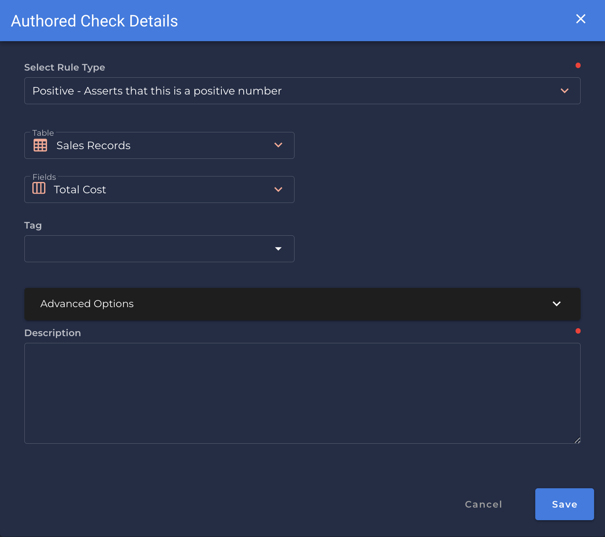

### Positive <spam id='single-field'>`single field`</spam>
* *Asserts that the data should not be empty.*

{: style="height:450px"}

!!! example
    `Total Cost` is a non-negative number.

=== "`Record Anomaly` error message"

    The value for `[field_name]` of '`[x value]`' is not a positive number.

=== "`Shape Anomaly` error message"
    In `[field_names]`, `[x]`% are not positive numbers.

---