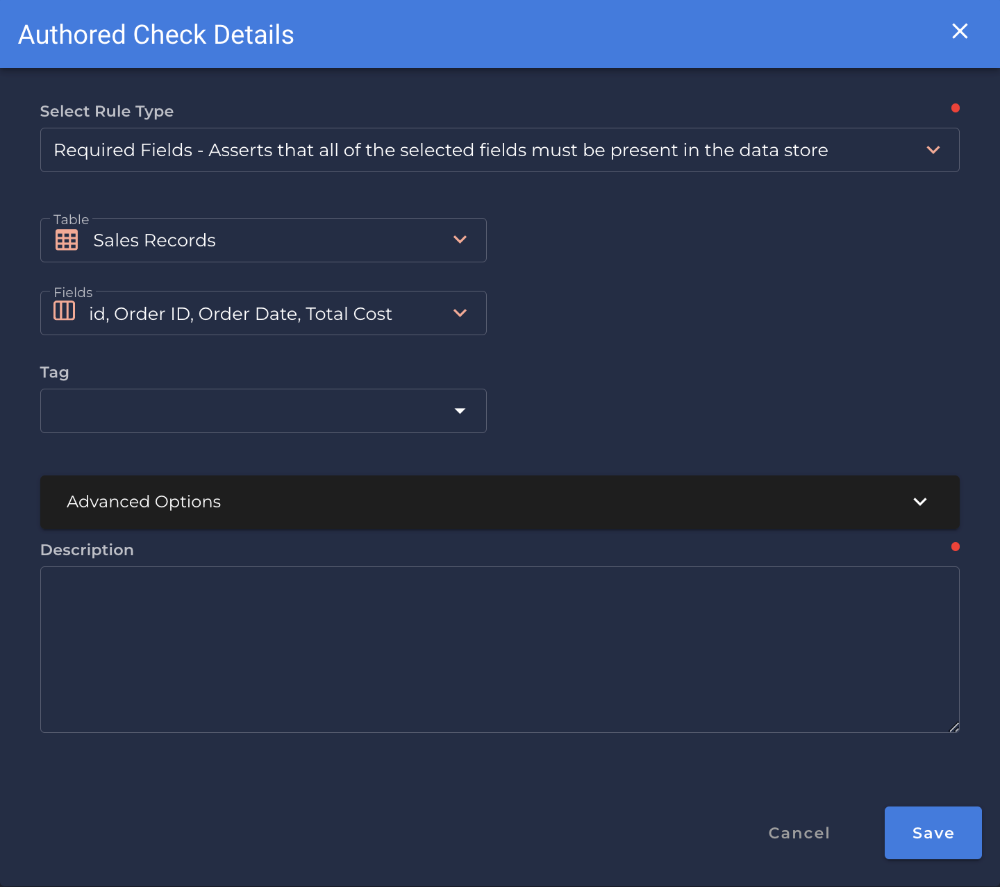

# Required Fields <spam id='multiple-fields'>`multiple fields`</spam>

---

*Asserts that all of the selected fields must be present in the data store.*

| Accepted Field Types   |                      |
| :--------------------: | :------------------: |
| `Date`                 | :white_check_mark:   |
| `Timestamp`            | :white_check_mark:   |
| `Integral`             | :white_check_mark:   |
| `Fractional`           | :white_check_mark:   |
| `String`               | :white_check_mark:   |
| `Boolean`              | :white_check_mark:   |

{: style="height:450px"}

!!! example 
    `SalesRecord` table has all of the defined fields `[Id, Order ID, Order Date, Total Cost]`

=== "`Shape Anomaly` error message"
    One of the required fields `[field_names]`, are missing.

---