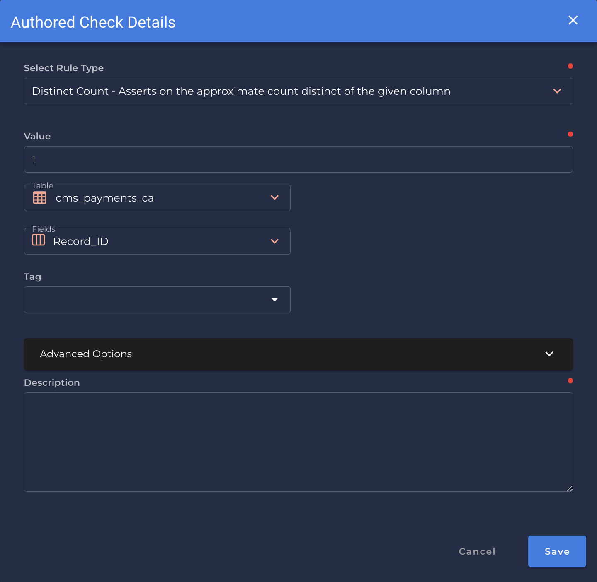
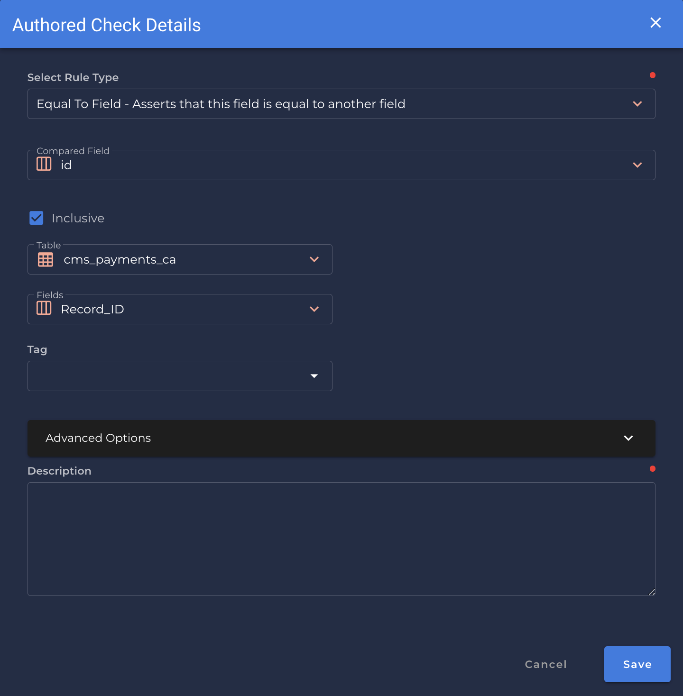
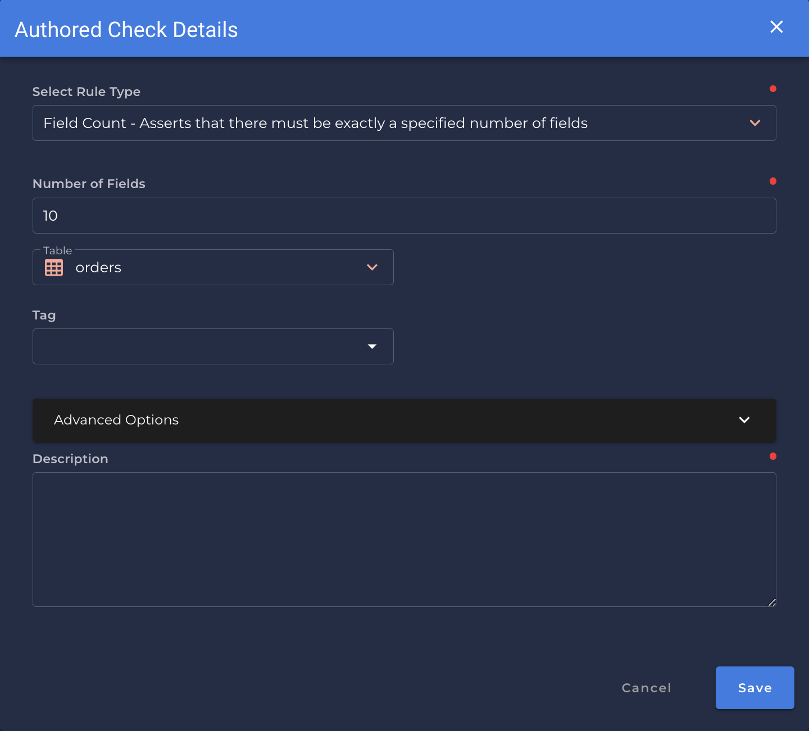
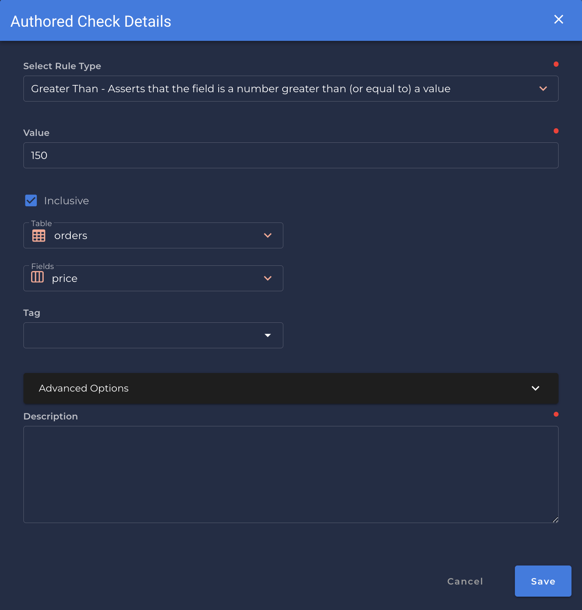
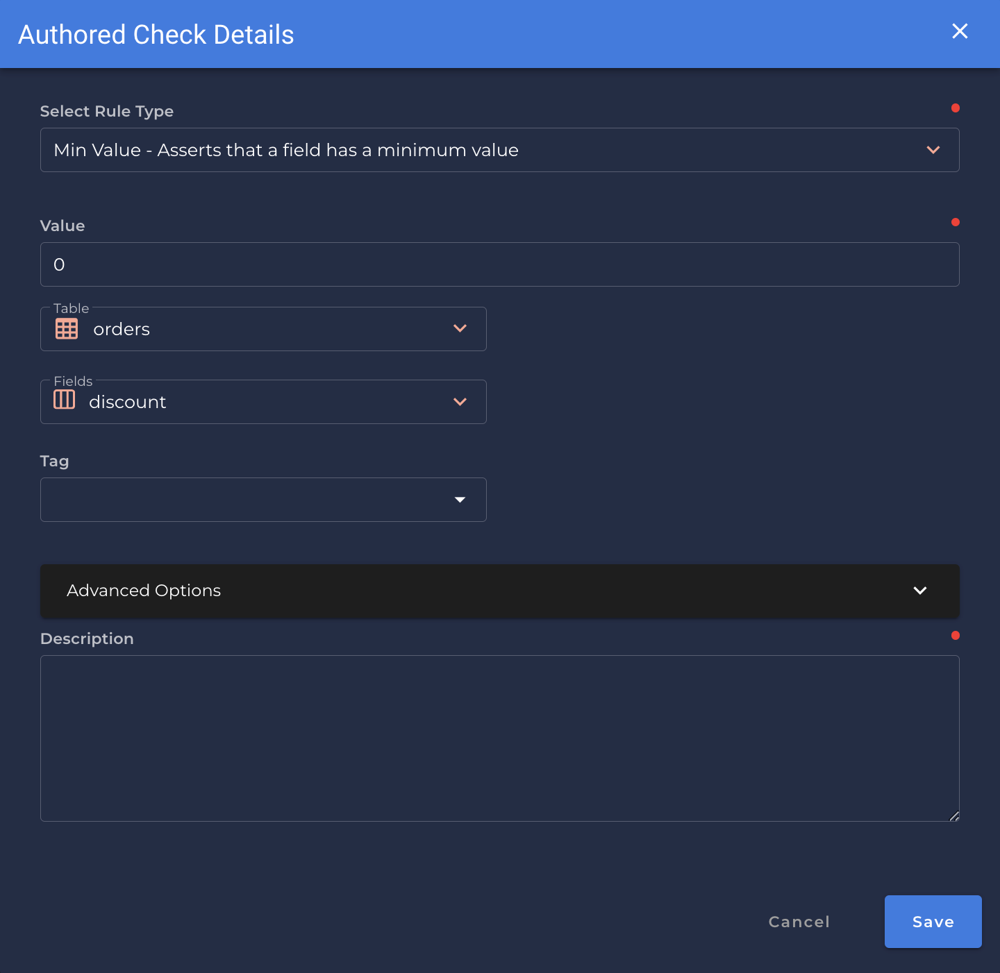
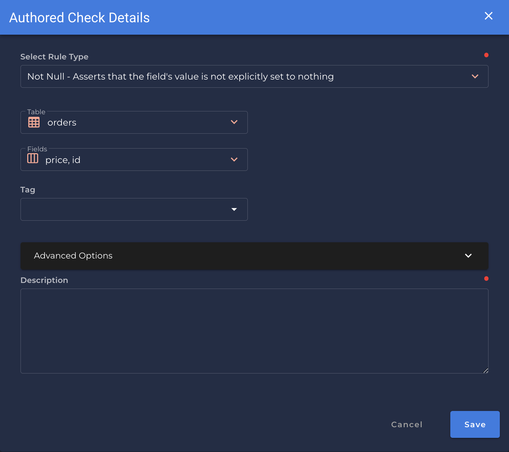
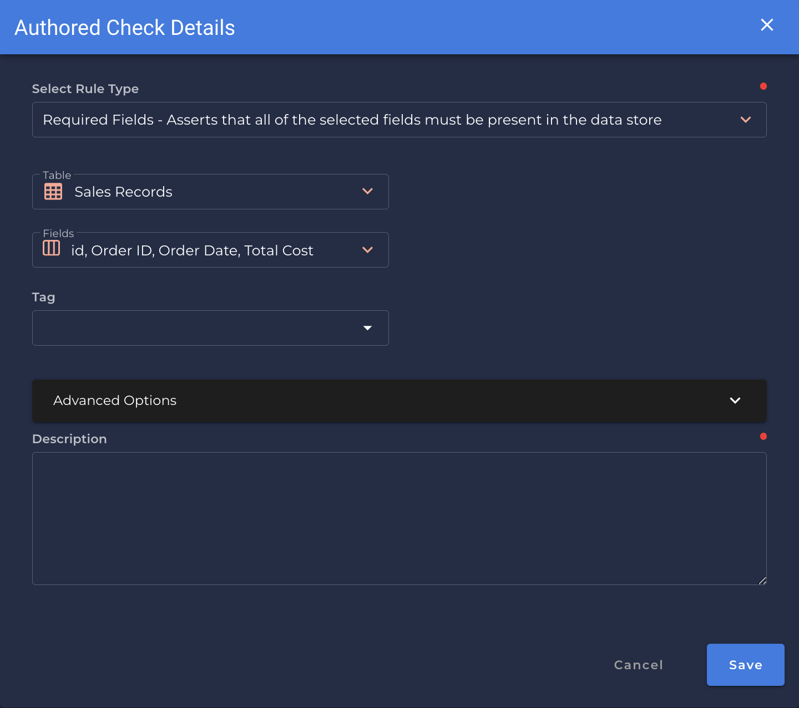
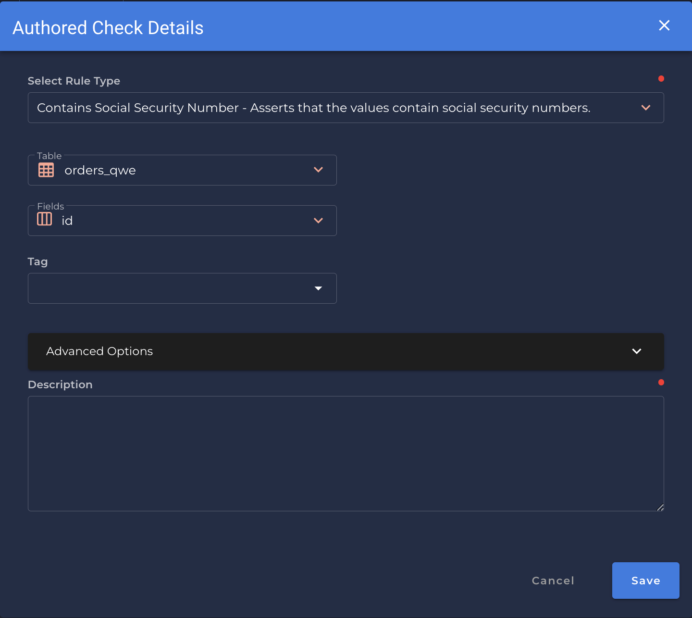

# Rule Types

---
In this section we are going to explain what are the many `Rule Types` that Qualytics App provides you to handle and manage the fields you want to have a better data quality.

---

# The definitive list of rule types

### After Date Time <spam id='single-field'>`single field`</spam>

* *Asserts that the field is a timestamp later than a specific date and time*

    {: style="height:450px"}

!!! example
    `order_time` is later than `2021-01-01`

=== "`Record Anomaly` error message"
    The `[field_name]` value of '`[x date time]`' is not later than `[selected_date_time]`

=== "`Shape Anomaly` error message"
    In `[field_names]`, `[x]`% are not later than `[selected_date_time]`

--- 
### Any Not Null <spam id='multiple-fields'>`multiple fields`</spam>
*  *Asserts that one of the fields must not be null*

    {: style="height:450px"}

!!! example
    `order_time` is not null.

=== "`Record Anomaly` error message"
    There is no value set for any of '`[field_name]`'

=== "`Shape Anomaly` error message"
    In `[field_names]`, `[x]`% have no value set for any of `[selected_field_name]`

--- 
### Before Date Time <spam id='single-field'>`single field`</spam>
* *Asserts that the field is a timestamp earlier than a specific date and time.*

    {: style="height:450px"}

!!! example
    `order_time` is before `2021-01-01`

=== "`Record Anomaly` error message"

    The `[field_name]` value of '`[x date time]`' is not earlier than `[selected_date_time]`

=== "`Shape Anomaly` error message"
    In `[field_names]`, `[x]`% are not earlier than `[selected_field_name]`

---
### Between <spam id='single-field'>`single field`</spam>

* *Asserts that values are equal to or between two numbers.*

{: style="height:450px"}

!!! example
    `price` is between `200` and `865`

=== "`Record Anomaly` error message"

    The value for `[field_name]` of '`[x value]`' is not between `[min_value]` and `[max_value]`.

=== "`Shape Anomaly` error message"
    In `[field_names]`, `[x]`% are not not between `[min_value]` and `[max_value]`.
---
### Between Times
* *Asserts that values are equal to or between two dates or times.*

{: style="height:450px"}

!!! example
    `order_time` is between `2021-01-01` and `2022-12-31`

=== "`Record Anomaly` error message"

    The value for `[field_name]` of '`[x value]`' is not between `[min_value]` and `[max_value]`.

=== "`Shape Anomaly` error message"
    In `[field_names]`, `[x]`% are not not between `[min_value]` and `[max_value]`.

---
### Contains Credit Card <spam id='single-field'>`single field`</spam>
* *Asserts that the values are credit card numbers.*

{: style="height:450px"}                                                  

!!! example
    `Form_of_Payment_or_Transfer_of_Value` contains credit card values.

=== "`Record Anomaly` error message"

    The `[field_name]`value of '`[x value]`' does not contain a credit card number.

=== "`Shape Anomaly` error message"
    In `[field_names]`, `[x]`% do not contain credit card numbers.

--- 
### Is Credit Card -- started here
* *Asserts that the values are credit card numbers.*

{: style="height:450px"}                                                 

!!! example
    `payment_type` is formatted as a credit card number.

=== "`Record Anomaly` error message"

    The `[field_name]` value of '`[x value]`' does not adhere to a credit card format.

=== "`Shape Anomaly` error message"
    In `[field_names]`, `[x]`% do not adhere to a credit card format.

---
### Data Type <spam id='single-field'>`single field`</spam>
* *Asserts that the data is of a specific type.*

{: style="height:450px"}
!!! example
    `Name_of_associated_Covered_Device` is a valid `String`

* You can list any of the following data types:

{: style="height:450px"}

=== "`Record Anomaly` error message"

    The `[field_name]` value of '`[x value]`' is not a valid `[data type]`.

=== "`Shape Anomaly` error message"
    In `[field_names]`, `[x]`% are not a valid `[data type]`.
---
### Distinct <spam id='single-field'>`single field`</spam>
* *The ratio of the count of distinct values (e.g. [a, a, b] is 2/3).*

{: style="height:450px"}

!!! example
    `Payment_Publication_Name` has a distinct ratio of `[value]

=== "`Shape Anomaly only` error message"
    In `[field_names]`, The distinct ratio of the `[field]` records is not `0.0`

---
### Distinct Count <spam id='single-field'>`single field`</spam>
* *Asserts on the approximate count distinct of the given column.*
{: style="height:450px"}

!!! example
    The distinct count of `Record_Id` is `0.0`

=== "`Shape Anomaly only` error message"
    In `[field_names]`, The distinct count of the records is not `0.0`

---
### Equal To Field
* *Asserts that this field is equal to another field.*
                                        
{: style="height:450px"}

!!! example
    `Record_Id` has the same values as `Id`.

=== "`Record Anomaly` error message"

    The `[field_name]` value of '`[x value]`' is not equal to the value of `[compared_field_name]`.

=== "`Shape Anomaly` error message"
    In `[field_names]`, `[x]`% of the fiels are not equal.

---
### Email <spam id='single-field'>`single field`</spam>
* *Asserts that the values are email addresses.*

{: style="height:450px"}
                                            
!!! example
    `id` contains an email address.

=== "`Record Anomaly` error message"

    The `[field_name]` value of '`[x value]`' does not contain an email address.

=== "`Shape Anomaly` error message"
    In `[field_names]`, `[x]`% do not contain email addresses.

---

### Expected Values <spam id='single-field'>`single field`</spam>
* *Asserts that values are contained within a list of expected values.*

{: style="height:450px"}

!!! example
    `discount` is one of the expected values `[5, 10, 15]`

=== "`Record Anomaly` error message"

    The `[field_name]` value of '`[x value]`' does not appear in the list of expected values.

=== "`Shape Anomaly` error message"
    In `[field_names]`, `[x]`% of values do not appear in the list of expected values.

---

### Field Count <spam id='single-field'>`single field`</spam>
* *Asserts that there must be exactly a specified number of fields.*

{: style="height:450px"}

!!! example
    `orders` has a field count of `10`.

=== "`Shape Anomaly` error message"
    In `[field_names]`, the field count is not `[value]`.

---

### Greater Than <spam id='single-field'>`single field`</spam>
* *Asserts that the field is a number greater than (or equal to) a value.*

{: style="height:450px"}

!!! example
    `price` is greater than `150`

=== "`Record Anomaly` error message"

    The `[field_name]` value of '`[x value]`' is not greater than `[value]`.

=== "`Shape Anomaly` error message"
    In `[field_names]`, `[x]`% are not greater than`[value]`.

---

### Greater Than Field
* *Asserts that this field is greater than another field.*
                                                record_anomaly_message="The {0.field_names} value of {1} is not greater than the value of {0.properties[field_name]}",
                                                shape_anomaly_message="In {0.field_names}, {1:.3f}% are not greater than {0.properties[field_name]}"),
{: style="height:450px"}
!!! example
    `price` has a value greater than `discount`.

=== "`Record Anomaly` error message"

    The `[field_name]` value of '`[x value]`' is not greater than the value of `[value]`.

=== "`Shape Anomaly` error message"
    In `[field_names]`, `[x]`% are not equal to `[compared_field_name]`.

---
### Less Than <spam id='single-field'>`single field`</spam>
* *Asserts that the field is a number less than (or equal to) a value.*

{: style="height:450px"}

!!! example
    `discount` is less then `25`.

=== "`Record Anomaly` error message"

    The `[field_name]` value of '`[x value]`' is not less than `[value]`.

=== "`Shape Anomaly` error message"
    In `[field_names]`, `[x]`% are not less than `[value]`.

---
### Less Than Field
* *Asserts that this field is less than another field.*

{: style="height:450px"}
!!! example
    `discount` has a value less than `price`.

=== "`Record Anomaly` error message"

    The `[field_name]` value of '`[x value]`' is not less than the value of `[compared_field_name]`.

=== "`Shape Anomaly` error message"
    In `[field_names]`, `[x]`% are not less than `[compared_field_name]`.

---

### Matches Pattern <spam id='single-field'>`single field`</spam>
* *Asserts that a field must match a pattern.*

{: style="height:450px"}

!!! example
    `Date_of_Payment` matches the pattern `\d{4}-\d{2}-\d{2}`.

=== "`Record Anomaly` error message"

    The `[field_name]` value of '`[x value]`' does not matche the pattern `[pattern]`

=== "`Shape Anomaly` error message"
    In `[field_names]`, `[x]`% do not match the pattern `[pattern]`.

---

### Max Length <spam id='single-field'>`single field`</spam>
* *Asserts that a string has a maximum length.*

{: style="height:450px"}

!!! example
    `units` has a maximum length of `75`.

=== "`Record Anomaly` error message"

    The `[field_name]` length of '`[x value]`' is greater than the max length of `[value]`

=== "`Shape Anomaly` error message"
    In `[field_names]`, `[x]`% have a length greater than `[value]`.

---
### Max Value <spam id='single-field'>`single field`</spam>
* *Asserts that a field has a maximum value.*

{: style="height:450px"}
!!! example
    `Period` has a maximum value of `900`.

=== "`Record Anomaly` error message"

    The `[field_name]` value of '`[x value]`' is greater than the max value of `[value]`

=== "`Shape Anomaly` error message"
    In `[field_names]`, `[x]`% are greater than the max value of `[value]`.

---
### Min Length <spam id='single-field'>`single field`</spam>
* *Asserts that a string has a minimum length.*

{: style="height:450px"}
!!! example
    `units` has a minimum length `356`.

=== "`Record Anomaly` error message"

    The `[field_name]` length of '`[x value]`' is less than the min length of `[value]`

=== "`Shape Anomaly` error message"
    In `[field_names]`, `[x]`% have a length less than `[value]`.

---

### Min Partition Size <spam id='none-field'>`none field`</spam>
* *Asserts the minimum number of records that should be loaded from each file or table partition.*

{: style="height:450px"}
!!! example
    `orders` has at least `1000` records.

=== "`Shape Anomaly` error message"
    In `[field_names]`, fewer than `[value]` records were loaded.

---

### Min Value <spam id='single-field'>`single field`</spam>
* *Asserts that a field has a minimum value.*

{: style="height:450px"}

!!! example
    `discount` has a minimum value of `0`.

=== "`Record Anomaly` error message"

    The `[field_name]` value of '`[x value]`' is less than the min value of `[value]`

=== "`Shape Anomaly` error message"
    In `[field_names]`, `[x]`% are less than the min value of `[value]`.

---

### Not Future
* *Asserts that the field's value is not in the future.*

{: style="height:450px"}

!!! example
    `order_time` is a time in the past.

=== "`Record Anomaly` error message"

    The value for `[field_name]` of '`[x value]`' is in the future.

=== "`Shape Anomaly` error message"
    In `[field_names]`, `[x]`% are future times.

---
### Not Negative <spam id='single-field'>`single field`</spam>
* *Asserts that this is a non-negative number.*

{: style="height:450px"}

!!! example
    `price`is a non-negative number.

=== "`Record Anomaly` error message"

    The value for `[field_name]` of '`[x value]`' is a negative number.

=== "`Shape Anomaly` error message"
    In `[field_names]`, `[x]`% are negative numbers.

---

### Not Null <spam id='multiple-fields'>`multiple fields`</spam>
* *Asserts that the field's value is not explicitly set to nothing.*

{: style="height:450px"}

!!! example
    `price` and `id` are a non-negative number.

=== "`Record Anomaly` error message"

    The is not assigned value for `[field_name]`.

=== "`Shape Anomaly` error message"
    In `[field_names]`, `[x]`% are not assigned values.

---

### Positive <spam id='single-field'>`single field`</spam>
* *Asserts that the data should not be empty.*

{: style="height:450px"}

!!! example
    `Total Cost` is a non-negative number.

=== "`Record Anomaly` error message"

    The value for `[field_name]` of '`[x value]`' is not a positive number.

=== "`Shape Anomaly` error message"
    In `[field_names]`, `[x]`% are not positive numbers.

---
### Required Fields <spam id='multiple-fields'>`multiple fields`</spam>
* *Asserts that all of the selected fields must be present in the data store.*

    {: style="height:450px"}

    !!! example
    `SalesRecord` table has all of the defined fields `[Id, Order ID, Order Date, Total Cost]`

=== "`Shape Anomaly` error message"
    One of the required fields `[field_names]`, are missing.

---

### Required Values <spam id='single-field'>`single field`</spam>
* *Asserts that all of the defined values must be present at least once within a field.*

{: style="height:450px"}

!!! example
    `Ship Date` is assigned all of the listed values at least once `[2022-10-15, 2022-11-12, 2022-12-12]`.

=== "`Shape Anomaly` error message"
    In `[field_names]`, required values are missing in the sample of `[x]` records.

---

### Predicted By <spam id='single-field'>`single field`</spam>
* *Asserts that the actual value of a field falls within the expected predicted range.*

{: style="height:450px"}

!!! example
    The `price` is predicted by `[expression] profit *10 + cogs *-10` +/- `[tolerance] 100.0`
    
=== "`Record Anomaly` error message"
    The `[field_name]` value of `['x']` is not within the predicted range defined by `[expression]`+/- `[tolerance]`

=== "`Shape Anomaly` error message"
    In `[field_names]`, `[x]`% are not within the predicted range defined by `[expression]` +/- `[tolerance]`

---

### Satisfies Equation <spam id='multiple-fields'>`multiple fields`</spam>
* *Evaluates the given equation (any valid Spark SQL) for each record.*

{: style="height:450px"}

!!! example
    The record satisfies the give equation.
    
=== "`Record Anomaly` error message"
    The record does not satisfy the give equation.

=== "`Shape Anomaly` error message"
    `[x]`% of records do not satisfy the give query equation.

---

### Social Security Number <spam id='single-field'>`single field`</spam>
* *Asserts that the values are social security numbers.*

{: style="height:450px"}

!!! example
    The `id` contains a social security number.
    
=== "`Record Anomaly` error message"
    The `[field_name]` value of `['x']` does not contain a social security number.

=== "`Shape Anomaly` error message"
    In `[field_names]`, `[x]`% do not contains social security numbers.

---
### Sum <spam id='single-field'>`single field`</spam>
* *Asserts that the sum of a field is a specific amount.*

{: style="height:450px"}

!!! example
    The `price` has a sum of `333,25`.

=== "`Shape Anomaly` error message"
    In `[field_names]`, the sum of the `[x]` records is not `[value]`.

---

### Time Distribution Size
* *Asserts that the count of records for each interval of a timestamp is between two numbers.*

{: style="height:450px"}

!!! example
    The count of records in `[interval]` segments of `[field_name]` is between `[min_size]` and `[max_size]`.
    
=== "`Shape Anomaly` error message"
    The count of records in `[interval]` segments of `[field_names]` is not between `[min_size]` and `[max_size]`.

---

### Unique <spam id='multiple-fields'>`multiple fields`</spam>
* *Asserts that the field's value is unique*.

!!! example
    The `id`, `price` are uniques.
    
=== "`Record Anomaly` error message"
    The `[field_name]` value of `['x']` exists more than once.

=== "`Shape Anomaly` error message"
    In `[field_names]`, `[x]`% are not unique.

---

### User Define Function
* *Asserts that the given user-defined function (as scala script) evaluates to true over the field's value"*.

                                      shape_anomaly_message="In {0.field_names}, {1:.3f}% of values to not evaluate true as a parameter to the given UDF")

!!! example
    The given UDF evaluates to true over `status`. If the `length` is greater than `2`.

=== "`Shape Anomaly` error message"
    In `[field_names]`, `[x]`% of values to not evaluate true as a parameter to the given UDF.

---

the unique value ratio in a single or combined set of fields
### Url <spam id='single-field'>`single field`</spam>
* *Asserts that the values contain valid URLs.*

                                           record_anomaly_message="The {0.field_names} value of '{1}' does not contain a URL",
                                           shape_anomaly_message="In {0.field_names}, {1:.3f}% do not contain a URL"),

{: style="height:450px"}

!!! example
    `Sales Channel` contains a URL.
    
=== "`Record Anomaly` error message"
    The `[field_name]` value of `['x']` does not contain a URL.

=== "`Shape Anomaly` error message"
    In `[field_names]`, `[x]`% do not contain a URL.

---