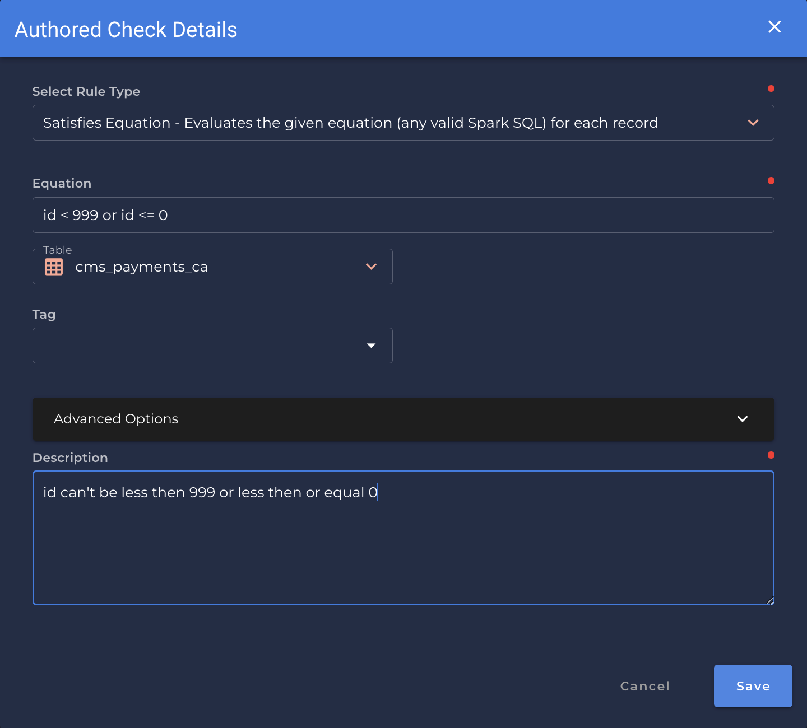

### Satisfies Equation <spam id='multiple-fields'>`multiple fields`</spam>

---

*Evaluates the given equation (any valid Spark SQL) for each record.*

{: style="height:450px"}

!!! example
    The record satisfies the give equation.
    
=== "`Record Anomaly` error message"
    The record does not satisfy the give equation.

=== "`Shape Anomaly` error message"
    `[x]`% of records do not satisfy the give query equation.

---