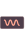

# Time Distribution Size

---

*Asserts that the count of records for each interval of a timestamp is between two numbers.*

| Accepted Field Types   |                      |
| :--------------------: | :------------------: |
| `Date`                 | :octicons-check-16:   |
| `Timestamp`            | :octicons-check-16:   |

!!! example
    The count of records in `[interval]` segments of `[field_name]` is between `[min_size]` and `[max_size]`.
    
=== "`Shape Anomaly` error message"
    The count of records in `[interval]` segments of `[field_names]` is not between `[min_size]` and `[max_size]`.

---