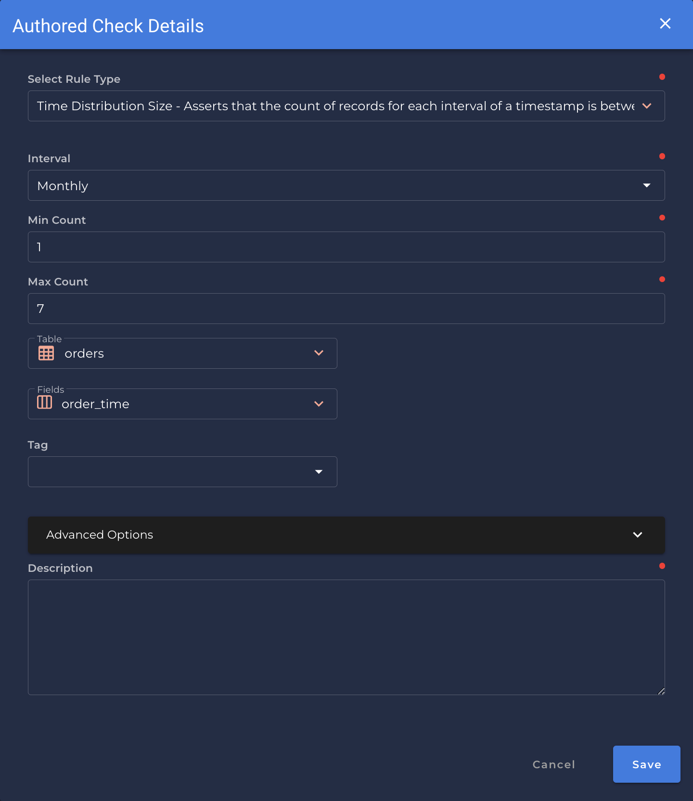

### Time Distribution Size
* *Asserts that the count of records for each interval of a timestamp is between two numbers.*

{: style="height:450px"}

!!! example
    The count of records in `[interval]` segments of `[field_name]` is between `[min_size]` and `[max_size]`.
    
=== "`Shape Anomaly` error message"
    The count of records in `[interval]` segments of `[field_names]` is not between `[min_size]` and `[max_size]`.

---