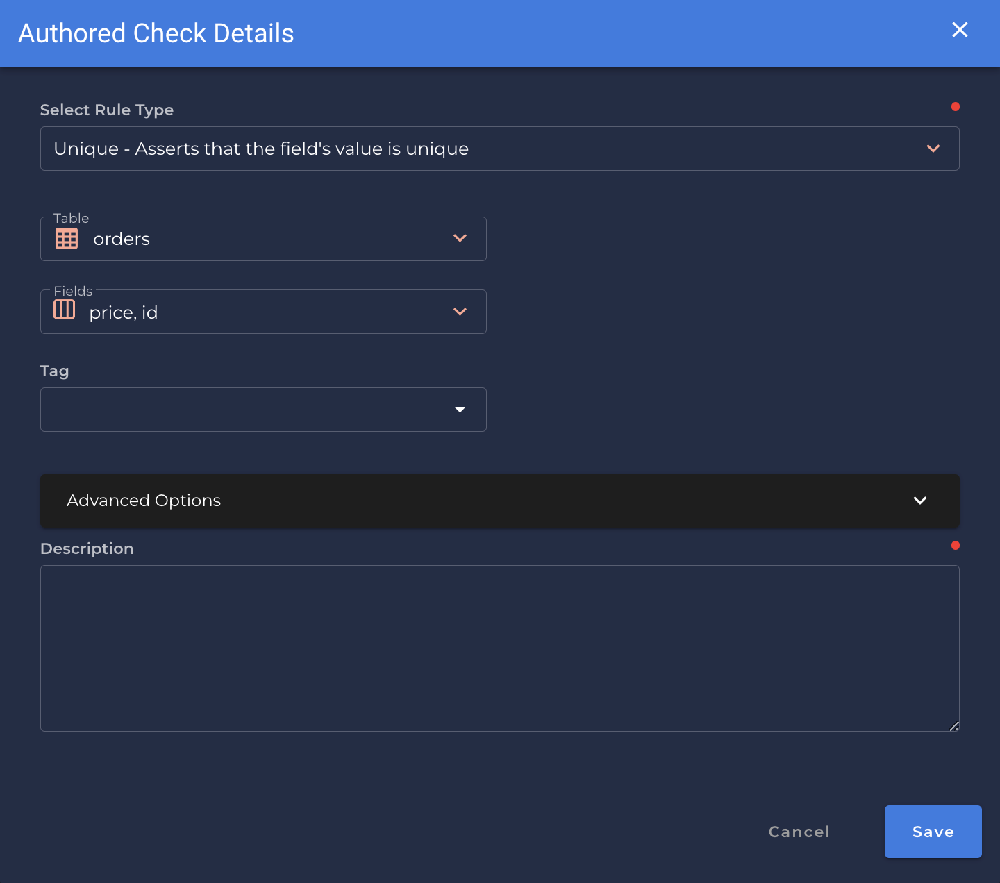

### Unique <spam id='multiple-fields'>`multiple fields`</spam>
* *Asserts that the field's value is unique*.

!!! example
    The `id`, `price` are uniques.
    
=== "`Record Anomaly` error message"
    The `[field_name]` value of `['x']` exists more than once.

=== "`Shape Anomaly` error message"
    In `[field_names]`, `[x]`% are not unique.

---