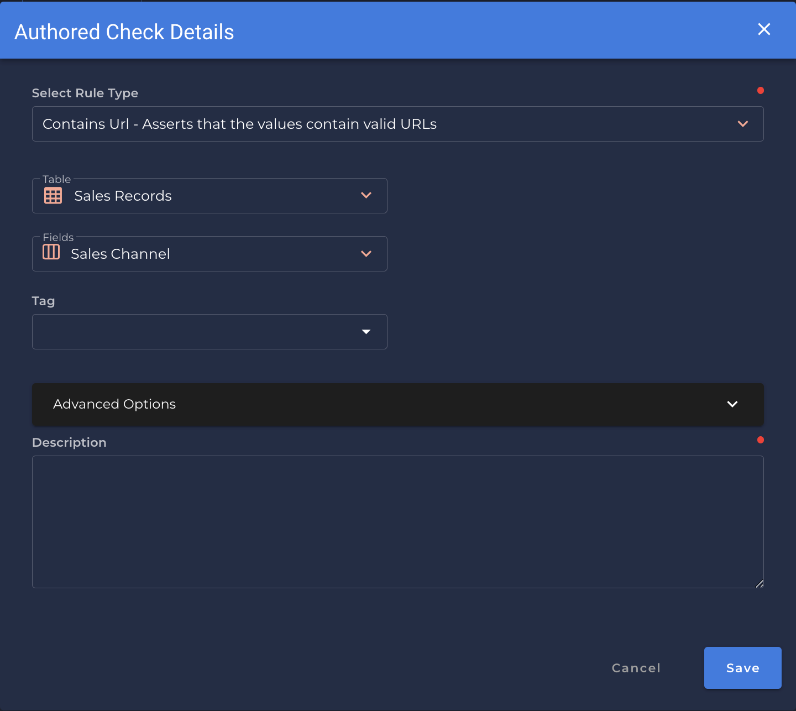

### Url <spam id='single-field'>`single field`</spam>
* *Asserts that the values contain valid URLs.*

                                           record_anomaly_message="The {0.field_names} value of '{1}' does not contain a URL",
                                           shape_anomaly_message="In {0.field_names}, {1:.3f}% do not contain a URL"),

{: style="height:450px"}

!!! example
    `Sales Channel` contains a URL.
    
=== "`Record Anomaly` error message"
    The `[field_name]` value of `['x']` does not contain a URL.

=== "`Shape Anomaly` error message"
    In `[field_names]`, `[x]`% do not contain a URL.

---