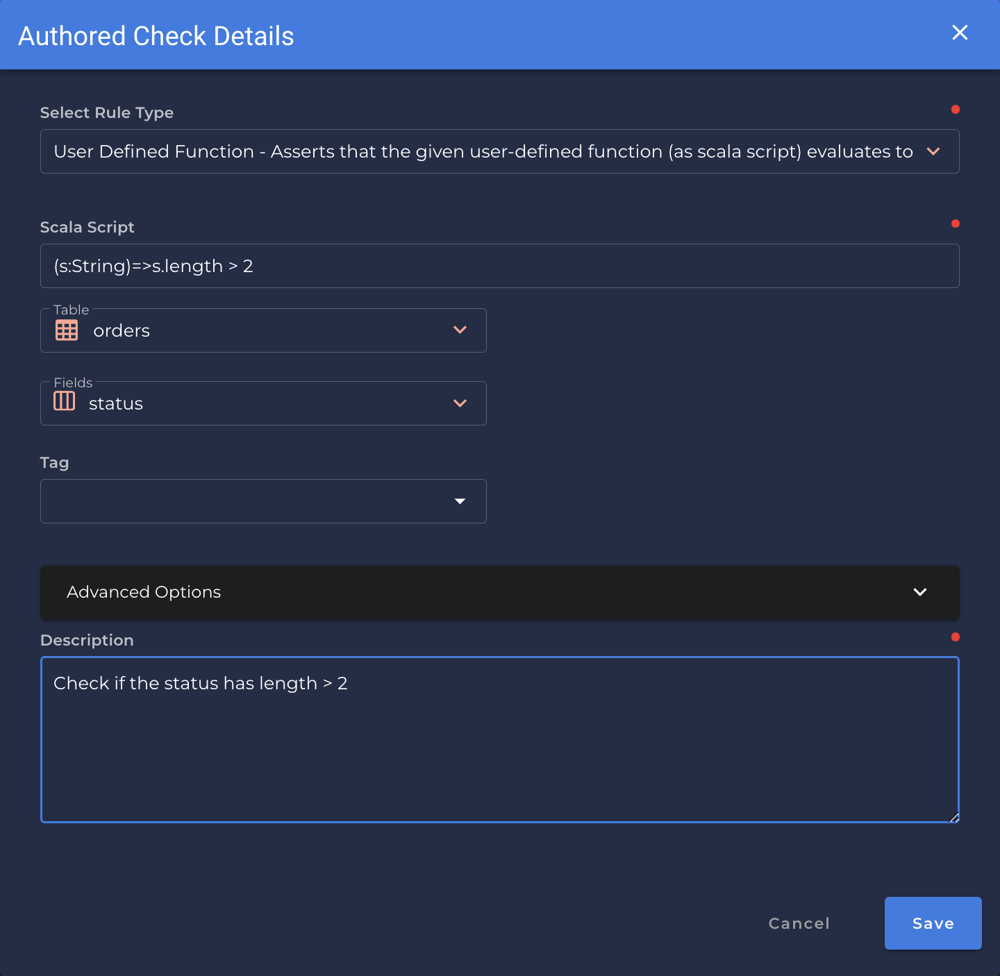

### User Define Function
* *Asserts that the given user-defined function (as scala script) evaluates to true over the field's value"*.

                                      shape_anomaly_message="In {0.field_names}, {1:.3f}% of values to not evaluate true as a parameter to the given UDF")

!!! example
    The given UDF evaluates to true over `status`. If the `length` is greater than `2`.

=== "`Shape Anomaly` error message"
    In `[field_names]`, `[x]`% of values to not evaluate true as a parameter to the given UDF.

---