# Volumetric Check

Volumetric Check ensures data stability by monitoring dataset size fluctuations in rows or bytes. It detects anomalies by comparing current volumes against historical trends (daily, weekly, monthly). Users can configure rules for precise control, while automated threshold adjustments enhance accuracy over time.

Let's get started 🚀

## Configure Volumetric Check

**Step 1:** Login into your Qualytics account and select the **datastore** from the left menu on which you want to add a volumetric check.

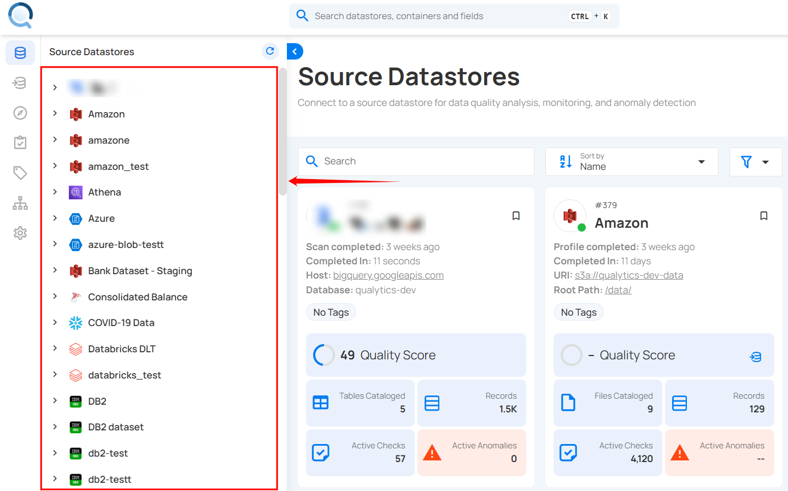

**Step 2:** Click the **Add** button and select **Checks**.

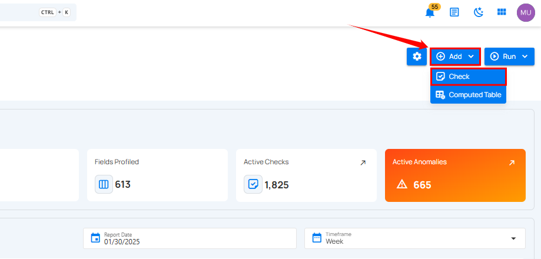

**Step 3:** A modal window appears. Enter the required details to configure the **Volumetric Check.**

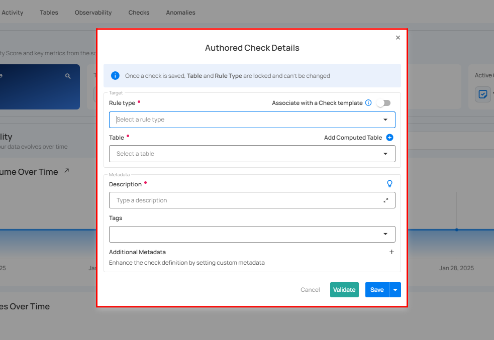

**Step 4:** Enter the details to configure the volumetric check**:**

|     No. |                 Field |                                Description |
| :---- | :---- | :---- |
|      **1.** |           Rule Type | Select the Volumetric Rule type from the dropdown. |
|      **2.** |          Table | Select the table for the rule to apply. |

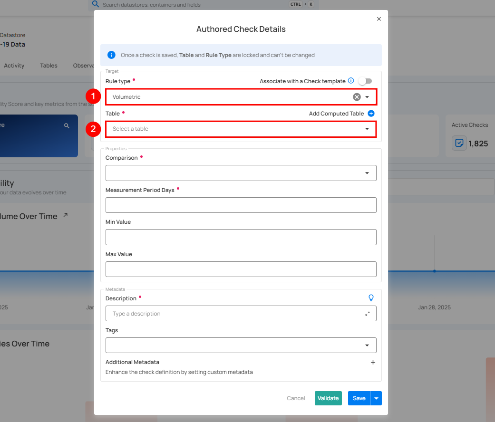

**3. Comparison:**  Specifies the type of comparison: Absolute Change, Absolute Value, or Percentage Change:

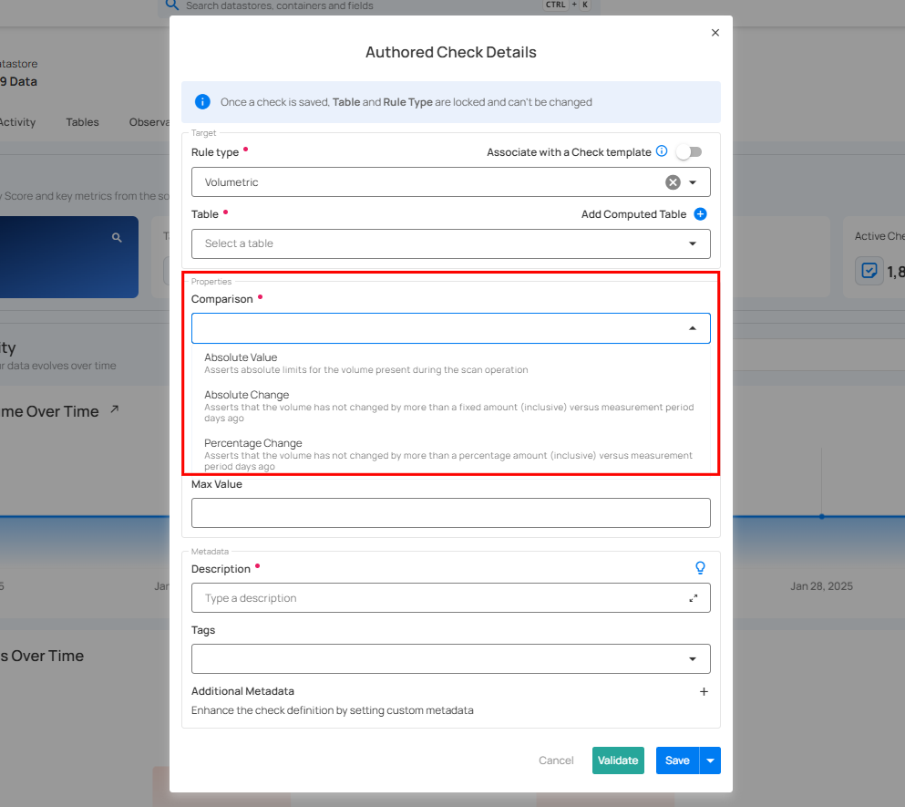

!!! note "Details"
    ### Comparison Options

    **Absolute Value**

    The `Absolute Value` comparison works by comparing the change in a numeric field's value to a pre-set limit `between` Min and Max values. If the field's value changes by more than this specified range since the last relevant scan, an anomaly is identified.

    ??? example "Illustration"
        _The value of the record in each scan should be within 100 and 300 to be considered normal_

        **Thresholds**: Min Value = 100, Max Value = 300

        | Scan | Current Value | Anomaly Detected |
        |------|---------------|------------------|
        | #1    | 150           | No              |
        | #2    | 
90
 | 
Yes
 |
        | #3    | 250           | No               |
        | #4    | 
310
 | 
Yes
 |
    
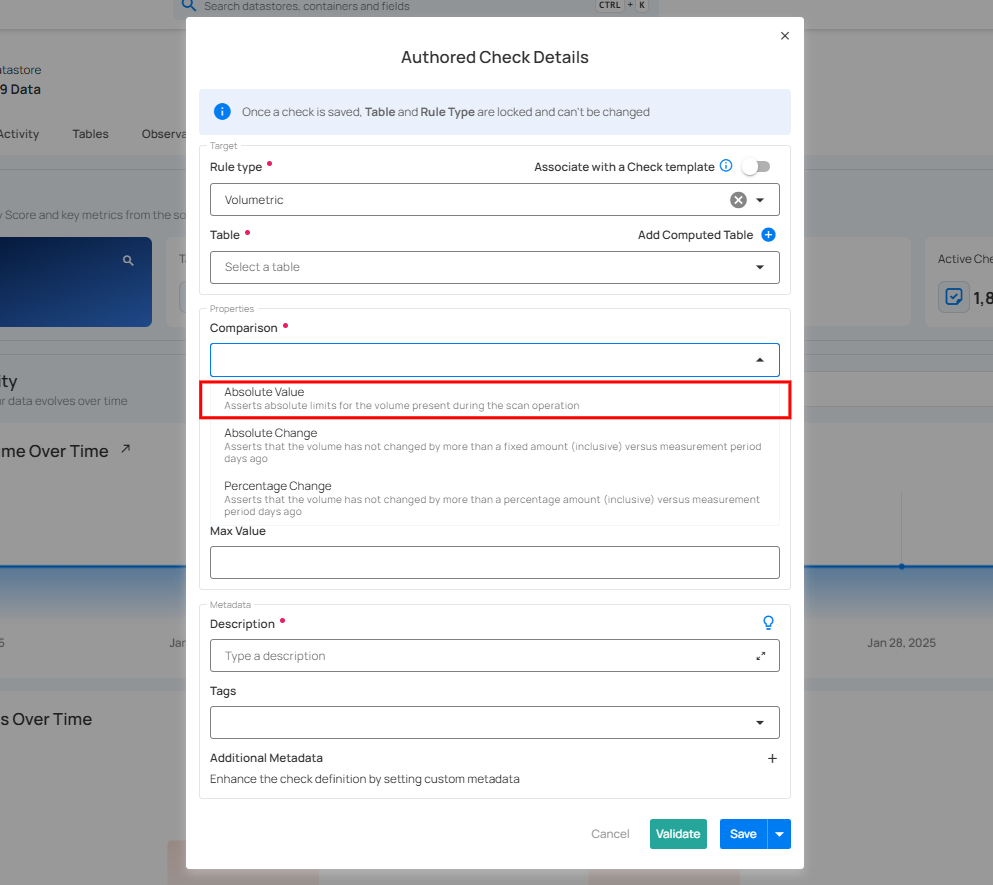

!!! note "Details"
    ### Comparison Options

    **Absolute Change**

    The `Absolute Change` comparison works by comparing the change in a numeric field's value to a pre-set limit (Min / Max). If the field's value changes by more than this specified limit since the last relevant scan, an anomaly is identified.

    ??? example "Illustration"
        _Any record with a value change smaller than 30 or greater than 70 compared to the last scan should be flagged as anomalous_
        
        **Thresholds**: Min Change = 30, Max Change = 70

        | Scan | Previous Value | Current Value | Absolute Change | Anomaly Detected |
        |------|----------------|---------------|-----------------|------------------|
        | #1    | -              | 100           | -               | No               |
        | #2    | 100            | 150           | 50              | No               |
        | #3    | 150            | 220           | 70              | No               |
        | #4    | 220            | 
300
 | 
80
  | 
Yes
 |

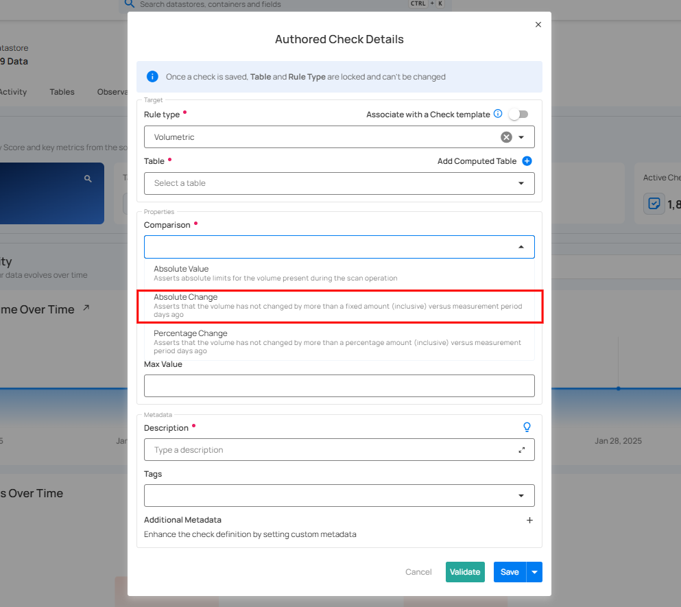

!!! note "Details"
    ### Comparison Options

    **Percentage Change**

    The `Percentage Change` comparison operates by tracking changes in a numeric field's value relative to its previous value. If the change exceeds the predefined percentage (%) limit since the last relevant scan, an anomaly is generated.

    ??? example "Illustration"
        _An anomaly is identified if the record's value decreases by more than 20% or increases by more than 50% compared to the last scan._

        **Thresholds**: Min Percentage Change = -20%, Max Percentage Change = 50%

        **Percentage Change Formula**: ( (current_value - previous_value) / previous_value ) * 100

        | Scan | Previous Value | Current Value | Percentage Change           | Anomaly Detected |
        |------|----------------|---------------|-----------------------------|------------------|
        | 1    | -              | 100           | -                           | No               |
        | 2    | 100            | 150           | 50%                         | No               |
        | 3    | 150            | 120           | -20%                        | No               |
        | 4    | 120            | 65            | 
-45.83%
 | 
Yes
 |
        | 5    | 65             | 110           | 
69.23%
  | 
Yes
  |

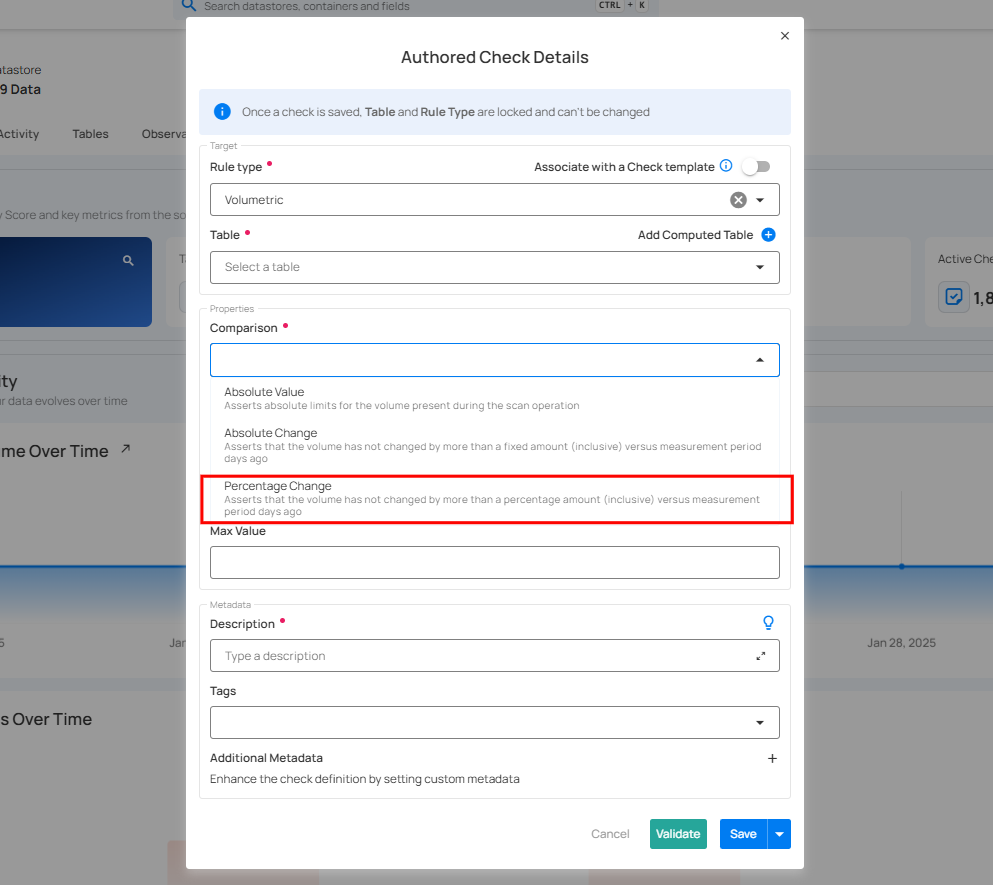

**4. Measurement Period Days:** Enter the number of days for measurement.

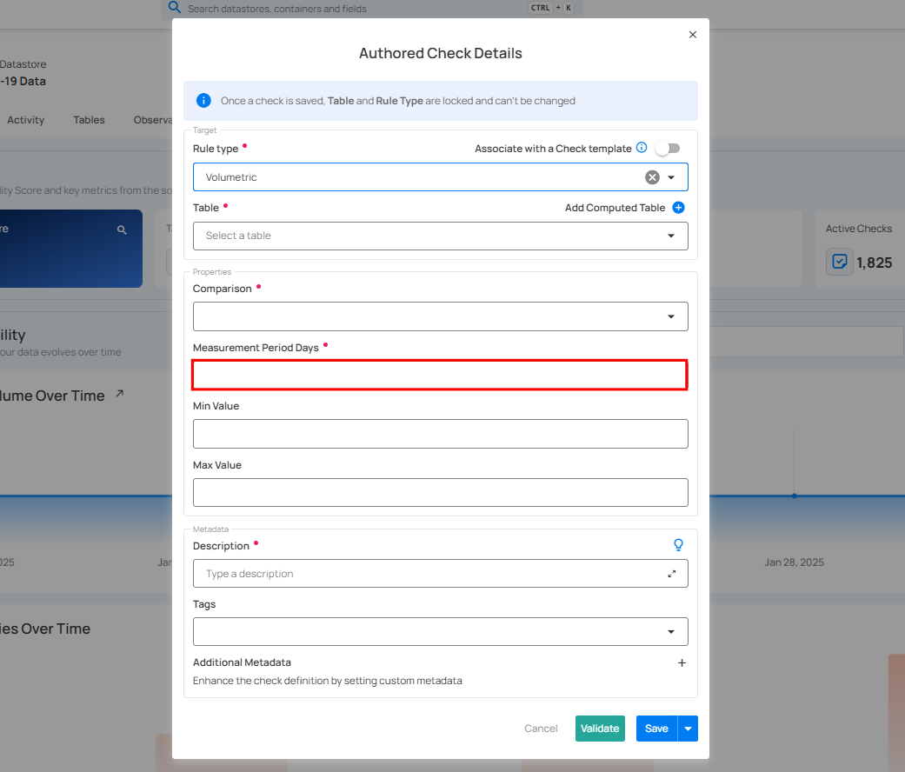

**5. Threshold:** At least the Min or Max value must be specified, and including both is optional. These values determine the acceptable range or limit of change in the field's value.

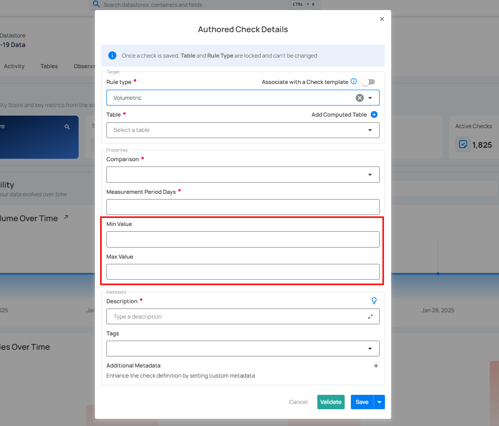

**Min Value**

* Represents the minimum allowable increase in the field's value.

* A negative Min Value signifies an allowable decrease, determining the minimum value the field can drop to be considered valid.

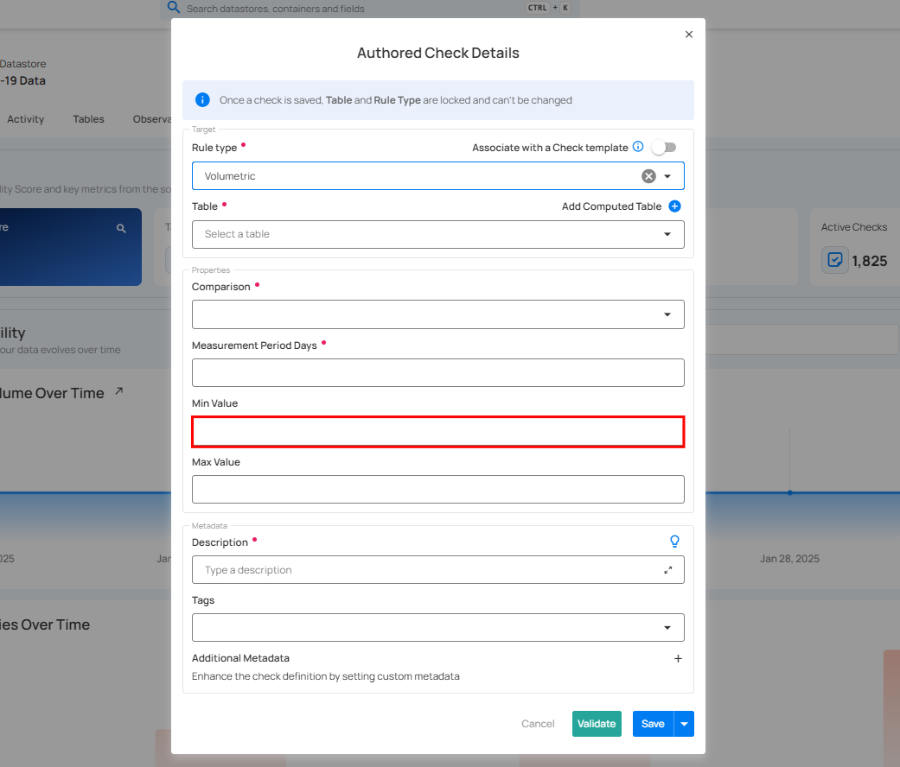

**Max Value**

* Indicates the maximum allowable increase in the field’s value, setting an upper limit for the value's acceptable growth or change.

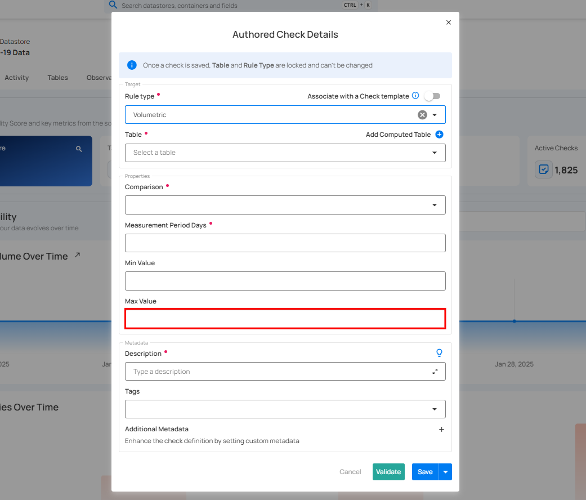

| No. |                           Field |                                       Description |
| :---- | :---- | :---- |
| **6.** |                    **Description** | Enter a description for the check. |
| **7.** |                       **Tag** | Add tags for categorizing the check. |
| **8.** |           **Additional Metadata** | Add custom metadata for additional details. |

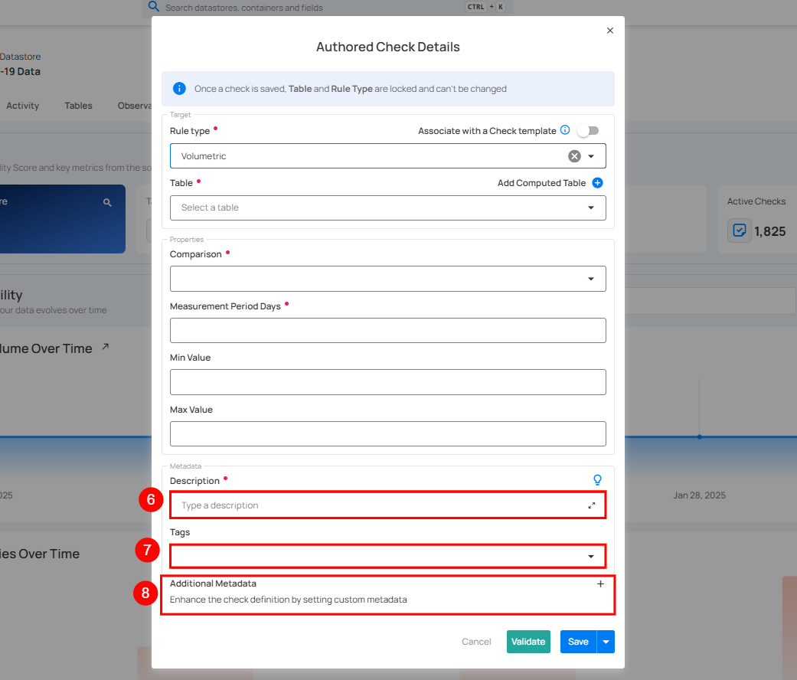

**Step 4:** After completing all the check details, click on the "Validate" button. This will perform a validation operation on the check without saving it. The validation allows you to verify that the logic and parameters defined for the check are correct. It ensures that the check will work as expected by running it against the data without committing any changes.

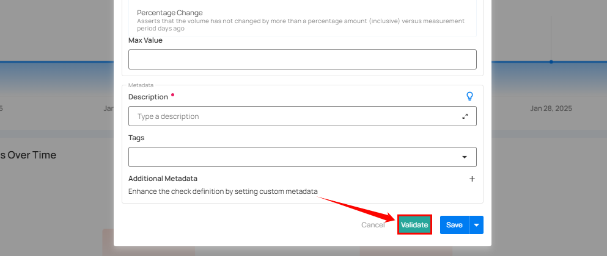

If the validation is successful, a green message will appear saying "Validation Successful".

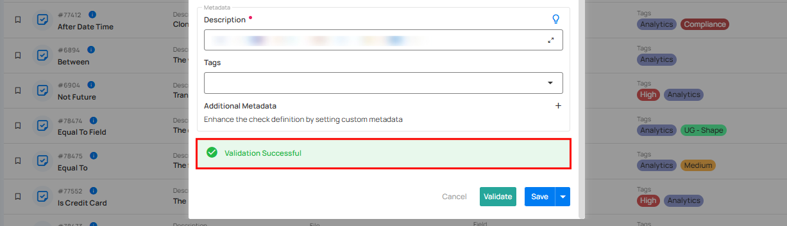

**Step 5:** Once you have a successful validation, click the **"Save"** button.

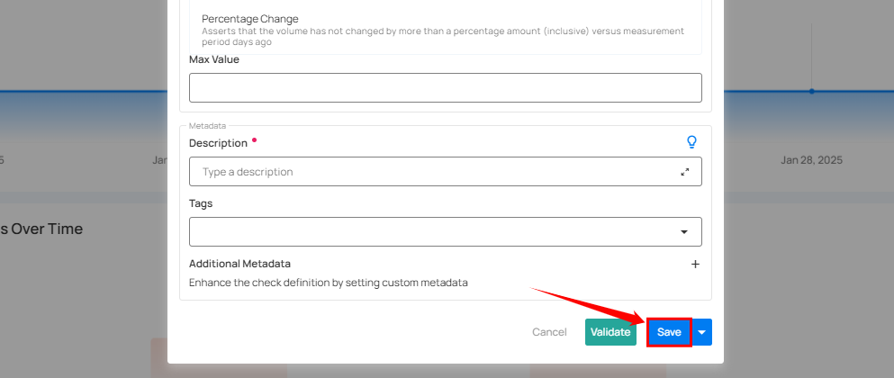

After clicking on the **“Save”** button your check is successfully created and a success flash message will appear saying **“Check successfully created”.**

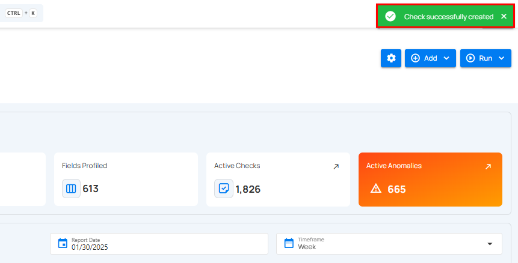

### How It Works

The system automatically infers and maintains volumetric checks based upon observed daily, weekly, and monthly averages. These checks enable proactive management of data volume trends, ensuring that any unexpected deviations are identified as anomalies for review.

### Automating Adaptive Volumetric Checks

The following Volumetric Checks are automatically inferred for data assets with automated volume measurements enabled:

* **Daily**: the expected daily volume expressed as an absolute minimum and maximum threshold. The thresholds are calculated as standard deviations from the previous 7-day moving average.  

* **Weekly**: the expected weekly volume expressed as an absolute minimum and maximum threshold. The thresholds are calculated as standard deviations from the previous four weeks’ weekly volume moving average.  

* **Monthly**: the expected 4-week volume expressed as an absolute minimum and maximum threshold. The thresholds are calculated as standard deviations from the previous sixteen weeks’ 4-week volume moving average.

#### Scan Assertion and Anomaly Creation

Volumetric Checks are asserted during a [Scan Operation](https://userguide.qualytics.io/source-datastore/scan/) just like all other check types and enrichment of volumetric check anomalies is fully supported. This enables full support for custom scheduling of volumetric checks and remediation workflows of volumetric anomalies.

## Adaptive Thresholds and Manual Adjustments

Each time data volume is measured for an asset, the system automatically updates the inferred Volumetric Checks.

**1.Automatic Threshold Adjustment:**

* The system sets initial thresholds at **2 standard deviations** from the moving average.

* Over time, these thresholds adjust automatically using **historical data trends** to improve accuracy.

**2.Continuous Learning:**

* The system **monitors past data** and **adapts thresholds** to detect unusual data volume changes.

**3.Why It Matters:**

* Helps maintain **data integrity** by identifying unexpected volume changes.

* Ensures quick detection and response to potential data issues.

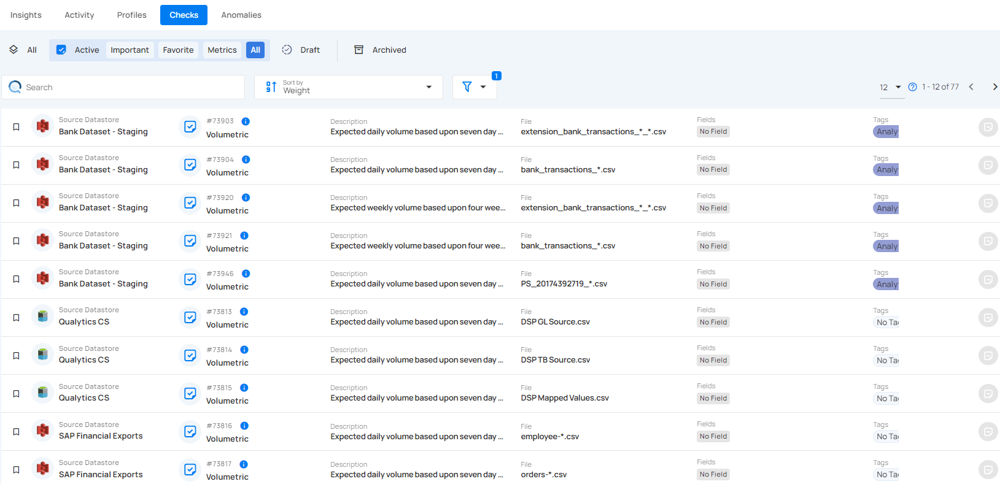