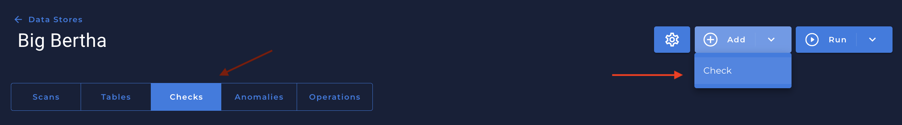
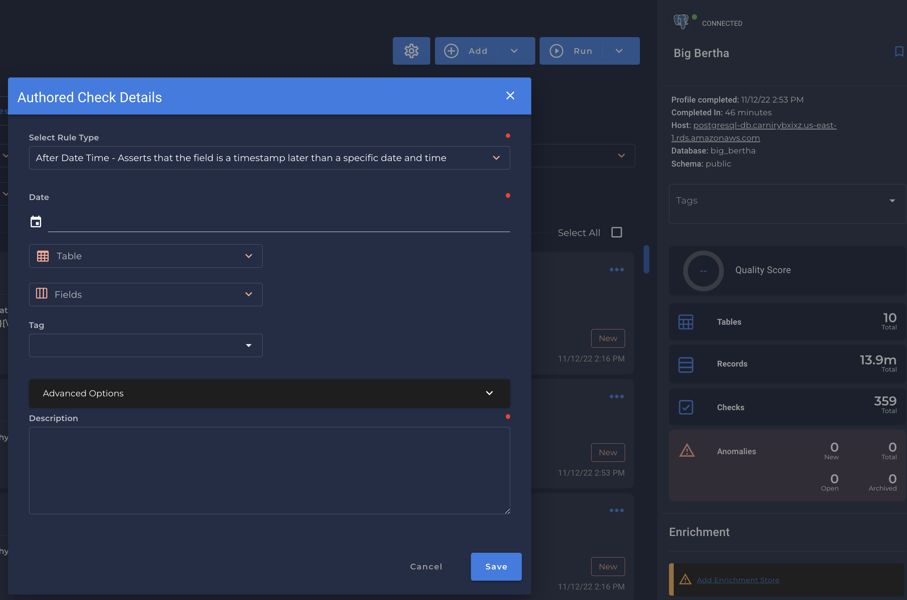
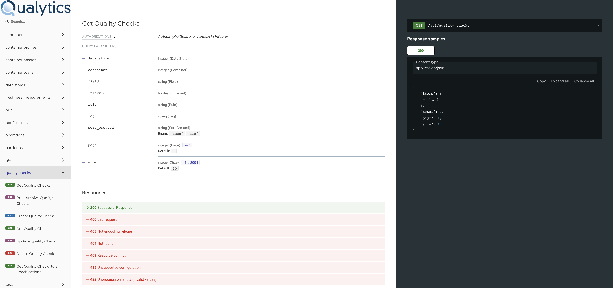

# What is an Authored Check?

---

`Authored` checks are manually authored by a user from scratch via UI or API. There are many types of checks that can be authored through templates for common checks as well as more complex rules through `SQL` and `UDF` (in `Scala`).

---

## Add a new Data Quality `Check`

1.  After going to `Checks` tab
2.  On the right top menu, click `Add`
    
3. Click `Check`
4. You are going to see the `Authored Checks Details` modal:
    

* Through this modal, a user can create an `Authored Quality Check` based on the desired field and input specific details of a rule.

!!! note
    * The UI will automatically adapt to a specific Check's input parameters.

---
## Authoring Checks via API

* Users are able to author and interact with Checks through the API by passing JSON Payloads. Please refer to the API documentation on details: `acme.qualytics.io/api/docs`

    

--- 