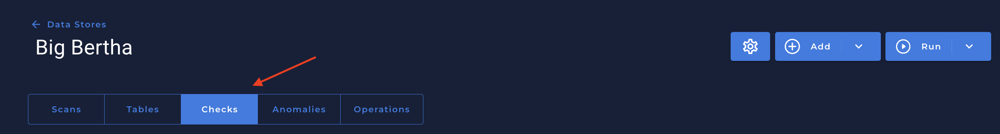
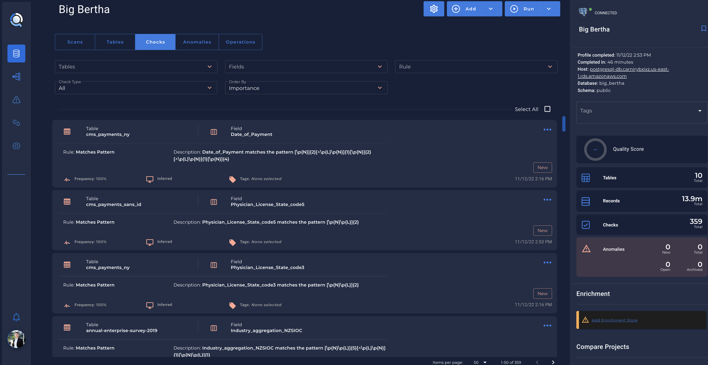

# What is?

---
Adding a Check means authoring a new data quality check from scratch. 

There are multiple types of checks that can be authored through the UI, which includes SQL and UDF (in Scala) as well.

--- 
## Checks Tab

1.  Select a `Data Store`.
2.  Click on `Checks` tab    
    
3. You are going to see all checks related to your `Data Store`   
    

---

## Add a new Data Quality `Check`

1.  After going to `Checks` tab
2.  On your right top menu, click in `Add`
    
3. Click in `Check`
4. You are going to see the `Authored Checks Details` menu
    

* In this menu you can create an `Authored Quality Check` based on your specific column/columns you want.

---
## Quality Checks Doc

* The same can be achieved through the API with passing JSON Payloads. Please refer to the API documentation on details: `acme.qualytics.io/api/docs`

    

--- 
# Rule Types & Quality Checks

 Qualytics App provides `Rule Types` & `Quality Checks` that you can to handle and manage the fields you want to have a better data quality.

 Qualytics App will create `Infered` Checks for the fields automatically, but you can create `Authored` checks as you wich based on the already listed `Rule Types`.

---
# The definitive list of rule types
 *  After Date Time: Asserts that the field is a timestamp later than a specific date and time.
                                           
*   Any Not Null: Asserts that one of the fields must not be null.
                                         
*   BeforeDateTime: Asserts that the field is a timestamp earlier than a specific date and time.

*   Between: Asserts that values are equal to or between two numbers.

*   Between Times: Asserts that values are equal to or between two dates or times.
                                       
*   Contains Credit Card: Asserts that the values contain a credit card number.
                                                  
*   Contains Email: Asserts that the values contain email addresses.
                                             
*   Contains Social Security Number: Asserts that the values contain social security numbers.
                                                            
*   Contains Url: Asserts that the values contain valid URLs.
                                                                               
*   Data Type: Asserts that the data is of a specific type.
                                        
*   Distinct: The ratio of the count of distinct values (e.g. [a, a, b] is 2/3).
                                        
*   Distinct Count: Asserts on the approximate count distinct of the given column.
                                            
*   Equal To Field:: Asserts that this field is equal to another field.
                                            
*   Expected Values: Asserts that values are contained within a list of expected values.
                                             
*   Field Count: Asserts that there must be exactly a specified number of fields.
        
*   Greater Than: Asserts that the field is a number greater than (or equal to) a value.
                                           
*   Greater Than Field: Asserts that this field is greater than another field.
                                                
*   Is Credit  Card: Asserts that the values are credit card numbers.
                                                  
*   Less Than: Asserts that the field is a number less than (or equal to) a value.
                                        
*   Less Than Field: Asserts that this field is less than another field.
                                             
*   Matches Pattern: Asserts that a field must match a pattern.
                                              
*   Max Length: Asserts that a string has a maximum length.
                                         
*   Max Value: Asserts that a field has a maximum value.
                                        
*   Min Length: Asserts that a string has a minimum length.
                                         
*   Min Partition Size: Asserts the minimum number of records that should be loaded from each file or table partition.
                                        
*   Min Value: Asserts that a field has a minimum value.
                                       
*   Not Future: Asserts that the field's value is not in the future.
                                         
*   Not Negative: Asserts that this is a non-negative number.
                                           
*   Not Null: Asserts that the field's value is not explicitly set to nothing.
                                       
*   Positive: Asserts that this is a positive number.

*   Predicted By: Asserts that the actual value of a field falls within an expected predicted range.

*   Required Fields: Asserts that all of the selected fields must be present in the data store.

*   Required Values: Asserts that all of the defined values must be present at least once within a field.
                                              
*   Satisfies Equation: Evaluates the given equation (any valid Spark SQL) for each record.
                                                 
*   Sum: Asserts that the sum of a field is a specific amount.

*   Time Distribution Size: Asserts that the count of records for each interval of a timestamp is between two numbers.

*   Unique: Asserts that the field's value is unique.
                                      
*   User Defined Function: Asserts that the given user-defined function (as scala script) evaluates to true over the field's value.