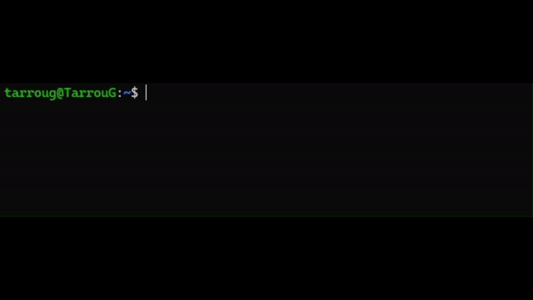
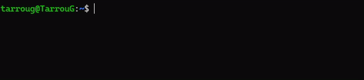
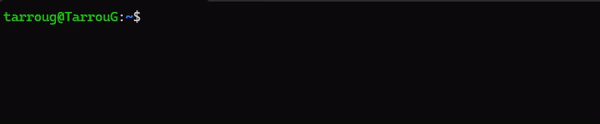
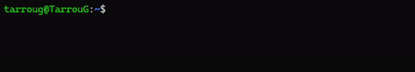
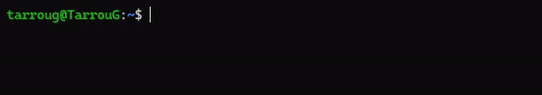

# Qualytics CLI

Qualytics CLI is a command-line tool designed to interact with the Qualytics API. With this tool, users can manage configurations, export and import checks, run operations and more.

You can check more the latest version in [Qualytics CLI](https://pypi.org/project/qualytics-cli/)

## Installation and Upgrading

You can install `Qualytics CLI` via pip:
```bash
pip install qualytics-cli
```

You can upgrade the `Qualytics CLI` via pip:

```bash
pip install qualytics-cli --upgrade
```

## Usage

### Help

To view available commands and their usage:

```bash
qualytics --help
```    

### Initializing Configuration

To set up your Qualytics URL and token:

```bash
qualytics init 
    --url "https://your-qualytics.qualytics.io/" 
    --token "YOUR_TOKEN_HERE"
```

Options:

| Option         | Type            | Description      | Default                          | Required |
|----------------|-----------------|------------------|----------------------------------|----------|
| `--url`  | TEXT         | The URL of your Qualytics instance    | None                 | Yes      |
| `--token`  | TEXT         | The personal access token for accessing Qualytics   | None | Yes      |


### Display Configuration

To view the currently saved configuration:

```bash
qualytics show-config
```

### Export Checks

To export checks to a file:

```bash
qualytics checks export 
    --datastore DATASTORE_ID [--containers CONTAINER_IDS] 
    [--tags TAG_NAMES] 
    [--output LOCATION_TO_BE_EXPORTED]
```

Options:

| Option         | Type            | Description      | Default                            | Required |
|----------------|-----------------|------------------|------------------------------------|---------|
| `--datastore`  | INTEGER         | Datastore ID     | None                               | Yes     |
| `--containers` | List of INTEGER | Containers IDs   | None                               | No      |
| `--tags`       | List of TEXT    | Tag names        | None                               | No      |
| `--output`     | TEXT            | Output file path | `$HOME/.qualytics/data_checks.json`      | No      |


### Export Check Templates

To export check templates:

```bash
qualytics checks export-templates 
    --enrichment_datastore_id ENRICHMENT_DATASTORE_ID 
    [--check_templates CHECK_TEMPLATE_IDS]
```

Options:

| Option        | Type     | Description                                                                | Default                            | Required |
|---------------|----------|----------------------------------------------------------------------------|------------------------------------|----------|
| `--enrichment_datastore_id` | INTEGER  | The ID of the enrichment datastore where check templates will be exported. | Yes      |
| `--check_templates`    | TEXT     | IDs of specific check templates to export (comma-separated or array-like).| No       |


### Import Checks

To import checks from a file:

```bash
qualytics checks import 
    --datastore DATASTORE_ID_LIST 
    [--input LOCATION_FROM_THE_EXPORT]
```

Options:

| Option       | Type | Description                                                          | Default                       | Required |
|--------------|------|----------------------------------------------------------------------|-------------------------------|----------|
| `--datastore`| TEXT | Datastore IDs to import checks into (comma-separated or array-like). | None                          | Yes      |
| `--input`    | TEXT | Input file path                                                     | HOME/.qualytics/data_checks.json | No       |


_Note_: Errors during import will be logged in `$HOME/.qualytics/errors.log`.

### Run a Catalog Operation on a Datastore

Allows you to trigger a catalog operation on any current datastore (datastore permission required by admin)

<!--  -->

```bash
qualytics run catalog 
    --datastore "DATSTORE_ID_LIST" 
    --include "INCLUDE_LIST" 
    --prune 
    --recreate 
    --background
```

Options:

| Option              | Type     | Description                                                                                                               | Required |
|---------------------|----------|---------------------------------------------------------------------------------------------------------------------------|----------|
| `--datastore`      | TEXT     | Comma-separated list of Datastore IDs or array-like format. Example: 1,2,3,4,5 or "[1,2,3,4,5]"                           | Yes      |
| `--include`        | TEXT     | Comma-separated list of include types or array-like format. Example: "table,view" or "[table,view]"                       | No       |
| `--prune`           | BOOL     | Prune the operation. Do not include if you want prune == false                                                           | No       |
| `--recreate`        | BOOL     | Recreate the operation. Do not include if you want recreate == false                                                     | No       |
| `--background`      | BOOL     | Starts the catalog but does not wait for the operation to finish                                                         | No       |


### Run a Profile Operation on a Datastore

Allows you to trigger a profile operation on any current datastore (datastore permission required by admin)

```bash
qualytics run profile 
    --datastore "DATSTORE_ID_LIST" 
    --container_names "CONTAINER_NAMES_LIST" 
    --container_tags "CONTAINER_TAGS_LIST"
    --infer_constraints 
    --max_records_analyzed_per_partition "MAX_RECORDS_ANALYZED_PER_PARTITION" 
    --max_count_testing_sample "MAX_COUNT_TESTING_SAMPLE"
    --percent_testing_threshold "PERCENT_TESTING_THRESHOLD" 
    --high_correlation_threshold "HIGH_CORRELATION_THRESHOLD" 
    --greater_then_date "GREATER_THAN_TIME"
    --greater_than_batch "GREATER_THAN_BATCH" 
    --histogram_max_distinct_values "HISTOGRAM_MAX_DISTINCT_VALUES" 
    --background
```

Options:

| Option                                 | Type     | Description                                                                                                                                      | Required |
|----------------------------------------|----------|--------------------------------------------------------------------------------------------------------------------------------------------------|----------|
| `--datastore`                          | TEXT     | Comma-separated list of Datastore IDs or array-like format. Example: 1,2,3,4,5 or "[1,2,3,4,5]"                                                  | Yes      |
| `--container_names`                    | TEXT     | Comma-separated list of include types or array-like format. Example: "container1,container2" or "[container1,container2]"                        | No       |
| `--container_tags`                     | TEXT     | Comma-separated list of include types or array-like format. Example: "tag1,tag2" or "[tag1,tag2]"                                                | No       |
| `--infer_constraints`                  | BOOL     | Infer quality checks in profile. Do not include if you want infer_constraints == false                                                           | No       |
| `--max_records_analyzed_per_partition` | INT      | Number of max records analyzed per partition                                                                                                     | No       |
| `--max_count_testing_sample`           | INT      | The number of records accumulated during profiling for validation of inferred checks. Capped at 100,000                                          | No       |
| `--percent_testing_threshold`          | FLOAT    | Percent of testing threshold                                                                                                                     | No       |
| `--high_correlation_threshold`         | FLOAT    | Number of Correlation Threshold                                                                                                                  | No       |
| `--greater_than_time`                  | DATETIME | Only include rows where the incremental field's value is greater than this time. Use one of these formats %Y-%m-%dT%H:%M:%S or %Y-%m-%d %H:%M:%S | No       |
| `--greater_than_batch`                 | FLOAT    | Only include rows where the incremental field's value is greater than this number                                                                | No       |
| `--histogram_max_distinct_values`      | INT      | Number of max distinct values of the histogram                                                                                                   | No       |
| `--background`                         | BOOL     | Starts the catalog but does not wait for the operation to finish                                                                                 | No       |

### Run a Scan Operation on a Datastore

Allows you to trigger a scan operation on a datastore (datastore permission required by admin)

<!--  -->

```bash
qualytics run scan 
    --datastore "DATSTORE_ID_LIST"
    --container_names "CONTAINER_NAMES_LIST" 
    --container_tags "CONTAINER_TAGS_LIST"
    --incremental 
    --remediation 
    --max_records_analyzed_per_partition "MAX_RECORDS_ANALYZED_PER_PARTITION" 
    --enrichment_source_records_limit
    --greater_then_date "GREATER_THAN_TIME" 
    --greater_than_batch "GREATER_THAN_BATCH" 
    --background
```

Options:

| Option                                 | Type     | Description                                                                                                                                      | Required |
|----------------------------------------|----------|--------------------------------------------------------------------------------------------------------------------------------------------------|----------|
| `--datastore`                          | TEXT     | Comma-separated list of Datastore IDs or array-like format. Example: 1,2,3,4,5 or "[1,2,3,4,5]"                                                  | Yes      |
| `--container_names`                    | TEXT     | Comma-separated list of include types or array-like format. Example: "container1,container2" or "[container1,container2]"                        | No       |
| `--container_tags`                     | TEXT     | Comma-separated list of include types or array-like format. Example: "tag1,tag2" or "[tag1,tag2]"                                                | No       |
| `--incremental`                        | BOOL     | Process only new or records updated since the last incremental scan                                                                              | No       |
| `--remediation`                        | TEXT     | Replication strategy for source tables in the enrichment datastore. Either 'append', 'overwrite', or 'none'                                      | No       |
| `--max_records_analyzed_per_partition` | INT      | Number of max records analyzed per partition. Value must be Greater than or equal to 0                                                           | No       |
| `--enrichment_source_record_limit`     | INT      | Limit of enrichment source records per . Value must be Greater than or equal to -1                                                               | No       |
| `--greater_than_date`                  | DATETIME | Only include rows where the incremental field's value is greater than this time. Use one of these formats %Y-%m-%dT%H:%M:%S or %Y-%m-%d %H:%M:%S | No       |
| `--greater_than_batch`                 | FLOAT    | Only include rows where the incremental field's value is greater than this number                                                                | No       |
| `--background`                         | BOOL     | Starts the catalog but does not wait for the operation to finish                                                                                 | No       |

_Note_: Errors during any of the three operations will be logged in `$HOME/.qualytics/operation-error.log`.

### Check Operation Status

To check the status of operations:

```bash
qualytics operation check_status 
    --ids "OPERATION_IDS"
```

<!-- 

 -->


Options:

| Option              | Type     | Description                                                                                                               | Required |
|---------------------|----------|---------------------------------------------------------------------------------------------------------------------------|----------|
| `--ids`             | TEXT     | Comma-separated list of Operation IDs or array-like format. Example: 1,2,3,4,5 or "[1,2,3,4,5]"                           | Yes      |
