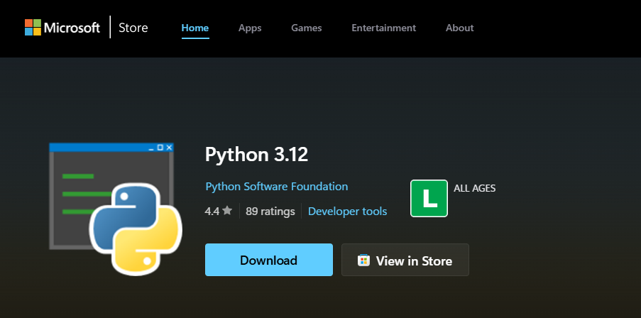
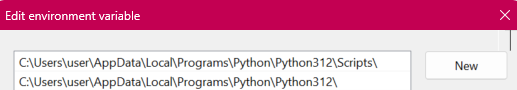

# Installing Python on Windows

Python can be installed either from the Microsoft Store or from the official website. Below are step-by-step guides for both methods, along with instructions on how to set up environment variables.

## Method 1: Installing Python from the Microsoft Store

1. Open the **Microsoft Store** on your Windows PC.


2. Search for **Python** in the search bar.
3. Look for the latest version of Python (e.g., **Python 3.x**) published by the **Python Software Foundation**.




4. Click **Install** and wait for the installation to complete.
5. Once installed, open a Command Prompt (`cmd`) and type:

```bash
python --version
```


If Python is installed correctly, it should display the installed version.

!!!info 
    Example output:
    ```bash
        C:\Users\user>python --version
        Python 3.12.0
    ```

## Method 2: Installing Python from the Official Website

1. Open a web browser and go to the official Python website: [https://www.python.org](https://www.python.org)
2. Click on **Downloads** and select **Python for Windows**.
3. Download the latest **Python 3.x** installer (64-bit recommended).
4. Run the downloaded installer.
5. **Important:** Check the box **"Add Python to PATH"** before clicking **Install Now**.
6. Wait for the installation to complete, then close the installer.
7. Verify the installation by opening a Command Prompt and typing:

```bash
python --version
```

If Python is installed correctly, it should display the installed version.

!!!info 
    Example output:
    ```bash
        C:\Users\user>python --version
        Python 3.12.0
    ```

## Setting Up Environment Variables (If Needed)

If you forgot to check "Add Python to PATH" during installation, you can manually set it up:

1. Open **File Explorer** and navigate to where Python is installed (typically `C:\Users\YourUsername\AppData\Local\Programs\Python\Python3x`).
2. Copy the path to the Python folder.
3. Press `Win + R`, type `sysdm.cpl`, and press **Enter**.
4. Go to the **Advanced** tab and click **Environment Variables**.
5. Under **System Variables**, find and select `Path`, then click **Edit**.
6. Click **New** and paste the copied Python installation path.
7. Also, add the **Scripts** folder path (e.g., `C:\Users\YourUsername\AppData\Local\Programs\Python\Python3x\Scripts`).
8. Click **OK** to save the changes and restart your computer.
9. Open Command Prompt and test by running:



If Python is installed correctly, it should display the installed version.

```bash
    python --version
```

!!!info 
    Example output:
    ```bash
        C:\Users\user>python --version
        Python 3.12.0
    ```


``` bash
    pip --version
```

!!!info 
    Example output:
    ```bash
        C:\Users\user>pip --version
        
        pip 25.0.1 from C:\Users\user\AppData\Local\Programs\Python\Python312\Lib\site-packages\pip (python 3.12)
    ```

Both should return valid version numbers, confirming that Python is set up correctly.

This guide provides a straightforward process for installing Python and configuring it properly on Windows.