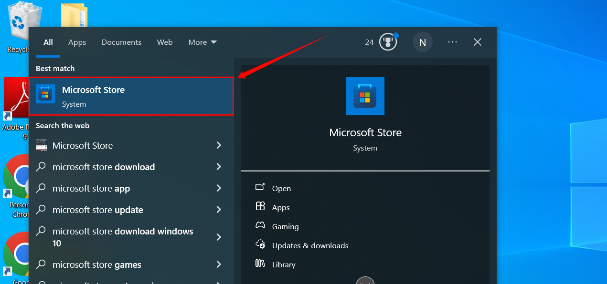

# Installing Python on Windows

Installing Python on Windows is simple and requires a compatible system, administrative access, and an internet connection. It can be installed through the Microsoft Store or the official website, with options to configure settings for seamless use. Verifying the installation ensures Python is ready for development, and setting environment variables can help with advanced tasks.

Let's get started 🚀

## Prerequisites 

Before you begin, ensure you meet the following requirements:

* **System Requirements:** Windows 7 or later with sufficient disk space.

* **Administrative Privileges:** You need admin rights to install Python and make changes to system settings.

* **Internet Connection:** A stable internet connection is required for downloading the installer.

## Method 1: Install Python from the Microsoft Store

**Step 1:** Click the Windows icon in the bottom-left corner of the screen, type **Microsoft Store** in the search bar.

**Step 2:**  Click on the Microsoft Store app to open it.

A **Microsoft Store** window will open, displaying a home screen with featured apps, games, and promotions.

**Step 3:** Click the search bar, type **Python**, and press Enter to search.

**Step 4:** A list of available Python versions appears. Select the latest version published by the Python Software Foundation to open its installation page.

**Step 5:** Click on the Python version you wish to install.

For demonstration purposes, we will install **Python 3.12**.

**Step 6:** Click the Get button to start the download and installation process.

**Step 7:** Once the download and installation are complete, click the Downloads button in the left panel of the Microsoft Store to view the downloaded application.

**Step 8:** Click the Open button next to the downloaded Python version.

 
   
**Step 9:** A modal command prompt window will open. In the command prompt, type **python --version** and press **Enter**.

If the installed Python version appears, it confirms that Python has been successfully installed on your system.

## Method 2: Installing Python from the Official Website

**Step 1:** Open a web browser and navigate to the **[Downloads for Windows section](https://www.python.org/downloads/windows/)** of the official Python website.

In the **Downloads** section, you will see different Python versions listed under **Stable Releases** and **Pre-releases**. Each version includes multiple installer options, such as:

* **Windows installer (64-bit)** – For 64-bit systems

* **Windows installer (32-bit)** – For 32-bit systems

* **Windows installer (ARM64)** – For ARM-based systems

Choose the appropriate installer based on your system requirements before proceeding with the download.

**Step 2:** Click the link to download the file. For demonstration purposes, we have selected the **Download Windows installer (64-bit)**.

**Step 3:** Locate the downloaded Python installer on your system and click to open it.

**Step 4:** Once the Python installer opens, the installation window shows two checkboxes:

* **Admin privileges:** Check the box labelled **Admin Privileges** parameter controls whether to install Python for the current or all system users. This option allows you to change the installation folder for Python.

* **Add Python to Path:** Check the box labeled Add Python to PATH important for running Python from the command line.

**Step 5:** Click **Install Now** option for the recommended installation.

Once installation is complete, you’ll see an option to Disable path length limit. Click this option if prompted, as it can prevent issues with long file paths during development.

**Step 6:** Click **Close** to exit the installer.

**Step 7**: Verify the installation by opening a Command Prompt and typing:

!!! syntax
    python --version

If Python is installed correctly, it should display the installed version:

!!! example 
    C:\Users\user\>python --version Python 3.12.4

## Setting Up Environment Variables

If the Python installer does not include the Add Python to PATH checkbox or you have not selected that option, continue in this step. Otherwise, skip these steps.

**Step 1:** Open File Explorer (Win +E) and navigate to where Python is installed. The default location is:

!!! example 
    C:\Users\win 10\AppData\Roaming\Microsoft\Windows\Start Menu\Programs\Python 3.12 

**Step 2:** Copy this path, then press **Win + R** on your keyboard, type sysdm.cpl, and press Enter.

   
**Step 3:** A modal window system properties will appear. Click on the **Advanced Tab.**

**Step 4:** Click on the Environment Variable button.

A modal window will appear. Under **System Variables**, select **Path** and click on **Edit button.**

Paste the copied Python installation path.

**Step 5**: Also, add the Scripts folder path:

!!! example
    C:\Users\YourUsername\AppData\Local\Programs\Python\Python3x\Scripts 
 

**Step 6:** Click **OK** to save the changes and restart your computer.

**Step 7:** Open the Command Prompt and type:

!!! syntax
    python --version 

If Python is installed correctly, it should display the installed version:

!!! example
    C:\Users\user\>python --version Python 3.12.4 

