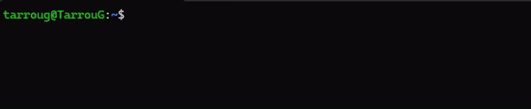

**Changes Made:**

The First part of this document will give you an overview of all the changes and what can be accomplished. The second part will be the rough draft based on that information. That section will include screenshots of the CLI working

**Operations:**

The Qualytics CLI now allows a user to run any of our operations on a created datastore. As long as the user has permission to access the datastore, they can run an operation.

*Note: Do we want to talk about what each operation does or should we have a link to an existing source explaining what each operation does. Are we going to assume a reader knows what each operation does?*

**Catalog:**

```bash
    qualytics run catalog --datastore "DATASTORE_ID'S"
```


**Profile**

```bash
    qualytics run profile --datastore "DATASTORE_IDS"
```

**Scan**

```bash
    qualytics run scan --datastore "DATASTORE_ID"
```

Check Status

This feature allows you to check the status of an operation that was triggered at some point in the past. Useful if a user triggers an operation in the background and wants to check on the status later.

```bash
    qualytics operation check_status --ids "OPERATION_IDS"
```




Profile

qualytics run profile --datastore "DATASTORE_IDS"
Other Parameters 

Parameter
Type
Description
Required
–datastore
TEXT
Comma-separated list of Datastore IDs or array-like format [default: None] 
YES
--container_names
TEXT
Comma-separated list of include types or array-like format. Example: "table,view" or "[table,view]"
NO
--container_tags
TEXT
Comma-separated list of include types or array-like format. Example: "table,view" or "[table,view]"
NO
--infer_constraints
BOOL
Infer quality checks in profile. Do not include if you want infer_constraints ==                                                                                       false
NO
--max_records_analyzed_per_partition
INT
Number of max records analyzed per partition
NO
--max_count_testing_sample
INT
The number of records accumulated during profiling for validation of inferred                                                                                          checks. Capped at 100,000
NO
--percent_testing_threshold
FLOAT
Percent of Testing Threshold
NO
--high_correlation_threshold
FLOAT
Number of Correlation Threshold
NO
--greater_than_time
DATETIME
 Only include rows where the incremental field's value is greater than this time.
NO
–greater_than_batch
FLOAT
Only include rows where the incremental field's value is greater than this number
NO
--histogram_max_distinct_values
INT
Number of max distinct values of the histogram
NO
–background
BOOL
Starts the catalog operation and has it run in the background, not having the                                                                              terminal wait for the operation to finish
NO


Scan

qualytics run scan --datastore "DATASTORE_ID"

Other Parameters

Parameter
Type
Description
Required
–datastore
TEXT
Comma-separated list of Datastore IDs or array-like format [default: None] 
YES
--container_names
TEXT
Comma-separated list of include types or array-like format. Example: "table,view" or "[table,view]"
NO
--container_tags
TEXT
Comma-separated list of include types or array-like format. Example: "table,view" or "[table,view]"
NO
--incremental
BOOL
Process only new or records updated since the last incremental scan
NO
–remediation
TEXT
Process only new or records updated since the last incremental scan                                               Replication strategy for source tables in the enrichment datastore. Either                                                                                        'append', 'overwrite', or 'none'
NO
--max_records_analyzed_per_partition
INT
Number of max records analyzed per partition
NO
--enrichment_source_record_limit


INT
Limit of enrichment source records per . Value must be Greater than or equal to                                                                                   -1
NO
--greater_than_time
DATETIME
 Only include rows where the incremental field's value is greater than this time.
NO
–greater_than_batch
FLOAT
Only include rows where the incremental field's value is greater than this number
NO
–background
BOOL
Starts the catalog operation and has it run in the background, not having the                                                                              terminal wait for the operation to finish
NO

Check Status
This feature allows you to check the status of an operation that was triggered at some point in the past. Useful if a user triggers an operation in the background and wants to check on the status later. 

qualytics operation check_status --ids "OPERATION_IDS"

Parameter
Type
Description
Required
–ids
TEXT
Comma-separated list of Operation IDs or array-like format
YES


Above are all the updates done in regards to operation. Below will be the rough draft with photos and whatnot. 


BLOG POST ROUGH DRAFT
Title: The Qualytics CLI Workflow
Link to python package: qualytics-cli
Intro Paragraph
We’re excited to announce that Qualytics now has a command line interface, offering a new workflow for your data quality monitoring. We wanted to provide users with another approach to their data quality that doesn’t involve navigating a user interface. We recognize that everyone has a different preference on how to perform their data quality monitoring and Qualytics wants to provide you with as many approaches as possible for data quality monitoring.     

Initializing the Qualytics CLI
When a user wants to use the CLI with their Qualytics instance, they must first do a quick configuration. All they need is to have their company's Quaytics URL and one of their personal tokens. Then you can run the following command to have the CLI ready to go. 

qualytics init --url "YOUR_URL" --token "YOUR_TOKEN"
  
Triggering an Operation VIA the CLI
The Qualytics CLI now allows a user to trigger any one of our operations on a connected datastore, providing an easy way to check your company's data quality at a moment's notice. No longer does an operation have to be triggered through the UI, but can be done at a moment's notice through your command line.

 
The command line offers all the same parameters as our user interface such as listing the container names for a profile or having a scan be incremental. Lastly, if you want to start an operation, but not having your command line waiting for the operation to finish, you can use the
–background parameter to trigger an operation without waiting for it to finish. This is especially useful because if your datastore possesses a huge quantity of data and operations take a long time to finish, your terminal will not be clogged by the Qualytics CLI.    

Check Operation Status
The Qualytics CLI also allows you to check the status of any operation that was triggered. If you triggered an operation to run in the background and want to see its status, just run this simple command to find out. The Qualytics CLI will report the correct status of the triggered operation, even if the operation failed or was aborted.  


Closing Paragraph
By leveraging the Qualytics CLI, we’re providing companies with another pipeline to their data quality governance pipeline. No longer does one have to use the user interface to accomplish their goals, but can use the Qualytics CLI to get the same end results. At the same time, Qualytics is committed to improving and expanding the CLI’s capabilities to provide the user with the smoothest experience in their data quality governance goals. 
To learn more about the full feature list of the Qualytics CLI, you can visit the pypi package page here: qualytics-cli. 
