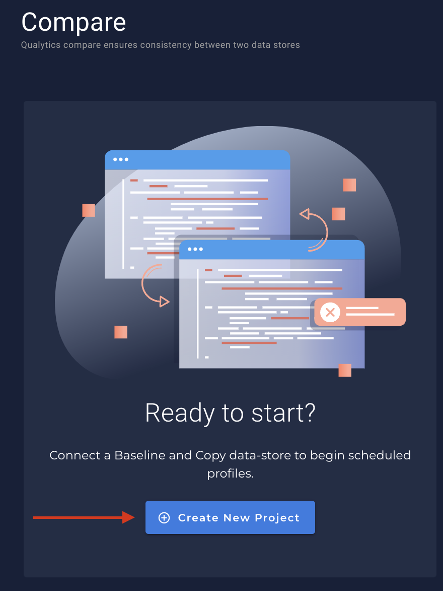
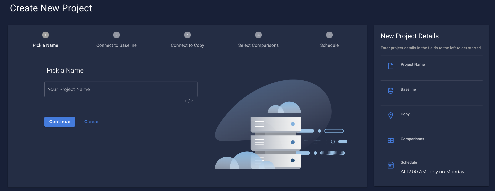
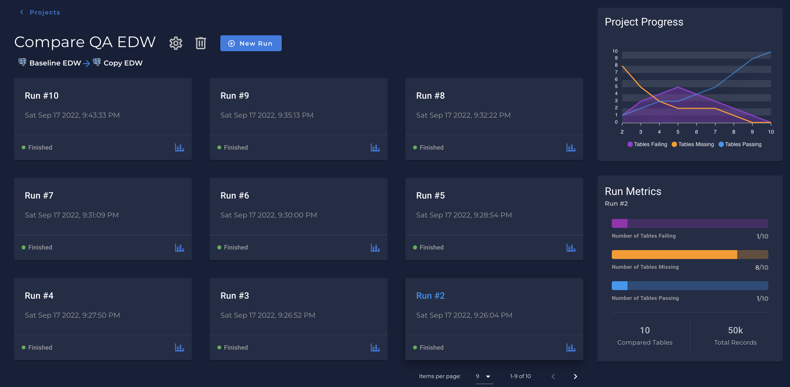
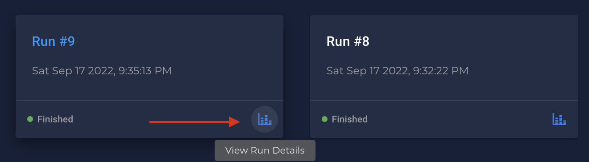
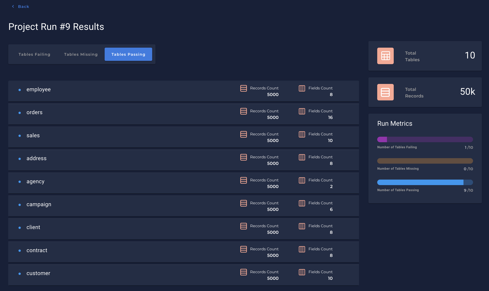
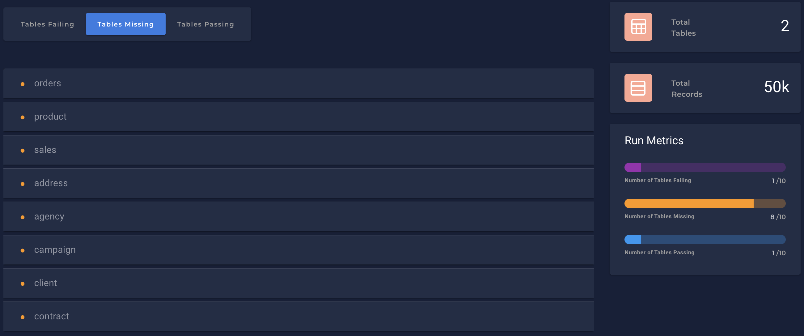
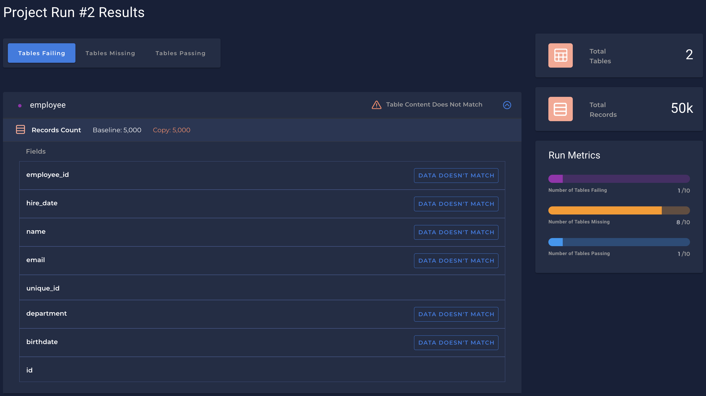
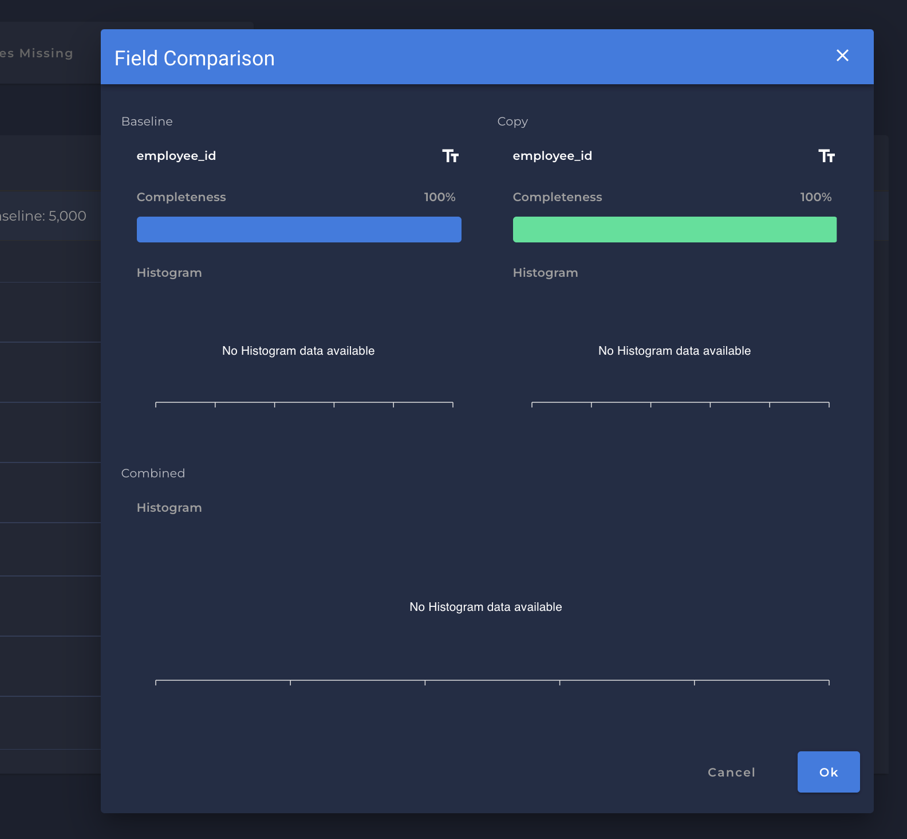

# Creating a new Compare Project

* In the `Compare` screen, you can see a button `Create a new Project`
    - {: style="width:360px"}

* Once you have clicked to create a new `Compare` project a new screen will show up to you:
    - 

* This will walk the user through the data store configurations and which fields should be compared. 

!!! note 
    Once configuration is completed, you can create new Comparison runs, where data stores are compared to each other with a snapshot in time

* You can see more details of each run clicking in `View Run Details` button.

* Each Run will highlight a few details:
    * `Tables Passing`.
    * `Tables Missing`.
    * `Tables Failing`.

---

# Tables Passing 

* Highlights which tables and underlying data were equivalent between the two.

# Tables Missing

* Exist on the Baseline data store, but are missing from the Copy data store.

# Tables Failing

* Exist on the Baseline data store, but are missing from the Copy data store.

* You can see more details of the field when clicking in `Data doesn't match` button.

