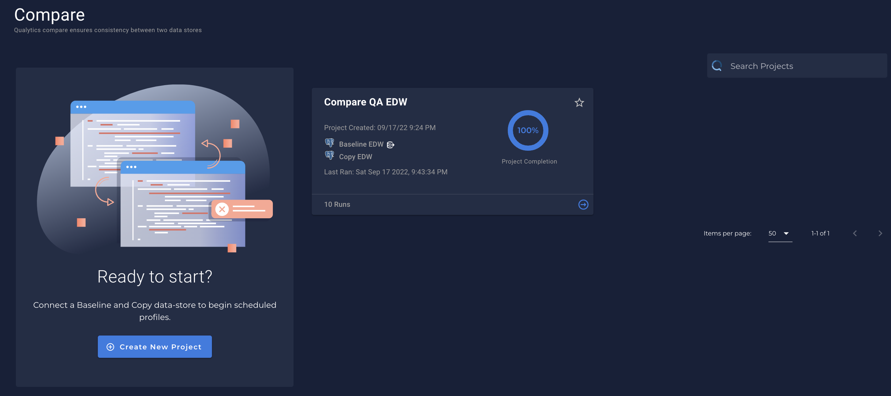

# What is a Compare?

* Often, data quality teams need a capability to compare two data stores to each other for data validation purposes, specifically for raw data equivalency. Qualytics offers this capability through `Compare`.

---

* You can find the `Compare` section clicking in `Settings` in the menu bar:
    - {: style="height:450px"}

* Once clicked in `Settings` you can see the `Compares` screen:
    - 
