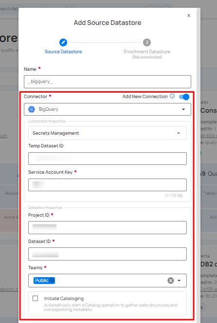
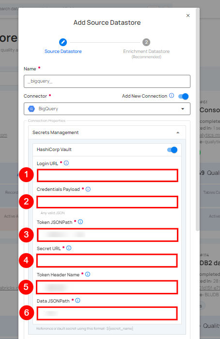
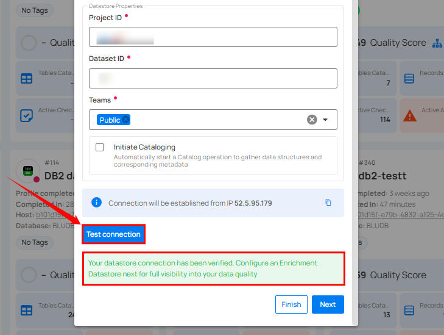
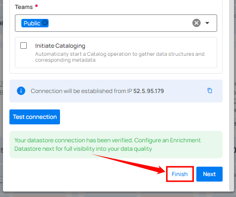
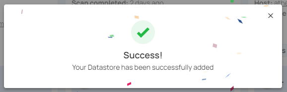
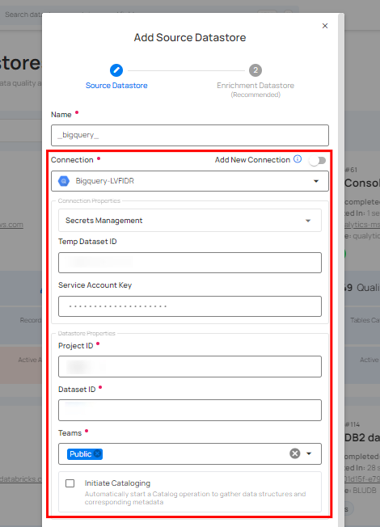

# Connections Overview

In Qualytics, setting up datastore connections is simple and efficient. Enter the necessary details like datastore name, connector, and authentication credentials to connect your datastores. You can also enable **Secrets Management** for secure credential handling with HashiCorp Vault.

Once verified, the **Reuse Connection** feature lets you use existing credentials for future datastores, saving time and ensuring consistency. Manage your connections easily by adding, editing, or deleting datastores as needed.

## Setup a Connection

To configure a datastore connection in Qualytics, begin by entering the required details such as the datastore name, connector, and authentication credentials. Optionally, enable **Secrets Management** for secure credential handling. Once the connection is tested and confirmed, your datastore will be set up and ready for use.

**Step 1:** Log in to your Qualytics account and click on the **Add Source Datastore** button located at the top-right corner of the interface.

**Step 2:** A modal window - **Add Datastore** will appear, providing you with the options to connect a datastore.

| REF. |                    FIELDS |                              ACTIONS |
| :---- | :---- | :---- |
| 1. | Name (Required) | Specify the name of the datastore (e.g., the specified name will appear on the datastore cards.) |
| 2. | Toggle Button | Toggle **ON** to create a new source datastore from scratch. |
| 3. | Connector (Required) | Select a connector from the drop-down list. |

For demonstration purposes, we have selected the **BigQuery Connector**.

**Step 3:** Add connection details such as temp dataset ID, service account key, project ID, and dataset ID.

**Secrets Management:** This is an optional connection property that allows you to securely store and manage credentials by integrating with HashiCorp Vault and other secret management systems. Toggle it **ON** to enable Vault integration for managing secrets.

!!! note 
	After configuring HashiCorp Vault integration, you can use ${key} in any connection property to reference a key from the configured Vault secret. Each time the connection is initiated, the corresponding secret value will be retrieved dynamically. 

| REF |            FIELDS |                    ACTIONS |
| :---- | :---- | :---- |
| 1. | Login URL | Enter the URL used to authenticate with HashiCorp Vault. |
| 2. | Credentials Payload | Input a valid JSON containing credentials for Vault authentication. |
| 3. | Token JSONPath | Specify the JSONPath to retrieve the client authentication token from the response (e.g., $.auth.client\_token). |
| 4. | Secret URL | Enter the URL where the secret is stored in Vault. |
| 5. | Token Header Name | Set the header name used for the authentication token (e.g., X-Vault-Token). |
| 6. | Data JSONPath | Specify the JSONPath to retrieve the secret data (e.g., $.data). |

**Step 4:** The configuration form requests credential details before establishing a connection.

!!! note 
	Different connectors have unique fields and parameters. For this demonstration, we have selected the BigQuery Connector, so the fields displayed are specific to the BigQuery configuration. 

| REF. |             FIELDS |                ACTIONS |
| :---- | :---- | :---- |
| 1. | Temp Dataset ID (Optional) | Enter a temporary dataset ID for intermediate data storage during BigQuery operations. |
| 2. | [Service Account Key](https://cloud.google.com/iam/docs/keys-create-delete) (Required) | Upload a JSON file that contains the credentials required for accessing BigQuery. |
| 3. | [Project ID](https://support.google.com/googleapi/answer/7014113?hl=en&ref_topic=7014522) (Required) | Enter the Project ID associated with BigQuery. |
| 4. | Dataset ID (Required) | Enter the Dataset ID (schema name) associated with BigQuery. |
| 5. | Teams (Required) | Select one or more teams from the dropdown to associate with this source datastore. |
| 6. | Initiate Cataloging (Optional) | Tick the checkbox to automatically perform a catalog operation on the configured source datastore to gather data structures and corresponding metadata. |

**Step 5:** After adding the source datastore details, click on the **Test Connection** button to check and verify its connection.

If the credentials and provided details are verified, a success message will be displayed indicating that the connection has been verified.

**Step 6:** Once the connection is verified, click the **Finish** button to complete the process.

**Step 7:** A message will appear indicating that **your datastore has been successfully added**. Once the datastore is added, you can reuse the connection for future tasks without needing to re-enter the details.

## Reuse a Connection

The **Reuse Connection** feature lets you use existing credentials to set up a new datastore, saving time and ensuring consistency in your Qualytics account. Simply toggle the option to reuse credentials instead of entering new ones.

**Step 1:** Log in to your Qualytics account and click on the **Add Source Datastore** button located at the top-right corner of the interface.

**Step 2:** A modal window - **Add Datastore** will appear, providing you with the options to connect a datastore.

| REF. |                    FIELDS |                              ACTIONS |
| :---- | :---- | :---- |
| 1. | Name (Required) | Specify the name of the datastore (e.g., the specified name will appear on the datastore cards). |
| 2. | Toggle Button | Toggle **OFF** to reuse credentials from an existing connection. |
| 3. | Connector (Required) | Select a connector from the drop-down list. |

For demonstration purposes, we have selected the **BigQuery Connector**.

**Step 3:** Add connection details such as temp dataset ID, service account key, project ID, and dataset ID.

**Step 4:** Click on the **Test Connection** button to verify the existing connection details. If connection details are verified, a success message will be displayed.

**Step 5:** Once the connection is verified, click the **Finish** button to complete the process.

A message will appear indicating that **your datastore has been successfully added**. 

## Manage Connection

You can effectively manage your connections by editing, deleting, and adding datastores to maintain accuracy and efficiency.

For more information on managing connections, refer to the [Manage Connection section](../settings/connections/manage-connections.md#manage-connection).

## Conclusion

Using Connections optimizes datastore management by enabling the reuse of connection parameters, making the process more streamlined and organized.