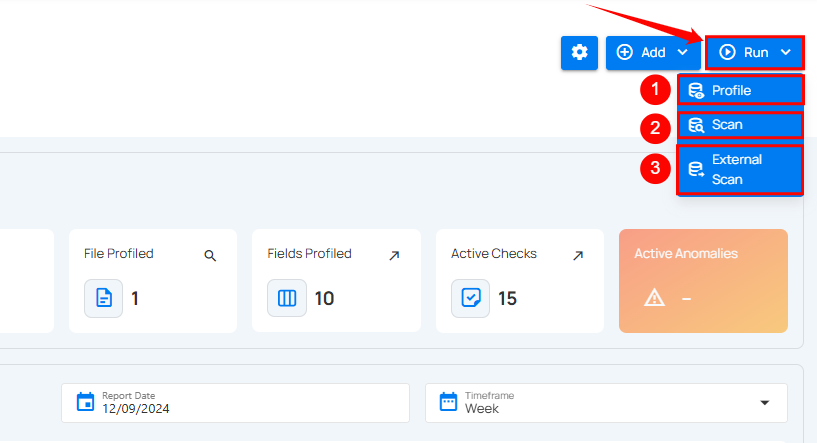

# Actions on Container

Users can perform various operations on containers to manage datasets effectively. The actions are divided into three main sections: **Settings**, **Add**, and **Run**. Each section contains specific options to perform different tasks.

## Settings

The **Settings** button allows users to configure the container. By clicking on the **Settings** button, users can access the following options:

| No. |           Options |                                Description |
| :---- | :---- | :---- |
| **1.** |        Settings | Configure incremental strategy, partitioning fields, and exclude specific fields from analysis. |
| **2.** |         Score | Score allowing you to adjust the decay period and factor weights for metrics like completeness, accuracy, and consistency. |
| **3.** |     Observability | Enables or disables tracking for data volume and freshness. **Volume Tracking:** Monitors daily volume metrics to identify trends and detect anomalies over time. **Freshness Tracking:** Records the last update timestamp to ensure data timeliness and detect pipeline delays. |
| **4.** | Migrate | Migrate authored quality checks from one container to another (even across datastores) to quickly reuse, standardize, and avoid recreating rules. |
| **5.** |         Export | Export quality checks, field profiles, and anomalies to an enrichment datastore for further action or analysis. |
| **6.** |         Materialize | Captures snapshots of data from a source datastore and exports it to an enrichment datastore for faster access and analysis. |
| **7.** |         Delete | Delete the selected container from the system. |

## Add

The **Add** button allows users to add checks or computed fields. By clicking on the **Add** button, users can access the following options:

| No. | Options | Description |
| :---- | :---- | :---- |
| **1.** | Checks | Checks allow you to add new checks or validation rules for the container. |
| **2.** | Computed Field | Allows you to add a computed field. |

## Run

The **Run** button provides options to execute operations on datasets, such as profiling, scanning, and external scans. By clicking on the **Run** button, users can access the following options:

| No. |          Options | Descriptions |
| :---- | :---- | :---- |
| **1.** | Profile | **Profile** allows you to run a profiling operation to analyze the data structure, gather metadata, set thresholds, and define record limits for comprehensive dataset profiling. |
| **2.** | Scan  | **Scan** allows you to perform data quality checks, configure scan strategies, and detect anomalies in the dataset. |
| **3.** | External Scan | **External Scan** allows you to upload a file and validate its data against predefined checks in the selected table. |