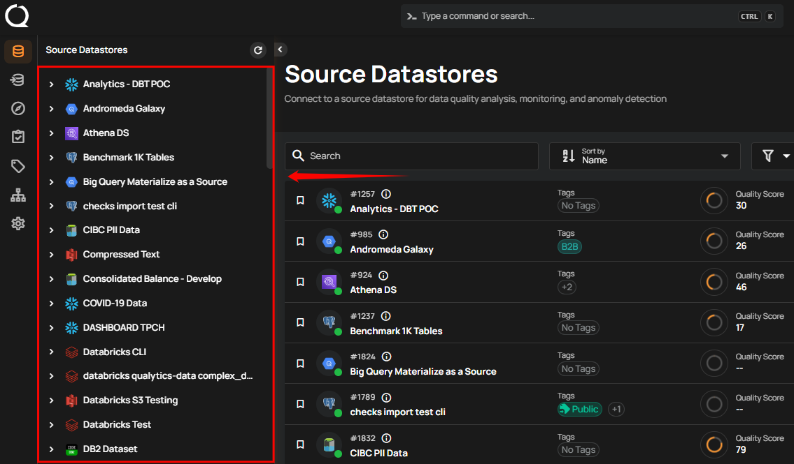
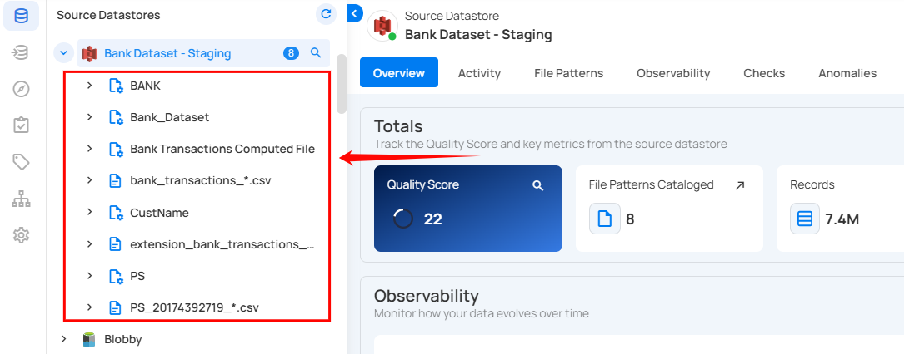
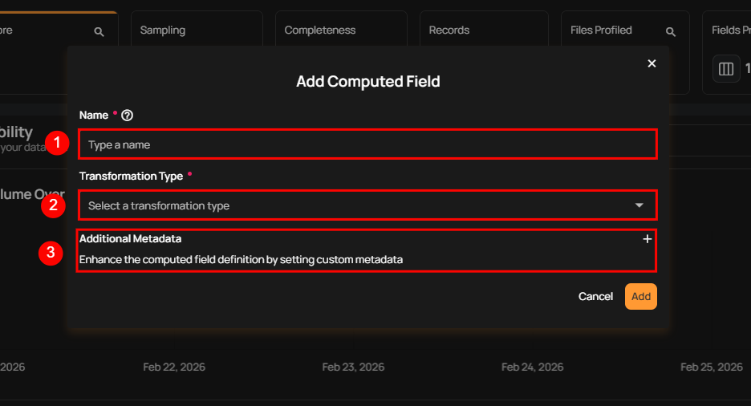
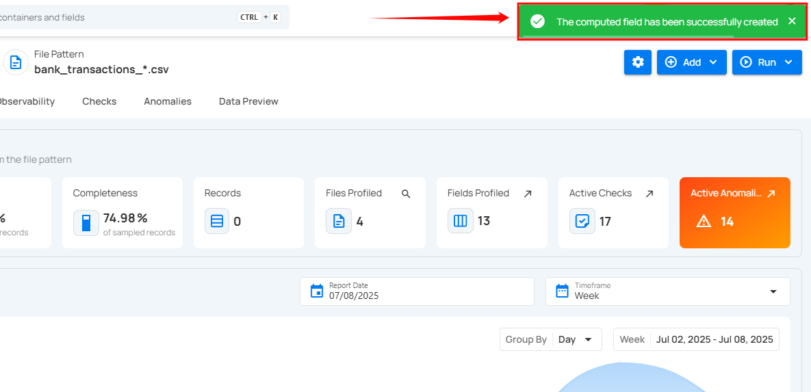
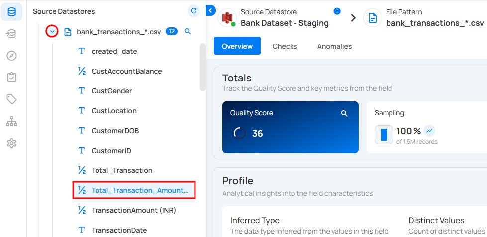

# Add Computed Fields

**Step 1:** Log in to Your Qualytics Account, navigate to the side menu, and select the **source datastore** where you want to create a computed field.

**Step 2:** Select the **Container** within the chosen datastore where you want to create the computed field. This container holds the data to which the new computed field will be applied, enabling you to enhance your data analysis within that specific datastore.

For demonstration purposes, we have selected the **Bank Dataset-Staging** source datastore and the **bank_transactions_.csv** container within it to create a computed field.

**Step 3:** After selecting the container, click on the **Add** button and select **Computed Field** from the dropdown menu to create a new computed field. 

A modal window will appear, allowing you to enter the details for your computed field. 

**Step 4:** Enter the **Name** for the computed field, select **Transformation Type** from the dropdown menu, and optionally add **Additional Metadata**.

| REF. | FIELDS | ACTION |
|------|--------|--------|
| 1. | Field Name (Required) | Add a unique name for your computed field. |
| 2. | Transformation Type (Required) | The type of transformation you want to apply from the available options. |
| 3. | Additional Metadata (Optional) | Enhance the computed field definition by setting custom metadata. Click the plus icon **(+)** to open the metadata input form and add key-value pairs. |

!!! info
    Transformations are changes made to data, like converting formats, doing calculations, or cleaning up fields. In Qualytics, you can use transformations to meet specific needs, such as cleaning entity names, converting formatted numbers, or applying custom expressions. With various transformation types available, Qualytics enables you to customize your data directly within the platform, ensuring it’s accurate and ready for analysis.

| Transformation Types | Purpose | Reference |
|------|--------|---------|
| Cleaned Entity Name | Removes business signifiers (such as 'Inc.' or 'Corp') from an entity name. | [See here](../computed-fields/transformation-types.md#cleaned-entity-name) |
| Convert Formatted Numeric | Removes formatting (such as parentheses for denoting negatives or commas as delimiters) from values that represent numeric data, converting them into a numerically typed field. | [See here](../computed-fields/transformation-types.md#convert-formatted-numeric) |
| Custom Expression | Allows you to create a new field by applying any valid Spark SQL expression to one or more existing fields. | [See here](../computed-fields/transformation-types.md#custom-expression) |

**Step 5:** After selecting the appropriate **Transformation Type**, click the **Save** button.

**Step 6:** After clicking on the **Save** button, your computed field is created and a success flash message will display saying **The computed field has been successfully created**.

You can find your computed field by clicking on the dropdown arrow next to the container you selected when creating the computed field.

