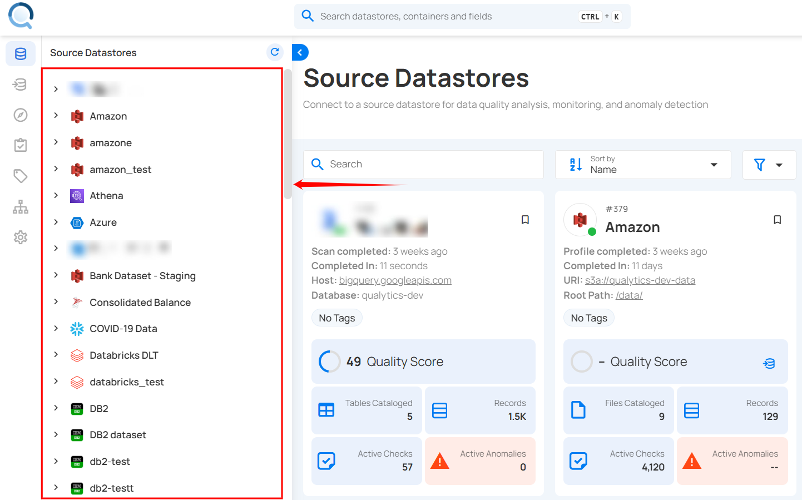
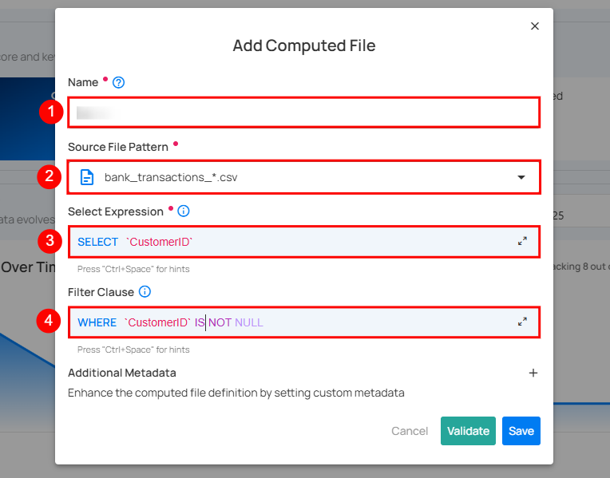
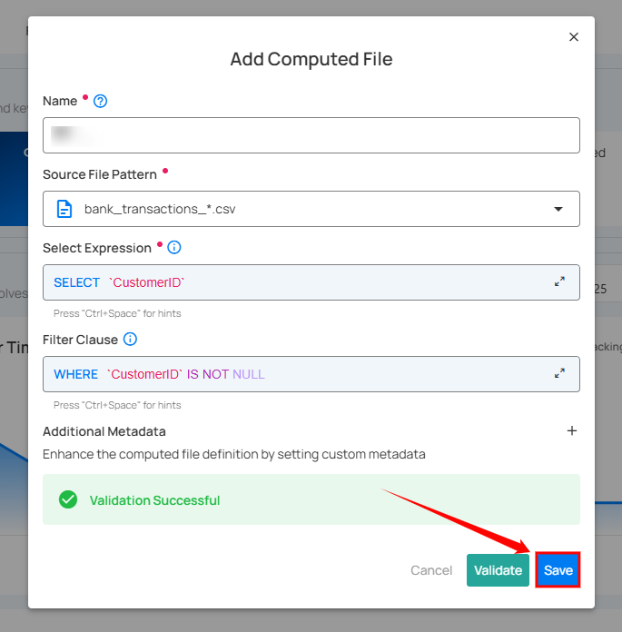

# Computed Files

Use Computed Files when you want to perform the following operations on your selected source datastore:

-  Data Preparation and Transformation: Efficiently clean and restructure raw data stored in a DFS.
-  Column-Level Transformations: Utilize Spark SQL functions to manipulate and clean individual columns.
-  Filtering Data: Extract specific data subsets within a DFS container using Spark SQL's WHERE clause.

## Add Computed Files

**Step 1:** Log in to your Qualytics account and select a DFS-type source datastore from the side menu on which you would like to add a computed file.

**Step 2:** After clicking on your preferred source datastore, you will be redirected to the source datastore operations page. From this page, click on the **Add** button and select the **Computed File** option from the dropdown menu.

**Step 3:** A modal window will appear prompting you to enter a name for your computed file, select a source file pattern, choose the expression, and optionally define a filter clause and add additional metadata.

| REF. | FIELDS  | ACTION  |
|------|----------------------------|---------------------------------------|
| 1.   | Name (Required) | Enter a name for your computed file. The name should be descriptive and meaningful to help you easily identify the file later (e.g., add a meaningful name like Customer_Order_Statistics). |
| 2.   | Source File Pattern (Required) | Select a source file pattern from the dropdown menu to match files that have a similar naming convention. |
| 3.   | Select Expression (Required)  | Select the expression to define the data you want to include in the computed file. |
| 4.   | Filter Clause (Optional)   | Add a WHERE clause to filter the data that meets certain conditions. |
| 5.   | Additional Metadata (Optional)   | Enhance the computed file definition by setting custom metadata. Click the plus icon **(+)** next to this section to open the metadata input form, where you can add key-value pairs. |

**Step 4:** Click on the **Validate** button to quickly check your query or expression before saving.

**Step 5:** Once validation is successful, click on the **Save** button to add the computed file to your selected source datastore.

After clicking the **Save** button, a success notification appears on the screen showing the action was completed successfully.