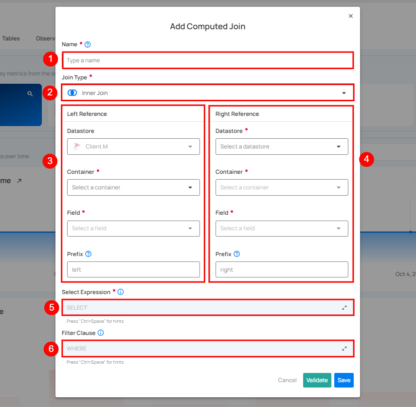

# Computed Join

A Computed Join Container allows you to combine data from two containers, which can be from the same source datastore or different source datastores (e.g., a database table vs. a file system container). You can choose the join type (Inner, Left, Right, or Full Outer) and apply transformations, filters, and custom queries to the joined result.

This feature is useful when you want to:

* Merge information from multiple source datastores into a single dataset.

* Perform cross-datastore analysis (e.g., JDBC tables with DFS files).

* Apply Spark SQL transformations and filters on top of the joined data.

Let's get started 🚀

!!! note
    Computed Join only supports base containers (physical tables, views, or files). Computed Tables and Computed Files cannot be used as join inputs.

## How It Works

The Add Computed Join form consists of:

| REF. | FIELDS  | DESCRIPTION  |
|------|----------------------------|---------------------------------------|
| 1 | **Name**               | The unique name for your computed join container.                                                                                                          |
| 2 | **Join Type**          | Choose one of the following:<br>• **Inner Join**: Keeps only rows with matching keys in both containers.<br>• **Left Join**: Keeps all rows from the left container, matching rows from the right.<br>• **Right Join**: Keeps all rows from the right container, matching rows from the left.<br>• **Full Outer Join**: Keeps all rows from both containers. |
| 3 | **Left Reference**     | • **Datastore**: Source datastore where the computed join container will be created.<br>• **Container**: The left container to join.<br>• **Field**: The key (column) to join on.<br>• **Prefix**: A label (e.g., `left`) applied to all columns from this container. |
| 4 | **Right Reference**    | • **Datastore**: Source datastore containing the second container.<br>• **Container**: The right container to join.<br>• **Field**: The key (column) to join on.<br>• **Prefix**: A label (e.g., `right`) applied to all columns from this container. |
| 5 | **Select Expression**  | A list of columns to include in the result. Columns are automatically prefixed (e.g., `left_name`, `right_name`) to avoid conflicts.                         |
| 6 | **Filter Clause (WHERE)** | Additional filters applied to the join result.                                                                                                            |



## Example Use Case

**Scenario**

We want to join:

* **Left Container**: customers
* **Right Container**: orders
* **Join Key**: customer_id
* **Join Type**: Left Join
* **Prefixes**: cust_ and order_

### Input Tables

#### customers

| customer_id | name   | city   |
|-------------|--------|--------|
| 1           | Alice  | Berlin |
| 2           | Bob    | London |
| 3           | Charlie| Paris  |

#### orders

| order_id | customer_id | product  |
|----------|-------------|----------|
| 101      | 1           | Laptop   |
| 102      | 1           | Mouse    |
| 103      | 2           | Keyboard |

---

#### Joined Result (Left Join)

| cust_customer_id | cust_name | cust_city | order_order_id | order_product |
|------------------|-----------|-----------|----------------|---------------|
| 1                | Alice     | Berlin    | 101            | Laptop        |
| 1                | Alice     | Berlin    | 102            | Mouse         |
| 2                | Bob       | London    | 103            | Keyboard      |
| 3                | Charlie   | Paris     | NULL           | NULL          |

---

### Visual Diagram

```text

+------------+                 +--------+
| customers  |    LEFT JOIN    | orders |
+------------+ <-------------> +--------+
    |                               |
    +-- customer_id = customer_id --+

```
## API Example

### Endpoint

**POST:**`/api/containers` 

**Expected response:** `200 OK`

---

=== "Request Payload"
    ```json
    {
        "container_type": "computed_join",
        "name": "customer_orders_join",
        "select_clause": "cust_customer_id, cust_name, cust_city, order_order_id, order_product",
        "where_clause": null,
        "left_join_field_name": "customer_id",
        "left_prefix": "cust",
        "right_join_field_name": "customer_id",
        "right_prefix": "order",
        "join_type": "left",
        "left_container_id": 101,
        "right_container_id": 202
    }
    ```
## Tips

* Always set prefixes to avoid column name collisions.
* Use Select Expression to choose only the columns you need.
* Apply a Filter Clause for better performance by reducing unnecessary data.
* Test the join type with sample data to verify expected behavior.

## Limitations

### Computed Tables and Computed Files Cannot Be Used as Inputs

Computed Join only accepts **base containers** as inputs—these are physical tables, views, or files that exist in your datastore catalog. You cannot select a Computed Table or Computed File as the left or right reference in a Computed Join.

#### Why This Limitation Exists

Computed Join is built to work with containers that have specific characteristics:

| Requirement | Why It Matters |
|-------------|----------------|
| **Cataloged in the datastore** | The container must have a stable identifier that Qualytics can discover and reference. |
| **Predictable load behavior** | Base containers support partitioning, incremental identifiers, and sampling—features that Computed Join relies on for efficient execution. |
| **Schema metadata available** | Qualytics needs to profile and understand the structure of the containers being joined. |
| **Deterministic execution** | The join must produce consistent results when re-run, which requires stable source objects. |

Computed Tables and Computed Files are internal Qualytics assets. They are not exposed as queryable objects in your data warehouse or DFS, which means they cannot be discovered, profiled, or loaded in the same way as base containers.

Additionally, allowing computed assets as join inputs would introduce complex dependency management:

* **Dependency ordering**: If Computed Join B depends on Computed Table A, which depends on base table X, Qualytics would need to manage this execution chain.
* **Incremental processing**: Determining the correct watermark for incremental loads across dependent assets is complex.
* **Failure handling**: Retries and error recovery become more complicated when multiple dependent assets are involved.

### Workarounds

If you need to join derived datasets, you have two main options:

#### Option 1: Build the Join as a Computed Table

Instead of using Computed Join, define your join logic directly in a Computed Table using SQL:

```sql
WITH customers_filtered AS (
    SELECT customer_id, name, city
    FROM customers
    WHERE status = 'active'
),
orders_recent AS (
    SELECT order_id, customer_id, product
    FROM orders
    WHERE order_date >= '2024-01-01'
)
SELECT
    c.customer_id,
    c.name,
    c.city,
    o.order_id,
    o.product
FROM customers_filtered c
LEFT JOIN orders_recent o ON c.customer_id = o.customer_id
```

This approach lets you combine filtering, transformations, and joins in a single query.

#### Option 2: Materialize Intermediate Results in Your Data Warehouse

If you need to reuse intermediate datasets across multiple contexts:

1. Create the intermediate result as a view or table in your data warehouse (using your warehouse's SQL interface, dbt, or another ETL tool).
2. Catalog that view or table in Qualytics as a base container.
3. Use the cataloged container as an input to your Computed Join.

This works because the materialized result becomes a first-class object in your datastore that Qualytics can discover, profile, and join like any other base container.
