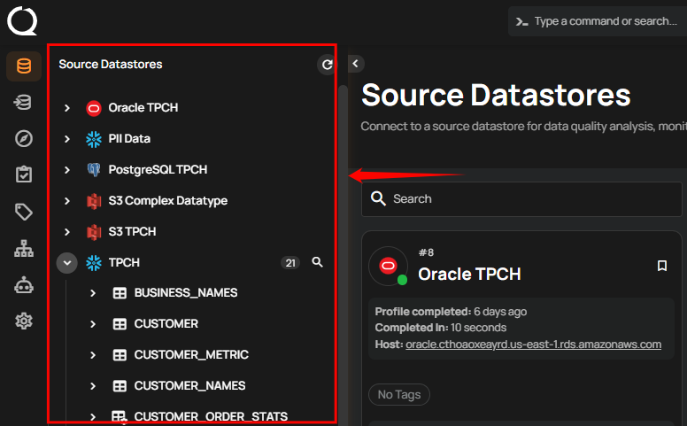
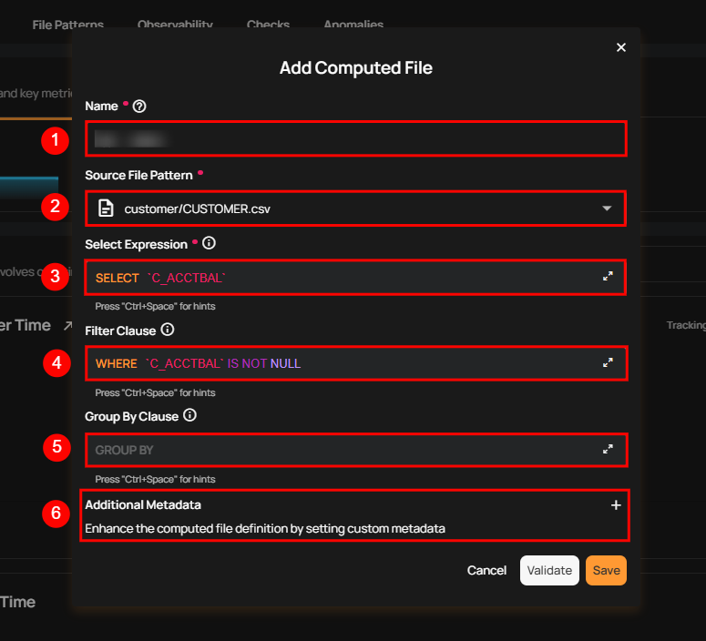
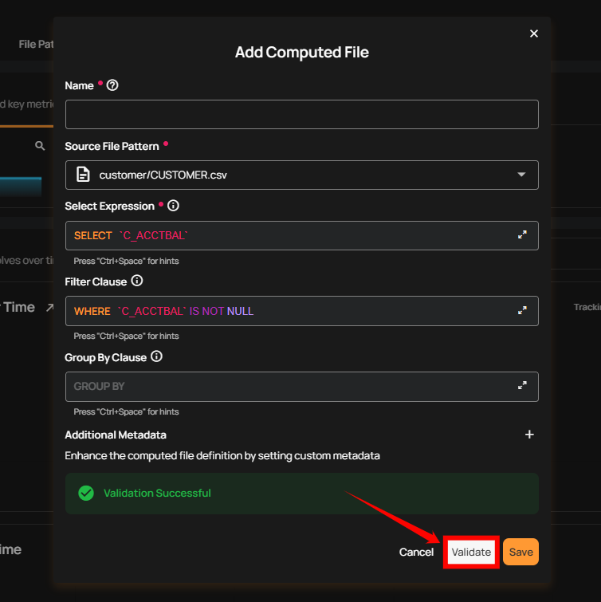
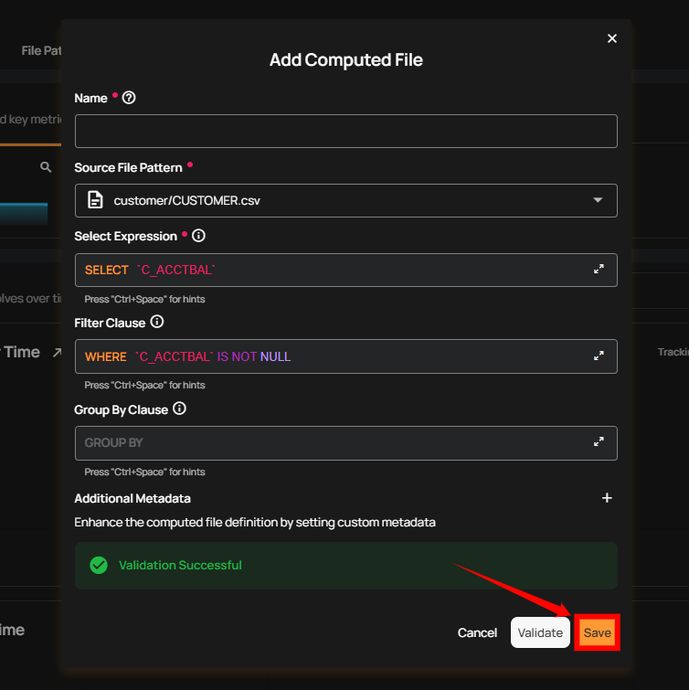

# Computed Files

Use Computed Files when you want to perform the following operations on your selected source datastore:

-  Data Preparation and Transformation: Efficiently clean and restructure raw data stored in a DFS.
-  Column-Level Transformations: Utilize Spark SQL functions to manipulate and clean individual columns.
-  Filtering Data: Extract specific data subsets within a DFS container using Spark SQL's WHERE clause.

!!! note 
    Computed Files can only reference base files from the datastore. They cannot reference other Computed Files or be used as inputs to Computed Joins.

## Add Computed Files

**Step 1:** Log in to your Qualytics account and select a DFS-type source datastore from the side menu on which you would like to add a computed file.

**Step 2:** After clicking on your preferred source datastore, you will be redirected to the source datastore operations page. From this page, click on the **Add** button and select the **Computed File** option from the dropdown menu.

**Step 3:** A modal window will appear prompting you to enter a name for your computed file, select a source file pattern, choose the expression, and optionally define a filter clause and add additional metadata.

| REF. | FIELDS  | ACTION  |
|------|----------------------------|---------------------------------------|
| 1   | Name (Required) | Enter a name for your computed file. The name should be descriptive and meaningful to help you easily identify the file later (e.g., add a meaningful name like Customer_Order_Statistics). |
| 2   | Source File Pattern (Required) | Select a source file pattern from the dropdown menu to match files that have a similar naming convention. |
| 3   | Select Expression (Required)  | Select the expression to define the data you want to include in the computed file. |
| 4   | Filter Clause (Optional)   | Add a WHERE clause to filter the data that meets certain conditions. |
| 5   | Additional Metadata (Optional)   | Enhance the computed file definition by setting custom metadata. Click the plus icon **(+)** next to this section to open the metadata input form, where you can add key-value pairs. |

**Step 4:** Click on the **Validate** button to quickly check your query or expression before saving.

**Step 5:** Once validation is successful, click on the **Save** button to add the computed file to your selected source datastore.

After clicking the **Save** button, a success notification appears on the screen showing the action was completed successfully.

## Limitations

### Referencing Other Computed Files

A computed file cannot directly reference another computed file in its expression. This is similar to how computed tables work—the computed file is defined within Qualytics but is not created as an actual file or dataset in your DFS datastore that can be queried by name.

### Workarounds

If you need to combine data from multiple sources:

#### Option 1: Combine Logic in a Single Computed File

If your transformations can be expressed as a single query, use the Select Expression and Filter Clause to perform all necessary operations on the source file pattern directly.

#### Option 2: Materialize Intermediate Results

If you need to chain transformations:

1. Create the intermediate result as an actual file in your DFS (using your data pipeline tools).
2. Catalog that file in Qualytics.
3. Use the cataloged file as the source for your computed file.

### Using Computed Files in Computed Joins

Computed files cannot be used as inputs in a Computed Join. Computed Joins are designed to work with base containers only—physical tables, views, or files that exist in your datastore catalog. For more details, see the [Computed Join](../computed-join.md#limitations) documentation.
