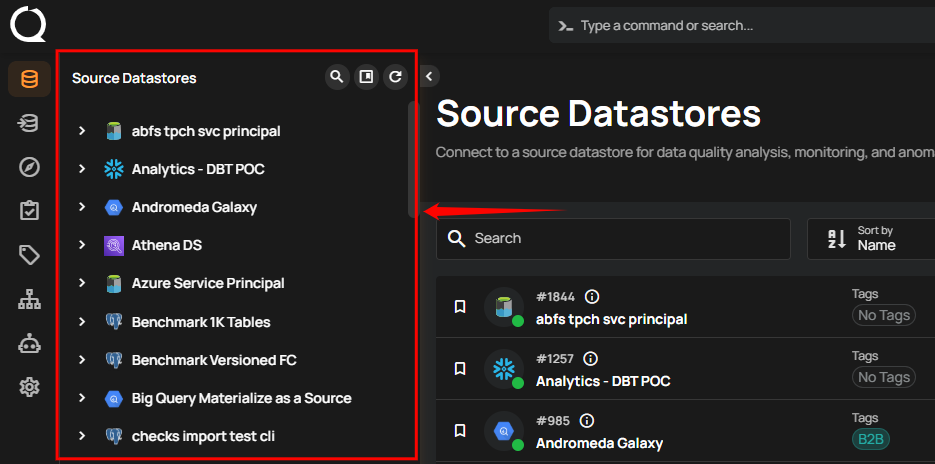
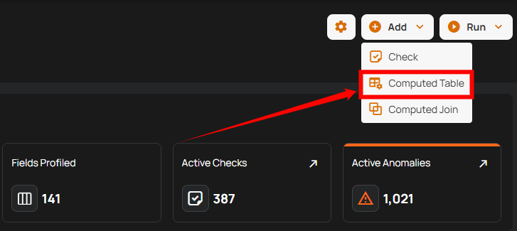
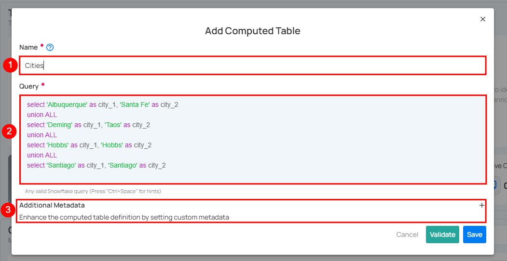

# Computed Tables

Use Computed Tables when you want to perform the following operations on your selected source datastores:

-   Data Preparation and Transformation: Clean, shape, and restructure raw data from JDBC source datastores.
-   Complex Calculations and Aggregations: Perform calculations not easily supported by standard containers.
-   Data Subsetting: Extract specific data subsets based on filters using SQL's WHERE clause.     
-   Joining Data Across Source Datastores: Combine data from multiple JDBC source datastores using SQL joins.

!!! note
    Computed Tables can only reference base containers (physical tables or views) from the datastore. They cannot reference other Computed Tables or Computed Files.

## Add Computed Tables

**Step 1:** Log in to your Qualytics account and select a JDBC-type source datastore from the side menu on which you would like to add a computed table.



**Step 2:** After selecting your preferred source datastore, you will be redirected to the source datastore operations page. From this page, click on the **Add** button and select the **Computed Table** option from the dropdown menu.



**Step 3:** A modal window will appear prompting you to enter a name for your computed table, a valid SQL query that supports your selected source datastore, and optionally, additional metadata.

| REF. | FIELDS | ACTIONS |
|------|--------|---------|
| 1   | Name (Required)  | Enter a name for your computed table. The name should be descriptive and meaningful to help you easily identify the table later (e.g., add a meaningful name like `Customer_Order_Statistics`). |
| 2   | Query (Required)  | Write a valid SQL query that supports your selected source datastore. The query helps to perform joins and aggregations on your selected source datastore. |
| 3   | Additional Metadata (Optional)  | Add custom metadata to enhance the definition of your computed table. Click the plus icon **(+)** next to this section to open the metadata input form, where you can add key-value pairs. |

!!! warning  
    When creating a Computed Table for **SQL Server, Oracle, or Redshift** datastores, you must specify the table using a **fully qualified name** (`SCHEMA.TABLE`).  
    The table selection field displays schema-prefixed table names to help you select the correct table.



**Step 4:** Click on the **Validate** button to instantly check the syntax and semantics of your SQL query. This ensures your query runs successfully and prevents errors before saving.


**Step 5:** Once validation is successful, click on the **Save** button to add the computed table to your selected source datastore.


## Limitations

### Referencing Other Computed Tables

A computed table cannot directly reference another computed table in its SQL query. For example, attempting to write a query like this will fail:

```sql
SELECT * FROM my_computed_table JOIN another_computed_table ON ...
```

**Why this happens:** Computed tables are defined and stored within Qualytics, but they are not created as actual database objects (like views or tables) in your data warehouse. When your SQL query runs, the database engine cannot find `my_computed_table` because it doesn't exist as a named object in the warehouse catalog.

### Workarounds

If you need to combine logic from multiple computed tables, you have several options:

#### Option 1: Combine Logic Using CTEs

Merge the SQL logic into a single computed table using Common Table Expressions (CTEs):

```sql
WITH dataset_a AS (
    SELECT id, name, amount
    FROM source_table_1
    WHERE status = 'active'
),
dataset_b AS (
    SELECT id, category, region
    FROM source_table_2
    WHERE year = 2024
)
SELECT
    a.id,
    a.name,
    a.amount,
    b.category,
    b.region
FROM dataset_a a
JOIN dataset_b b ON a.id = b.id
```

This approach works because the entire query is executed as a single unit by the database engine.

#### Option 2: Create a View in Your Data Warehouse

If you need to reuse intermediate results across multiple computed tables:

1. Create a view or table directly in your data warehouse (e.g., using your warehouse's SQL interface or a tool like dbt).
2. Catalog that view or table in Qualytics.
3. Reference the cataloged object in your computed table queries.

This works because the intermediate result becomes a real, queryable object in your warehouse.

### Using Computed Tables in Computed Joins

Computed tables cannot be used as inputs in a Computed Join. Computed Joins are designed to work with base containers only—physical tables, views, or files that exist in your datastore catalog. For more details, see the [Computed Join](../computed-join.md#limitations) documentation.
