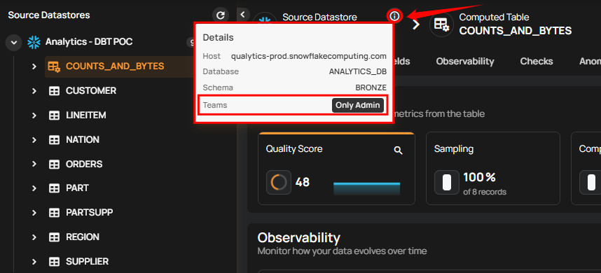

# Computed Tables & Files

Computed Tables and Computed Files are powerful virtual tables within the Qualytics platform, each serving distinct purposes in data manipulation. Computed Tables are created using SQL queries on JDBC source datastores, enabling advanced operations like joins and where clauses. Computed Files, derived from Spark SQL transformations on DFS source datastores, allow for efficient data manipulation and transformation directly within the DFS environment.

This guide explains how to add Computed Tables and Computed Files and discusses the differences between them.

Let's get started 🚀

## Computed Tables

Use Computed Tables when you want to perform the following operations on your selected source datastores:

!!! note
    For more information, please refer to the [computed tables documentation](../computed-tables-and-files/computed-tables.md){target="_blank"}.

## Add Computed Tables

**Step 1:** Log in to your Qualytics account and select a JDBC-type source datastore from the side menu on which you would like to add a computed table.

!!! note
    For more information, please refer to the [add computed tables section](../computed-tables-and-files/computed-tables.md#add-computed-tables){target="_blank"}.

## Computed Files

Use Computed Files when you want to perform the following operations on your selected source datastore:

!!! note
    For more information, please refer to the [computed files documentation](../computed-tables-and-files/computed-files.md){target="_blank"}.

## Add Computed Files

**Step 1:** Log in to your Qualytics account and select a DFS-type source datastore from the side menu on which you would like to add a computed file.

!!! note
    For more information, please refer to the [add computed files section](../computed-tables-and-files/computed-files.md#add-computed-files).

## Computed Table Vs. Computed File

!!! note
    For more information, please refer to the [computed tables vs file documentation](../computed-tables-and-files/computed-table-vs-file.md){target="_blank"}.
    
## View Assigned Teams

By hovering over the information, icon, users can view the assigned teams for enhanced collaboration and data transparency.

