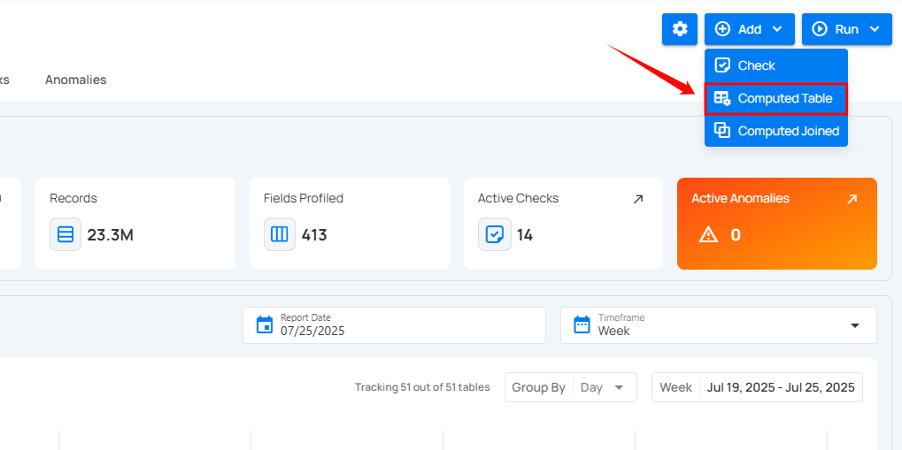
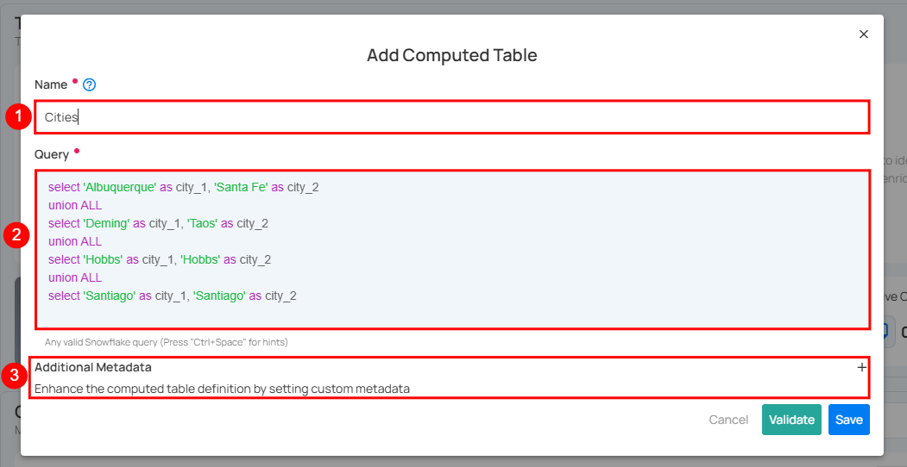
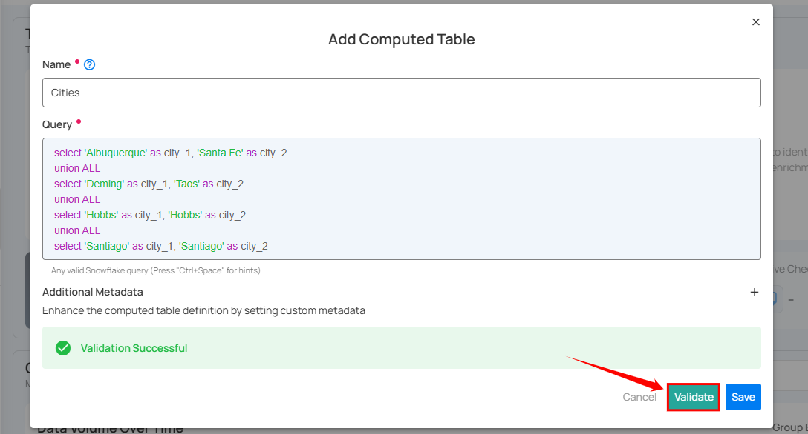

# Computed Tables

Use Computed Tables when you want to perform the following operations on your selected source datastores:

-   Data Preparation and Transformation: Clean, shape, and restructure raw data from JDBC source datastores.
-   Complex Calculations and Aggregations: Perform calculations not easily supported by standard containers.
-   Data Subsetting: Extract specific data subsets based on filters using SQL's WHERE clause.     
-   Joining Data Across Source Datastores: Combine data from multiple JDBC source datastores using SQL joins.

## Add Computed Tables

**Step 1:** Log in to your Qualytics account and select a JDBC-type source datastore from the side menu on which you would like to add a computed table.

**Step 2:** After selecting your preferred source datastore, you will be redirected to the source datastore operations page. From this page, click on the **Add** button and select the **Computed Table** option from the dropdown menu.

**Step 3:** A modal window will appear prompting you to enter a name for your computed table, a valid SQL query that supports your selected source datastore, and optionally, additional metadata.

| REF. | FIELDS | ACTIONS |
|------|--------|---------|
| 1.   | Name (Required)  | Enter a name for your computed table. The name should be descriptive and meaningful to help you easily identify the table later (e.g., add a meaningful name like `Customer_Order_Statistics`). |
| 2.   | Query (Required)  | Write a valid SQL query that supports your selected source datastore. The query helps to perform joins and aggregations on your selected source datastore. |
| 3.   | Additional Metadata (Optional)  | Add custom metadata to enhance the definition of your computed table. Click the plus icon **(+)** next to this section to open the metadata input form, where you can add key-value pairs. |

**Step 4:** Click on the **Validate** button to instantly check the syntax and semantics of your SQL query. This ensures your query runs successfully and prevents errors before saving.

**Step 5:** Once validation is successful, click on the **Save** button to add the computed table to your selected source datastore.

