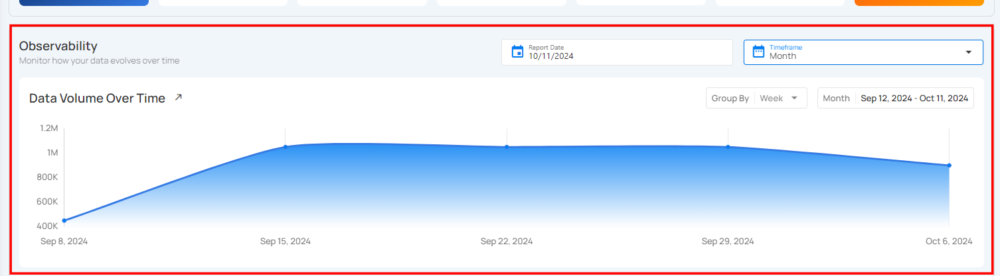

# Container Attributes

### Totals

!!! note
    Totals are calculated from sampled data, not the full dataset. Values may differ from actual totals across all records.

1. **Quality Score**: This represents the overall health of the data based on various checks. A higher score indicates better data quality and fewer issues detected.

2. **Sampling**: Displays the percentage of data sampled during profiling. A 100% sampling rate means the entire dataset was analyzed for the quality report.

3. **Completeness**: Indicates the percentage of records that are fully populated without missing or incomplete data. Lower percentages may suggest that some fields have missing values.

4. **Records Profiled**: Shows the number or percentage of records that have been analyzed during the profiling process.

5. **Fields Profiled**: This shows the number of fields or attributes within the dataset that have undergone data profiling, which helps identify potential data issues in specific columns.

6. **Active Checks**: Represents the number of ongoing checks applied to the dataset. These checks monitor data quality, consistency, and correctness.

7. **Active Anomalies**: Displays the total number of anomalies found during the data profiling process. Anomalies can indicate inconsistencies, outliers, or potential data quality issues that need resolution.  

### Observability

**1. Volumetric Measurement**  

Volumetric measurement allows users to track the size of data stored within the table over time. This helps in monitoring how the data grows or changes, making it easier to detect sudden spikes that may impact system performance. Users can visualize data volume trends and manage the table's efficiency. This helps in optimizing storage, adjusting resource allocation, and improving query performance based on the size and growth of the computed table.

**2. Anomalies Measurement**

The **Anomalies** section helps users track any unusual data patterns or issues within the computed tables. It shows a visual representation of when anomalies occurred over a specific time period, making it easy to spot unusual activity. This allows users to quickly identify when something might have gone wrong and take action to fix it, ensuring the data stays accurate and reliable.

