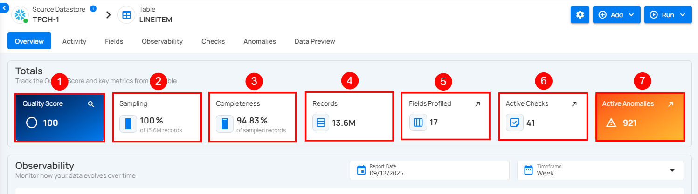
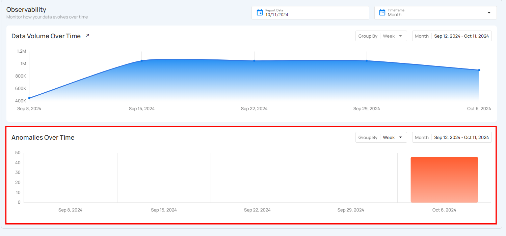
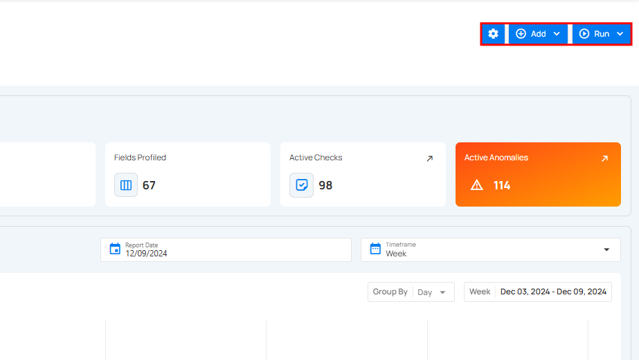
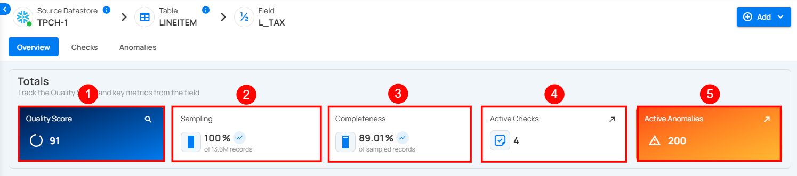
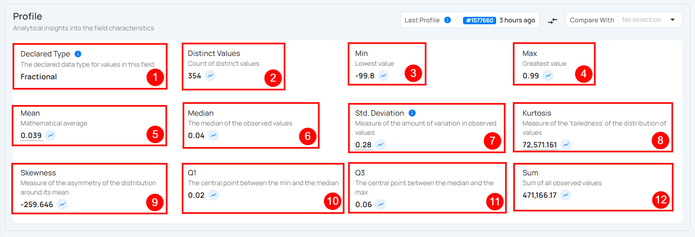
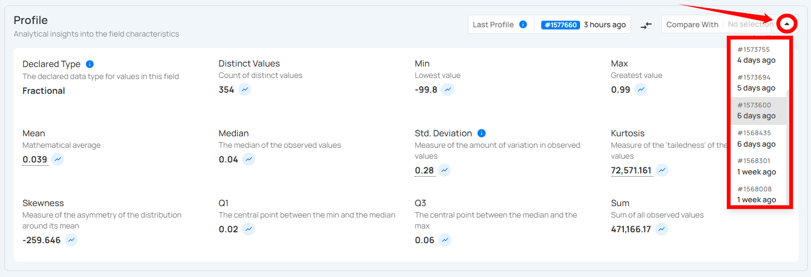
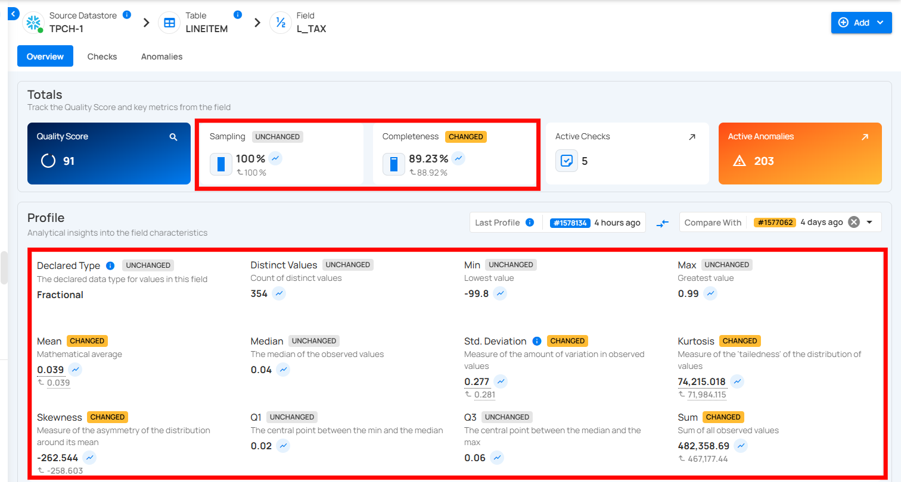
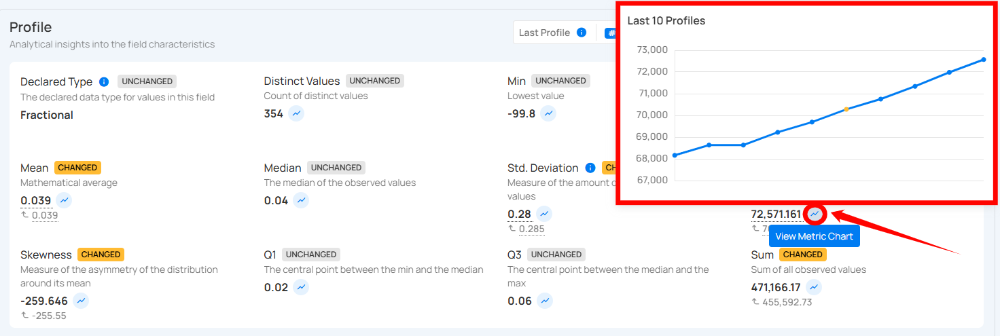

# Containers Overview

Containers are fundamental entities representing structured data sets. These containers could manifest as tables in JDBC datastores or as files within DFS datastores. They play a pivotal role in data organization, profiling, and quality checks within the Qualytics application.

Let’s get started 🚀

## Container Types

There are two main types of containers in Qualytics:

### JDBC Container

JDBC containers are virtual representations of database objects, making it easier to work with data stored in relational databases. These containers include tables, which organize data into rows and columns like a spreadsheet, views that provide customized displays of data from one or more tables, and other database objects such as indexes or stored procedures. Acting as a bridge between applications and databases, JDBC enables seamless interaction with these containers, allowing efficient data management and retrieval.

### DFS Container

DFS containers are used to represent files stored in distributed file systems, such as Hadoop or cloud storage. These files can include formats like CSV, JSON, or Parquet, which are commonly used for storing and organizing data. DFS containers make it easier for applications to work with these files by providing a structured way to access and process data in large-scale storage systems.

## Container Attributes

### Totals

!!! note
    Totals are calculated from sampled data, not the full dataset. Values may differ from actual totals across all records.

1. **Quality Score**: This represents the overall health of the data based on various checks. A higher score indicates better data quality and fewer issues detected.

2. **Sampling**: Displays the percentage of data sampled during profiling. A 100% sampling rate means the entire dataset was analyzed for the quality report.

3. **Completeness**: Indicates the percentage of records that are fully populated without missing or incomplete data. Lower percentages may suggest that some fields have missing values.

4. **Records Profiled**: Shows the number or percentage of records that have been analyzed during the profiling process.

5. **Fields Profiled**: This shows the number of fields or attributes within the dataset that have undergone data profiling, which helps identify potential data issues in specific columns.

6. **Active Checks**: Represents the number of ongoing checks applied to the dataset. These checks monitor data quality, consistency, and correctness.

7. **Active Anomalies**: Displays the total number of anomalies found during the data profiling process. Anomalies can indicate inconsistencies, outliers, or potential data quality issues that need resolution.  

### Observability

**1. Volumetric Measurement**  

Volumetric measurement allows users to track the size of data stored within the table over time. This helps in monitoring how the data grows or changes, making it easier to detect sudden spikes that may impact system performance. Users can visualize data volume trends and manage the table's efficiency. This helps in optimizing storage, adjusting resource allocation, and improving query performance based on the size and growth of the computed table.

**2. Anomalies Measurement**

The **Anomalies** section helps users track any unusual data patterns or issues within the computed tables. It shows a visual representation of when anomalies occurred over a specific time period, making it easy to spot unusual activity. This allows users to quickly identify when something might have gone wrong and take action to fix it, ensuring the data stays accurate and reliable.

## Actions on Container

Users can perform various operations on containers to manage datasets effectively. The actions are divided into three main sections: **Settings**, **Add**, and **Run**. Each section contains specific options to perform different tasks.

### Settings

The **Settings** button allows users to configure the container. By clicking on the **Settings** button, users can access the following options:

| No. |           Options |                                Description |
| :---- | :---- | :---- |
| **1.** |        Settings | Configure incremental strategy, partitioning fields, and exclude specific fields from analysis. |
| **2.** |         Score | Score allowing you to adjust the decay period and factor weights for metrics like completeness, accuracy, and consistency. |
| **3.** |     Observability | Enables or disables tracking for data volume and freshness. **Volume Tracking:** Monitors daily volume metrics to identify trends and detect anomalies over time. **Freshness Tracking:** Records the last update timestamp to ensure data timeliness and detect pipeline delays. |
| **4.** | Migrate | Migrate authored quality checks from one container to another (even across datastores) to quickly reuse, standardize, and avoid recreating rules. |
| **5.** |         Export | Export quality checks, field profiles, and anomalies to an enrichment datastore for further action or analysis. |
| **6.** |         Materialize | Captures snapshots of data from a source datastore and exports it to an enrichment datastore for faster access and analysis. |
| **7.** |         Delete | Delete the selected container from the system. |

### Add

The **Add** button allows users to add checks or computed fields. By clicking on the **Add** button, users can access the following options:

| No. | Options | Description |
| :---- | :---- | :---- |
| **1.** | Checks | Checks allow you to add new checks or validation rules for the container. |
| **2.** | Computed Field | Allows you to add a computed field. |

### Run

The **Run** button provides options to execute operations on datasets, such as profiling, scanning, and external scans. By clicking on the **Run** button, users can access the following options:

| No. |          Options | Descriptions |
| :---- | :---- | :---- |
| **1.** | Profile | **Profile** allows you to run a profiling operation to analyze the data structure, gather metadata, set thresholds, and define record limits for comprehensive dataset profiling. |
| **2.** | Scan  | **Scan** allows you to perform data quality checks, configure scan strategies, and detect anomalies in the dataset. |
| **3.** | External Scan | **External Scan** allows you to upload a file and validate its data against predefined checks in the selected table. |

## Field Profiles

After profiling a container, individual field profiles offer granular insights:

### Totals

**1. Quality Score**: This provides a comprehensive assessment of the overall health of the data, factoring in multiple checks for accuracy, consistency, and completeness. A higher score, closer to 100, indicates optimal data quality with minimal issues or errors detected. A lower score may highlight areas that require attention and improvement.

**2. Sampling**: This shows the percentage of data that was evaluated during profiling. A sampling rate of 100% indicates that the entire dataset was analyzed, ensuring a complete and accurate representation of the data’s quality across all records, rather than just a partial sample.

**3. Completeness**: This metric measures how fully the data is populated without missing or null values. A higher completeness percentage means that most fields contain the necessary information, while a lower percentage indicates data gaps that could negatively impact downstream processes or analysis.

**4. Active Checks**: This refers to the number of ongoing quality checks being applied to the dataset. These checks monitor aspects such as format consistency, uniqueness, and logical correctness. Active checks help maintain data integrity and provide real-time alerts about potential issues that may arise.

**5. Active Anomalies**: This tracks the number of anomalies or irregularities detected in the data. These could include outliers, duplicates, or inconsistencies that deviate from expected patterns. A count of zero indicates no anomalies, while a higher count suggests that further investigation is needed to resolve potential data quality issues.

### Profile

This provides detailed insights into the characteristics of the field, including its type, distinct values, and length. You can use this information to evaluate the data's uniqueness, length consistency, and complexity.

| No | Profile | Description |
| :---- | :---- | :---- |
| 1 | Declared Type | Indicates whether the type is declared by the source or inferred. |
| 2 | Distinct Values | Count of distinct values observed in the dataset. |
| 3 | Min Length | Shortest length of the observed string values or lowest value for numerics. |
| 4 | Max Length | Greatest length of the observed string values or highest value for numerics. |
| 5 | Mean | Mathematical average of the observed numeric values. |
| 6 | Median | The median of the observed numeric values. |
| 7 | Standard Deviation | Measure of the amount of variation in observed numeric values. |
| 8 | Kurtosis | Measure of the ‘tailedness’ of the distribution of observed numeric values. |
| 9 | Skewness | Measure of the asymmetry of the distribution of observed numeric values. |
| 10 | Q1 | The first quartile; the central point between the minimum and the median. |
| 11 | Q3 | The third quartile; the central point between the median and the maximum. |
| 12 | Sum | Total sum of all observed numeric values. |

#### Last Profile

The **Last Profile** timestamp helps users understand how up-to-date the field is. When you hover over the time indicator shown on the right side of the Last Profile label (e.g., "1 week ago"), a tooltip displays the complete date and time the field was last profiled.

This visibility ensures better context for interpreting profile metrics like mean, completeness, and anomalies.

#### Compare Profile

You can compare the current field profile with earlier versions to spot changes over time. Visual indicators highlight modified metrics, interactive charts show numeric trends across profile history, and special badges identify data drift or field type changes.

By clicking on the dropdown under **Compare With**, you can select an earlier profile run (for example, 1 day ago or 5 days ago).

Once selected, the system highlights the differences between the two profiles, marking metrics as **Changed** or **Unchanged**. This makes it easy to track shifts in key values such as mean, median, standard deviation, or completeness.

#### View Metric Chart

You can access detailed metric charts by clicking the **View Metric Chart** button. This will display variations across the last 10 profiles. By hovering over points on the chart, you can see additional details such as profile dates, measured values, and sampling percentages for deeper analysis.

