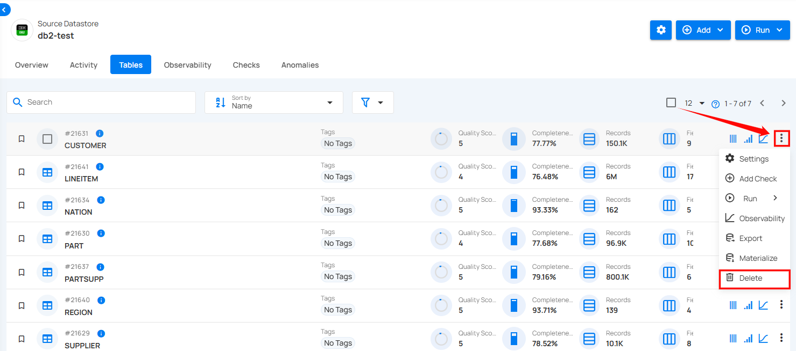

# Delete

**Delete** allows you to remove a table from the connected source datastore. While the table and its associated data will be deleted, it is not permanent, as the table can be recreated if you run a catalog with the "recreate" option. 

!!! note
    Deleting a table is a reversible action if a catalog with the "recreate" option is run later. 

**Step 1:** Select the tables in your connected source datastore that you would like to delete, then click on **Delete**.

**Step 2:** A confirmation modal window will appear, click on the Delete button to remove the table from the system.

**Step 3:** After clicking on the delete button, your table is successfully deleted and a success flash message will appear saying **"Profile has been successfully deleted"**

