# Export Operation

Qualytics metadata export feature lets you capture the changing states of your data. You can export metadata for Quality Checks, Field Profiles, and Anomalies from selected profiles into an enrichment datastore so that you can perform deeper analysis, identify trends, detect issues, and make informed decisions based on your data.

To keep things organized, the exported files use specific naming patterns:

* **Anomalies:** Saved as `_<enrichment_prefix>_anomalies_export`.  
* **Quality Checks:** Saved as `_<enrichment_prefix>_checks_export`.  
* **Field Profiles:** Saved as `_<enrichment_prefix>_field_profiles_export`.

!!! note 
    Ensure that an enrichment datastore is already set up and properly configured to accommodate the exported data. This setup is essential for exporting anomalies, quality checks, and field profiles successfully. 

Let’s get started 🚀

**Step 1:** Select a source datastore from the side menu from which you would like to export the metadata.

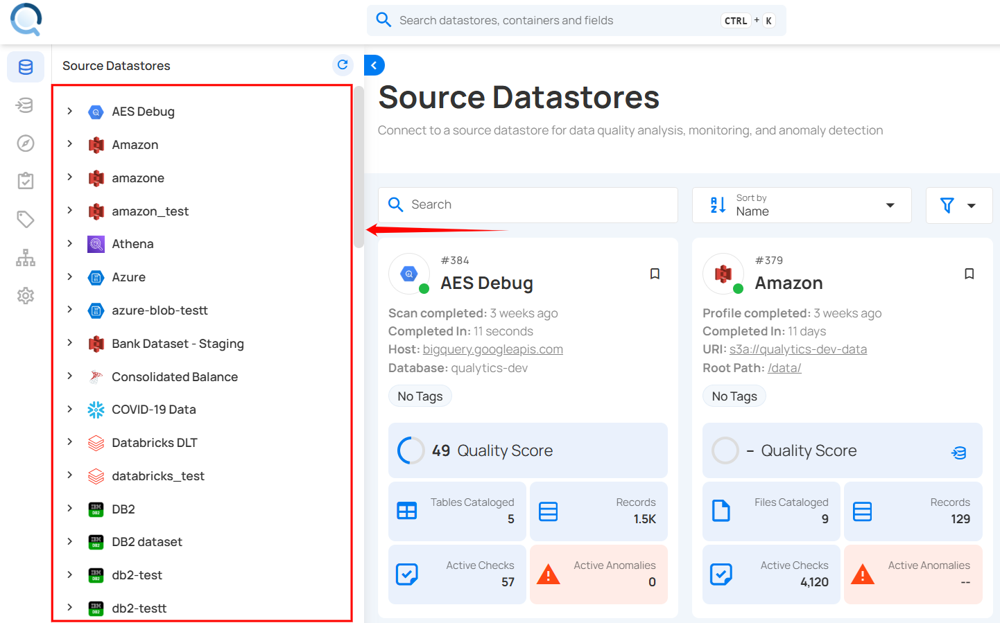

For demonstration purposes, we have selected the **“COVID-19 Data”** Snowflake source datastores.

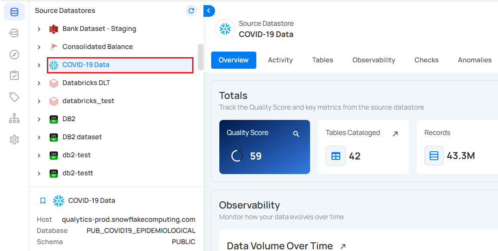

**Step 2:** After selecting a datastore, a bottom-up menu appears on the right side of the interface. Click **Enrichment Operations** next to the Enrichment Datastore and select **Export**.

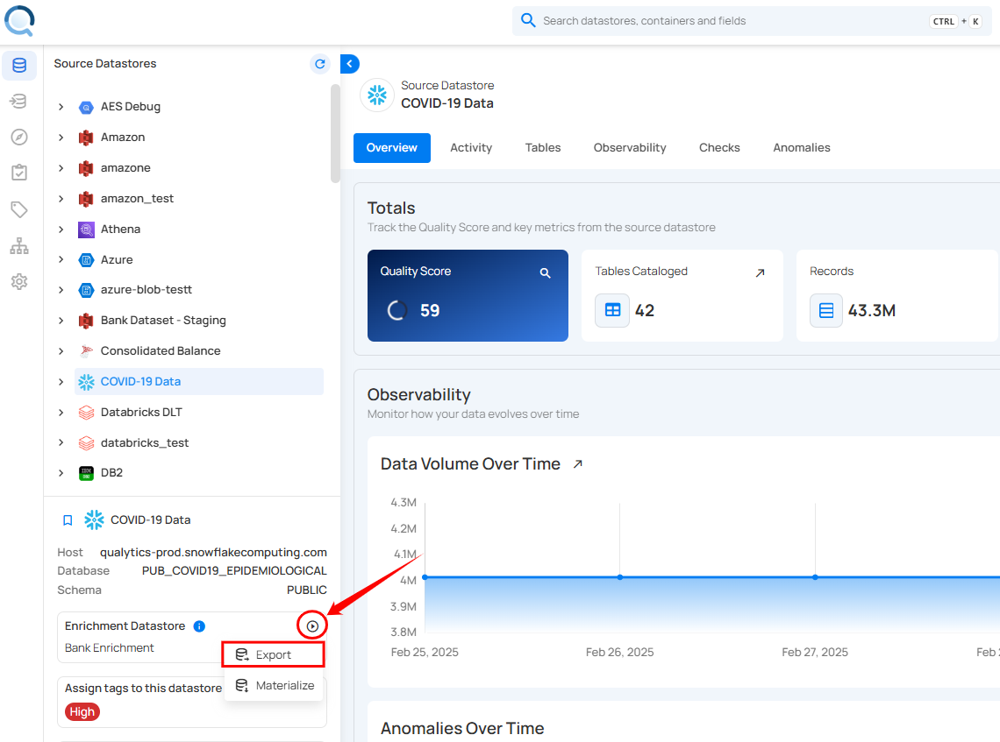

**Step 3:** After clicking **Export**, the **Export Operation** modal window appears, allowing metadata extraction from the selected source datastore to the enrichment datastore. 

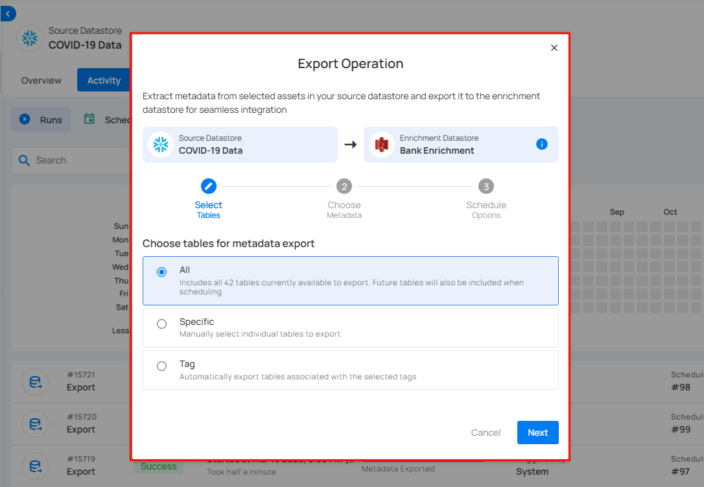

**Step 4:** Select the tables you wish to export. **All**, **Specific**, or **Tag** and click **Next** to proceed.

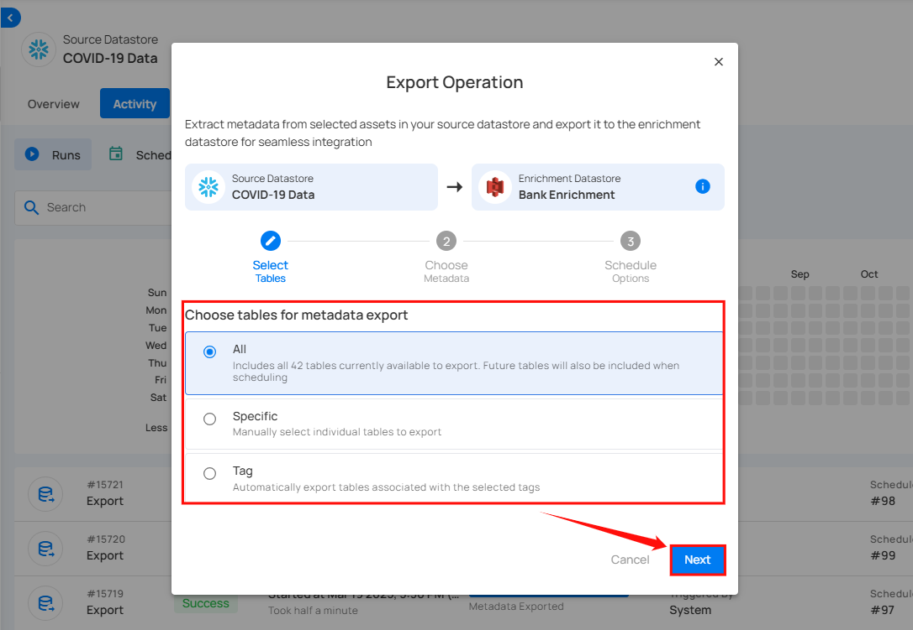

**Step 5:** After clicking **Next**, select the assets you want to export to your Enrichment Datastore: Anomalies, Quality Checks, or Field Profiles, and click **Export** to proceed with the export process.

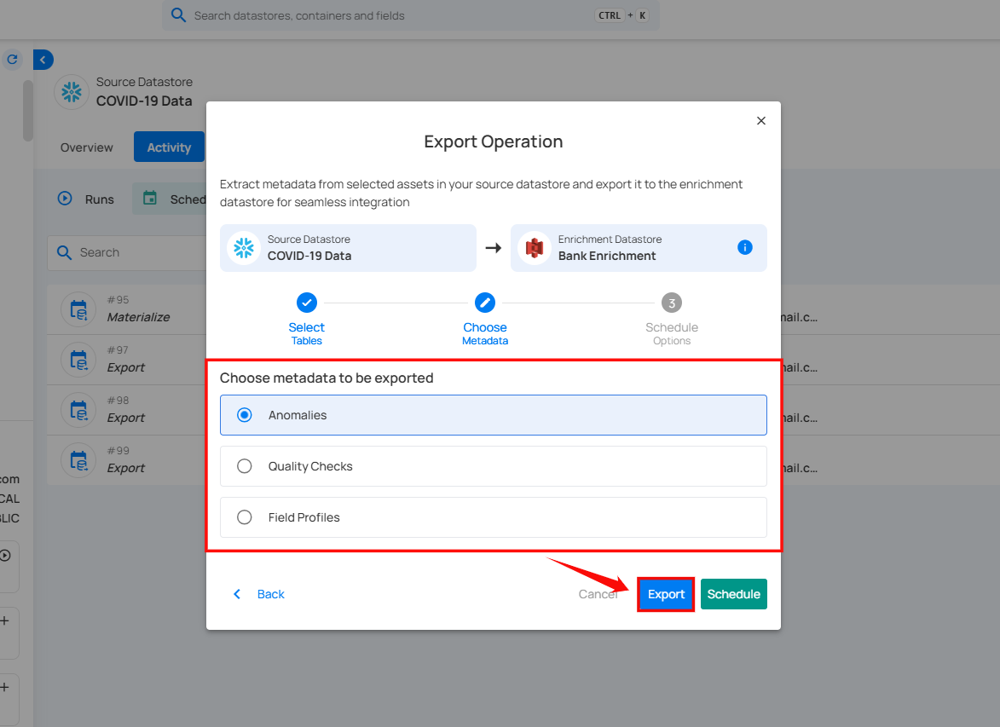

After clicking **Export**, a confirmation message appears stating **"Export in motion."** In a couple of minutes, the metadata will be available in your Enrichment Datastore.

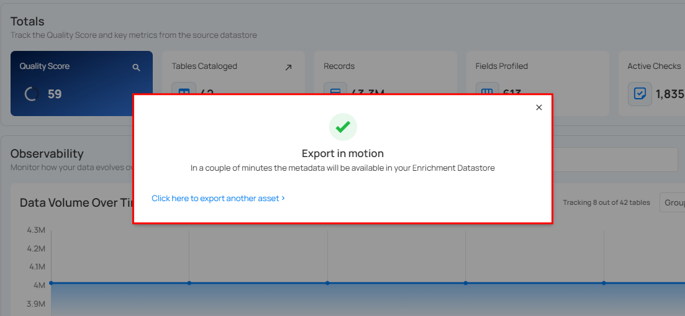

## Schedule Operation

**Step 1:** Click **Schedule** to configure scheduling options for the Export Operation.

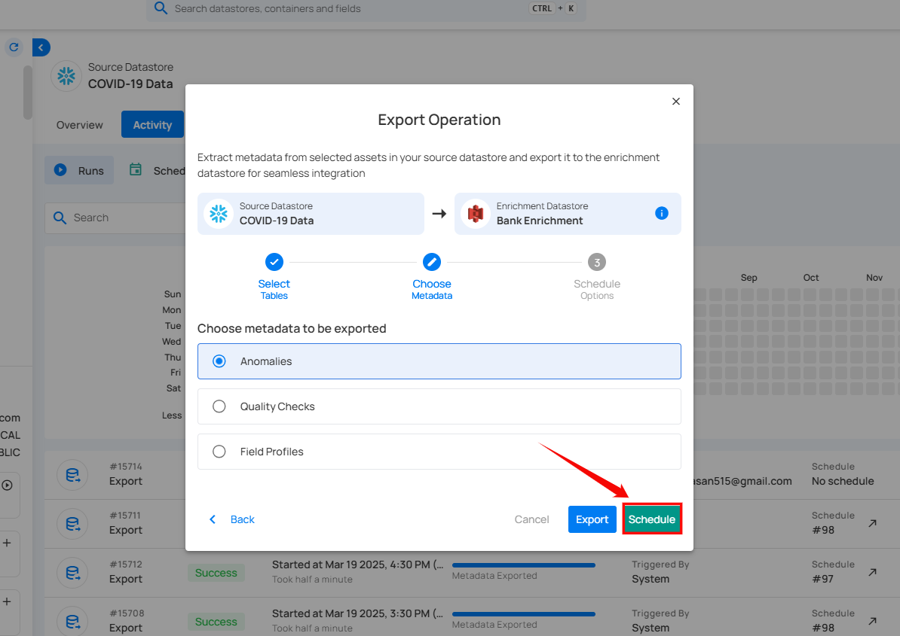

**Step 2:** Configure the scheduling preferences for the Export Operation.

* **Hourly:** Runs every set number of hours at a specified minute. (e.g., Every 1 hour at 00 minutes).

* **Daily:** Runs once per day at a specific UTC time. (e.g., Every day at 00:00 UTC).

* **Weekly:** Runs on selected weekdays at a set time. (e.g., Every Sunday and Friday at 00:00 UTC).

* **Monthly:** Runs on a specific day of the month at a set time. (e.g., 1st day of every month at 00:00 UTC).

* **Advanced:** Use Cron expressions for custom scheduling. (e.g., `0 12 * * 1-5` runs at 12 PM, Monday to Friday).

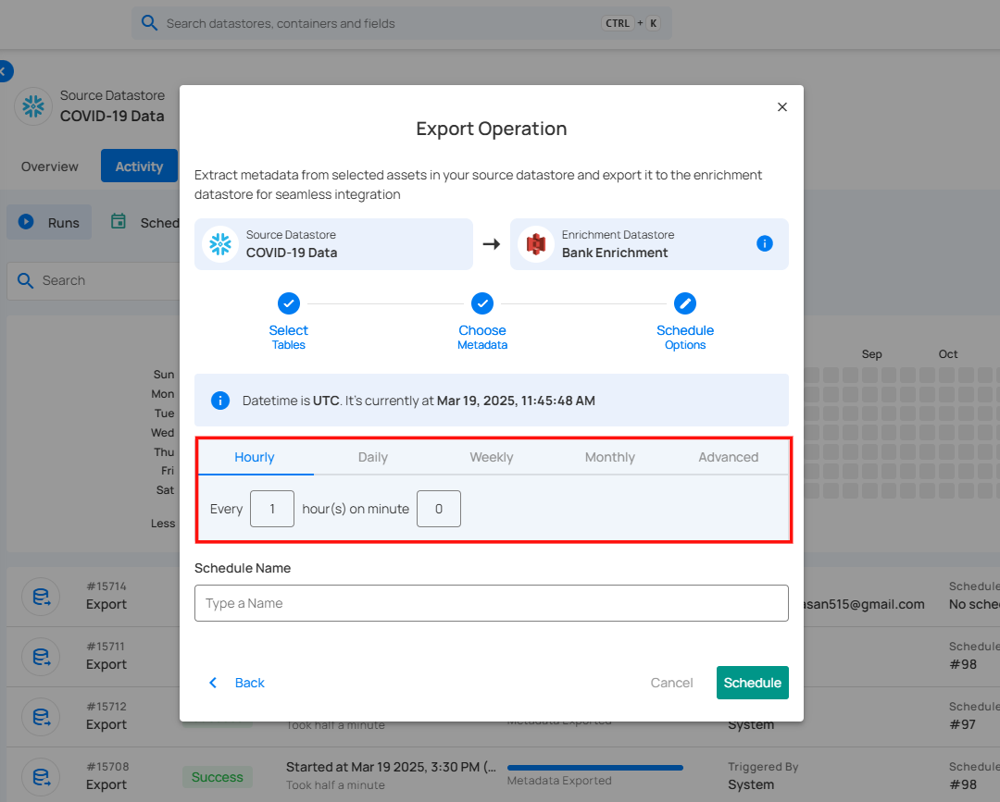

**Step 3:** Define the Schedule Name to identify the scheduled Export Operation when it runs.

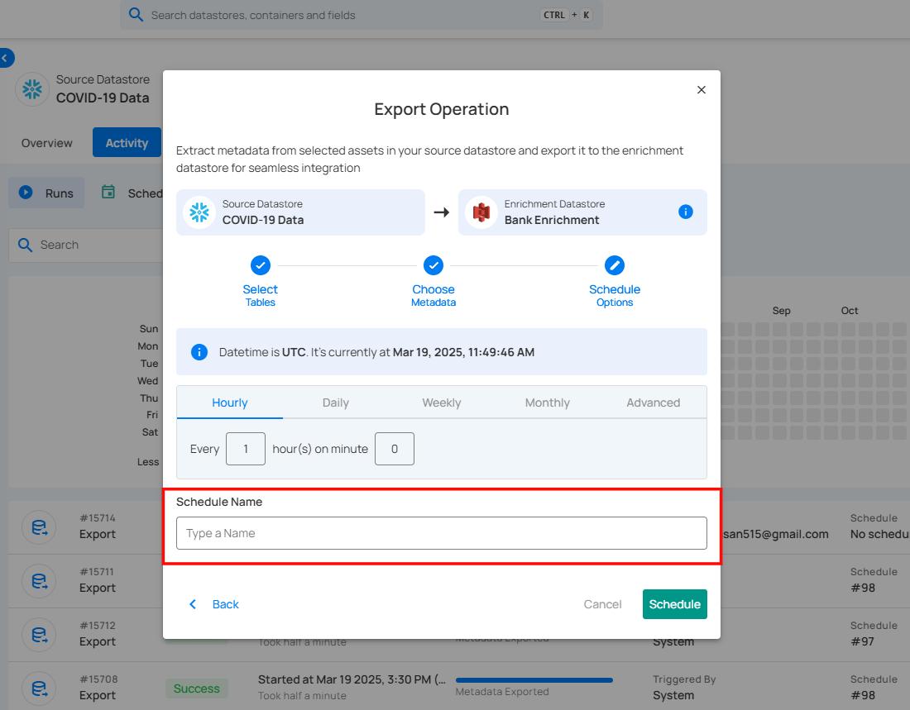

**Step 4:** Click **Schedule** to finalize and schedule the Export Operation.

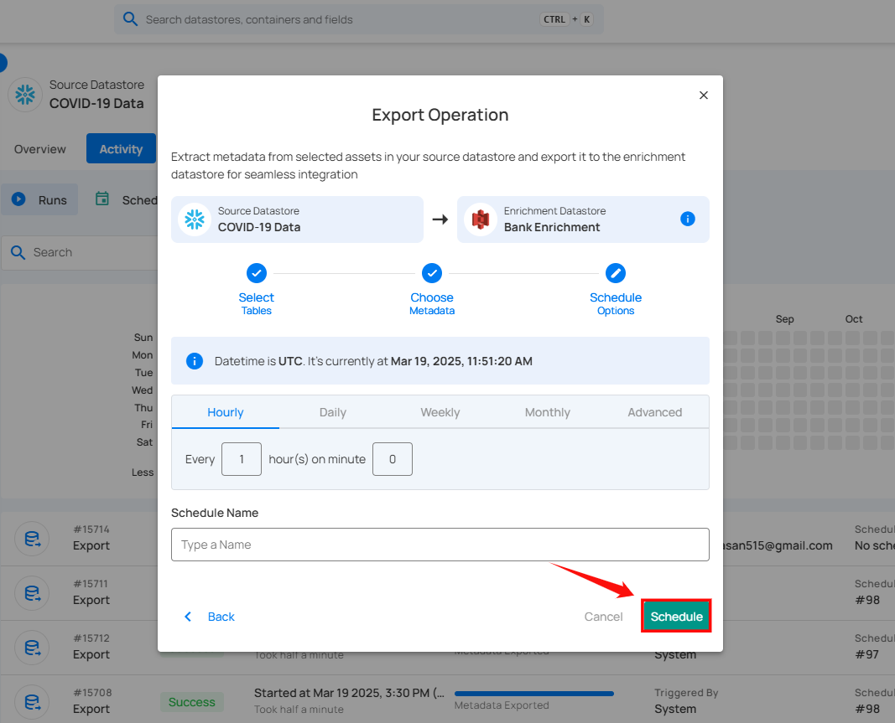

After clicking **Schedule**, a confirmation message appears stating **"Operation Scheduled"**. Go to the Activity tab to see the progress of export operation.

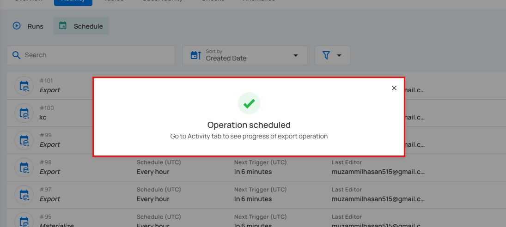

## Review Exported Data

**Step 1:** Once the metadata has been exported, navigate to the **“Enrichment Datastores”** located on the left menu.

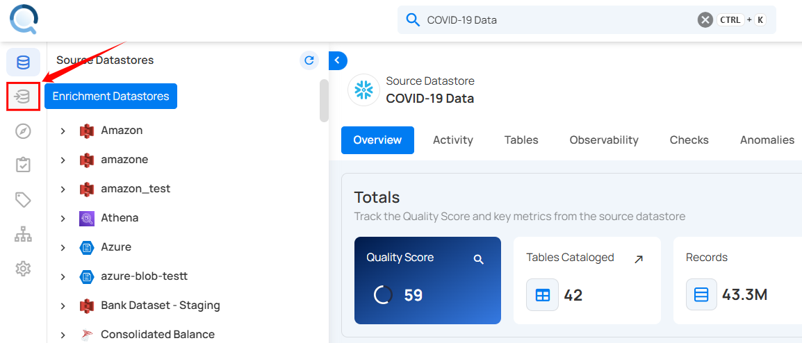

**Step 2:** In the **“Enrichment Datastores”** section, select the datastore where you exported the metadata. The exported metadata will now be visible in the selected datastore.

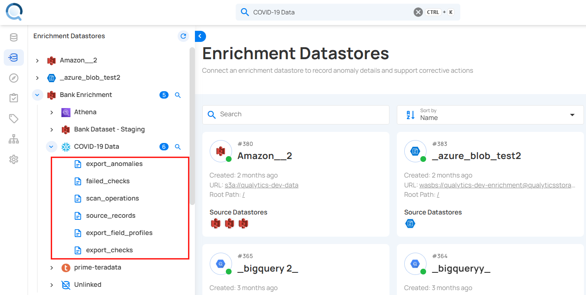

**Step 3:** Click on the exported files to view the metadata. For demonstration purposes, we have selected the **“export_field_profiles”** file to review the metadata.

The exported metadata is displayed in a table format, showing key details about the field profiles from the datastore. It typically includes columns that indicate the uniqueness of data, the completeness of the fields, and the data structure. You can use this metadata to check data quality, prepare for analysis, ensure compliance, and manage your data.

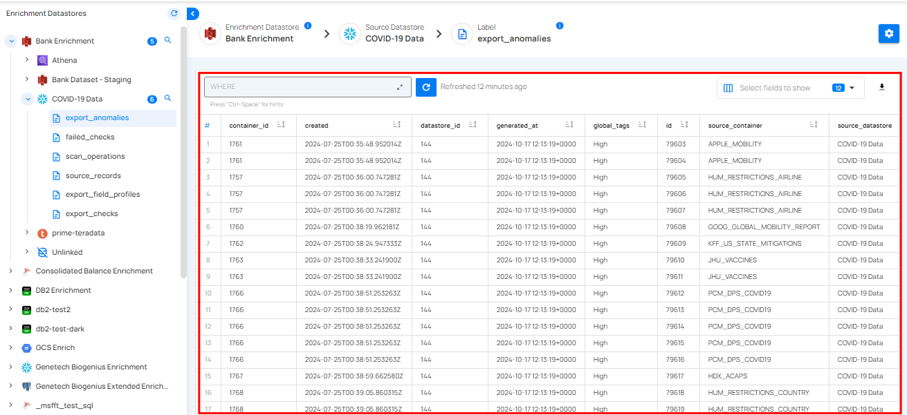
                                                         