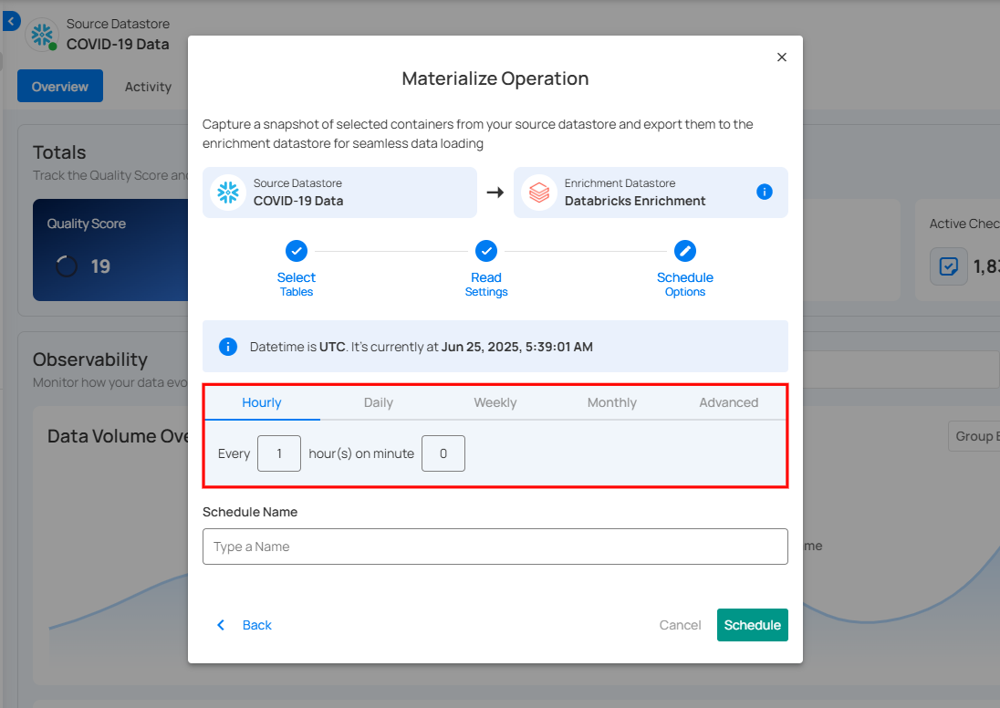
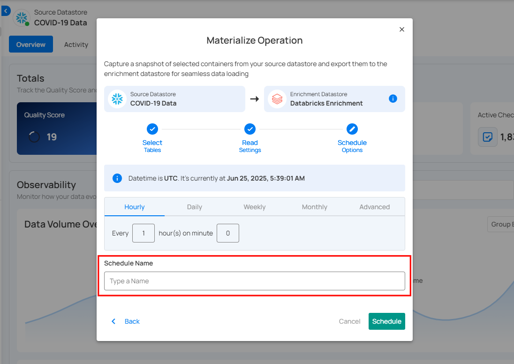

# Materialize Operation

**Materialize Operation** captures snapshots of selected containers from a **source datastore** and exports them to an **enrichment datastore** for seamless data loading. Users can run it instantly or schedule it at set intervals, ensuring structured data is readily available for analysis and integration.

## Materialize Naming Conventions

To keep materialized data organized and compatible across different enrichment datastores, the system applies specific naming conventions. These conventions ensure that the resulting container names remain valid, readable, and free of conflicts.

### Default Naming Convention

Used when the container name is safe to use as-is.

`<enrichment_prefix>_mat_<container_name>`.

This naming format is applied when:

- The container name length is **60 characters or less**.
- The container name does **not contain special characters** that may cause invalid table or file names.

**Example:**

If the enrichment prefix is `sales` and the container name is `orders_2024`:

`sales_mat_orders_2024`.

### Fallback Naming Convention

If the container name contains characters that may cause issues in downstream systems, the system switches to a safer naming structure by using the **container ID** instead.

`<enrichment_prefix>_materialize_<container_id>`.

This fallback is used when:

- The container name **exceeds 60 characters**.
- The container name includes **restricted or special characters**. 
  **(e.g., symbols, glob patterns when moving from DFS to JDBC)**.

**Example:**

If the enrichment prefix is `sales` and the container ID is `1023456`:

`sales_materialize_1023456`.

!!! note
    The fallback naming ensures successful loading into the enrichment datastore by preventing invalid or non-compliant table names.

Let’s get started 🚀

**Step 1:** Select a source datastore from the side menu to capture and export containers for the Materialize Operation.

For demonstration purposes, we have selected the **“COVID-19 Data”** Snowflake source datastore.

**Step 2:** After selecting a datastore, a bottom-up menu appears on the right side of the interface. Click **Enrichment Operations** next to the Enrichment Datastore and select **Materialize**.

**Step 3:**  After clicking **Materialize** a modal window appears, allowing you to configure the data export settings for the Materialize Operation.

**Step 4:**  Select tables to materialize all tables, specific tables, or tables by tag, then click **Next**.

**Step 5:** Configure Record Limit: set the maximum number of records to be materialized per table.

## Run Now

Click **Run Now** to instantly materialize selected containers.

After clicking **Run Now**, a confirmation message appears stating **"Operation Triggered"**. Go to the Activity tab to see the progress of materialize operation.

## Schedule

**Step 1:** Click **Schedule** to configure scheduling options for the Materialize Operation.

**Step 2:** Configure the scheduling preferences for the Materialize Operation.

* **Hourly:** Runs every set number of hours at a specified minute. (e.g., Every 1 hour at 00 minutes).

* **Daily:** Runs once per day at a specific UTC time. (e.g., Every day at 00:00 UTC).

* **Weekly:** Runs on selected weekdays at a set time. (e.g., Every Sunday and Friday at 00:00 UTC).

* **Monthly:** Runs on a specific day of the month at a set time. (e.g., 1st day of every month at 00:00 UTC).

* **Advanced:** Use Cron expressions for custom scheduling. (e.g., `0 12 * * 1-5` runs at 12 PM, Monday to Friday).

**Step 3:** Define the Schedule Name to identify the scheduled Materialize Operation when it runs.

**Step 4:** Click **Schedule** to finalize and schedule the Materialize Operation.

After clicking **Schedule**, a confirmation message appears stating **"Operation Scheduled"**. Go to the Activity tab to see the progress of materialize operation.

## Review Materialized Data

**Step 1:** Once the selected containers are materialized, go to **Enrichment Datastores** from the left menu. 

**Step 2:** In the **Enrichment Datastores** section, select the datastore where you materialized the snapshot. The materialized containers will now be visible.

**Step 3:** Click on the materialized files to review the snapshot. For demonstration, we have selected the **"materialized_field_profiles"** file.

The materialized data is displayed in a table format, showing key details about the selected containers. It typically includes columns indicating data structure, completeness, and uniqueness. You can use this data for analysis, validation, and integration.

