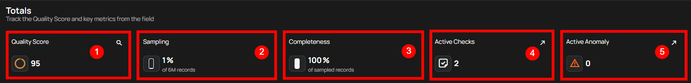
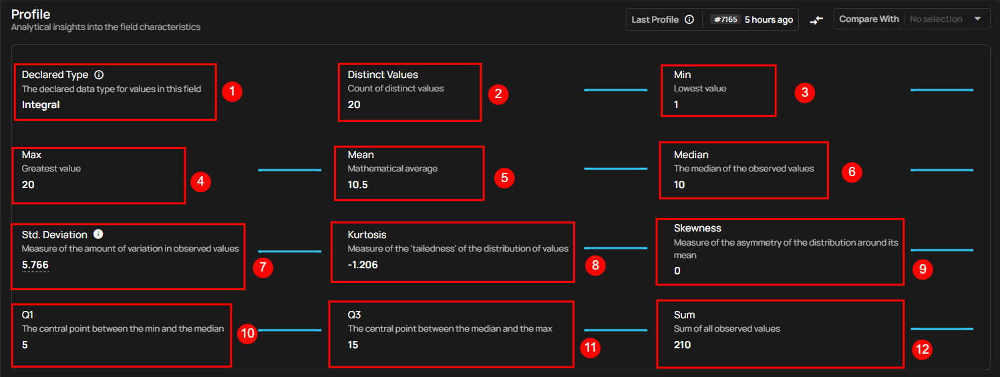
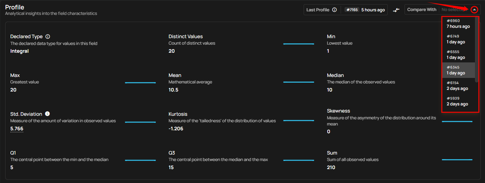
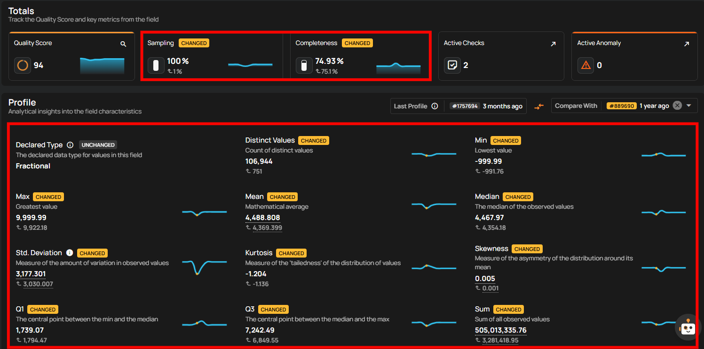
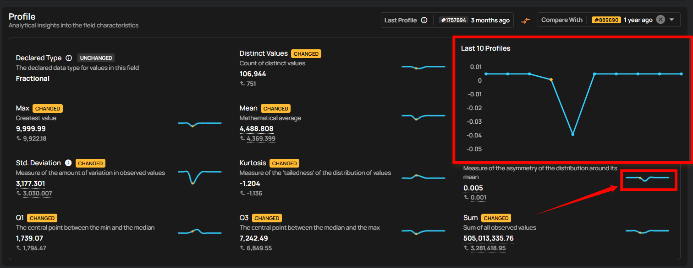

# Field Profiles

A Field Profile provides a detailed breakdown of a field’s data after a profiling operation. It helps you understand the structure, quality, and distribution of values for each field inside a container.

## What Field Profiles Are Used For

Field Profiles help you:

- Validate the completeness, consistency, and quality of individual fields  
- Identify unexpected patterns such as outliers, skewed values, or sudden changes  
- Compare current field behavior with previous profiling runs  
- Support quality checks by exposing metrics like distinct values, min/max length, and statistical indicators  

These insights make it easier to detect data issues early and understand how a field behaves over time.

## How Field Profiles Are Generated

Field Profiles are automatically created when you run a [**Profile**](../source-datastore/profile.md) operation on a container:

1. Qualytics scans the dataset and evaluates each field.
2. It computes metrics such as declared type, distinct counts, distribution statistics, sampling, and completeness.
3. The platform stores these results as the latest profile.
4. Each time you re-profile the container, the Field Profile is updated, allowing you to compare current metrics with previous runs.

This ensures your field-level insights remain current and can be tracked across multiple profiling sessions.

## Totals

**1 Quality Score**: This provides a comprehensive assessment of the overall health of the data, factoring in multiple checks for accuracy, consistency, and completeness. A higher score, closer to 100, indicates optimal data quality with minimal issues or errors detected. A lower score may highlight areas that require attention and improvement.

**2 Sampling**: This shows the percentage of data that was evaluated during profiling. A sampling rate of 100% indicates that the entire dataset was analyzed, ensuring a complete and accurate representation of the data’s quality across all records, rather than just a partial sample.

**3 Completeness**: This metric measures how fully the data is populated without missing or null values. A higher completeness percentage means that most fields contain the necessary information, while a lower percentage indicates data gaps that could negatively impact downstream processes or analysis.

**4 Active Checks**: This refers to the number of ongoing quality checks being applied to the dataset. These checks monitor aspects such as format consistency, uniqueness, and logical correctness. Active checks help maintain data integrity and provide real-time alerts about potential issues that may arise.

**5 Active Anomalies**: This tracks the number of anomalies or irregularities detected in the data. These could include outliers, duplicates, or inconsistencies that deviate from expected patterns. A count of zero indicates no anomalies, while a higher count suggests that further investigation is needed to resolve potential data quality issues.

## Profile

This provides detailed insights into the characteristics of the field, including its type, distinct values, and length. You can use this information to evaluate the data's uniqueness, length consistency, and complexity.

| No. | Profile | Description |
| :---- | :---- | :---- |
| 1 | Declared Type | Indicates whether the type is declared by the source or inferred. |
| 2 | Distinct Values | Count of distinct values observed in the dataset. |
| 3 | Min Length | Shortest length of the observed string values or lowest value for numerics. |
| 4 | Max Length | Greatest length of the observed string values or highest value for numerics. |
| 5 | Mean | Mathematical average of the observed numeric values. |
| 6 | Median | The median of the observed numeric values. |
| 7 | Standard Deviation | Measure of the amount of variation in observed numeric values. |
| 8 | Kurtosis | Measure of the ‘tailedness’ of the distribution of observed numeric values. |
| 9 | Skewness | Measure of the asymmetry of the distribution of observed numeric values. |
| 10 | Q1 | The first quartile; the central point between the minimum and the median. |
| 11 | Q3 | The third quartile; the central point between the median and the maximum. |
| 12 | Sum | Total sum of all observed numeric values. |

### Last Profile

The **Last Profile** timestamp helps users understand how up-to-date the field is. When you hover over the time indicator shown on the right side of the Last Profile label (e.g., "1 week ago"), a tooltip displays the complete date and time the field was last profiled.

This visibility ensures better context for interpreting profile metrics like mean, completeness, and anomalies.

### Compare Profile

You can compare the current field profile with earlier versions to spot changes over time. Visual indicators highlight modified metrics, interactive charts show numeric trends across profile history, and special badges identify data drift or field type changes.

By clicking on the dropdown under **Compare With**, you can select an earlier profile run (for example, 1 day ago or 5 days ago).

Once selected, the system highlights differences between profiles, marking metrics as **Changed** or **Unchanged**. It compares data quality **(Sampling, Completeness)** and statistical measures **(mean, median, standard deviation, skewness, kurtosis, min, max, distinct values, etc.)**, making it easy to track shifts in data quality and distribution.

### View Metric Chart

You can access detailed metric charts by clicking the **View Metric Chart** button. This will display variations across the last 10 profiles. By hovering over points on the chart, you can see additional details such as profile dates, measured values, and sampling percentages for deeper analysis.

