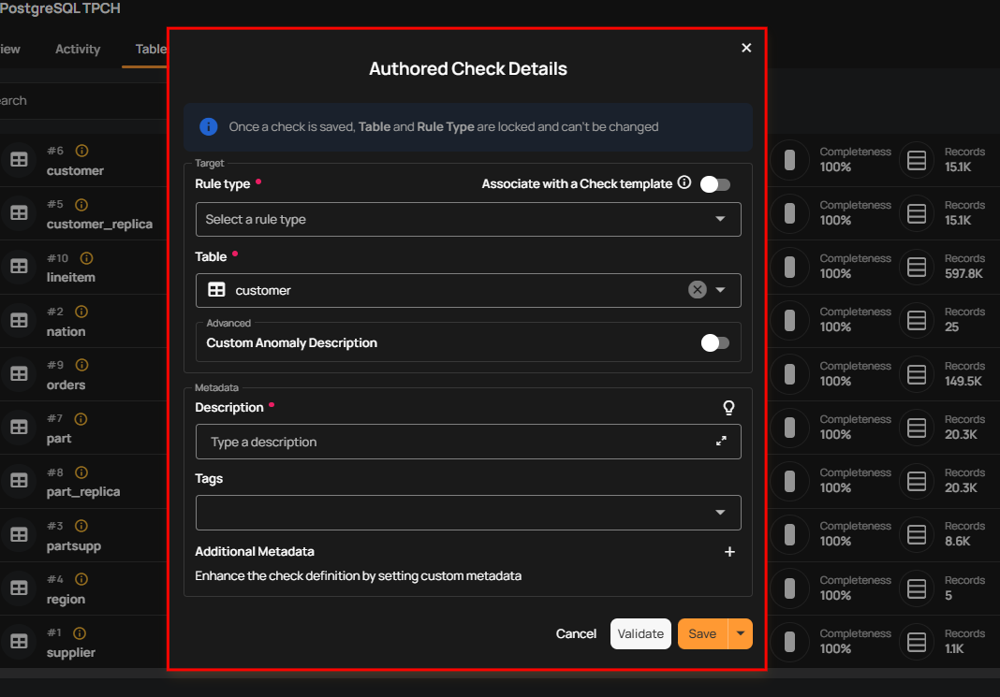

# Add Checks

**Add Check** allows you to create rules to validate the data within a particular table. You can choose the type of rule, link it directly to the selected table, and add descriptions or tags. This ensures that the table's data remains accurate and compliant with the required standards.

**Step 1:** Click on the vertical ellipse next to the table name and select **Add Checks**.

A modal window will appear to add checks against the selected table.

To understand how to add checks, you can follow the remaining steps from the documentation [Checks Template.](../../checks/checks-template.md)