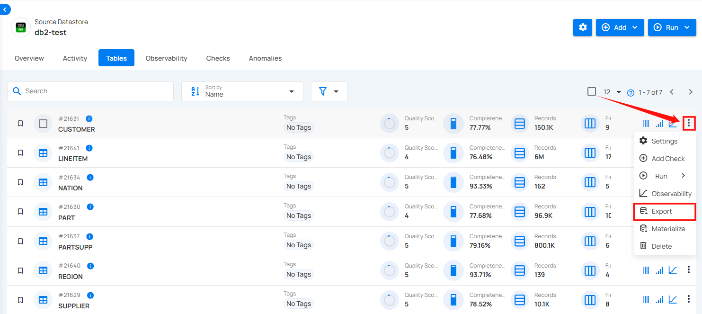

# Export

**Export feature** lets you capture changes in your tables. You can export metadata for Quality Checks, Field Profiles, and Anomalies from selected tables to an enrichment datastore. This helps you analyze data trends, find issues, and make better decisions based on the table data.

**Step 1:** Select the tables in your JDBC datastore that you would like to export, then click on **Export**.

A modal window will appear with the **Export Operation** setting.

For the next steps, detailed information on the Export Operation is available in the [Export Operation](../enrichment-operation/export-operation.md) section of the documentation.