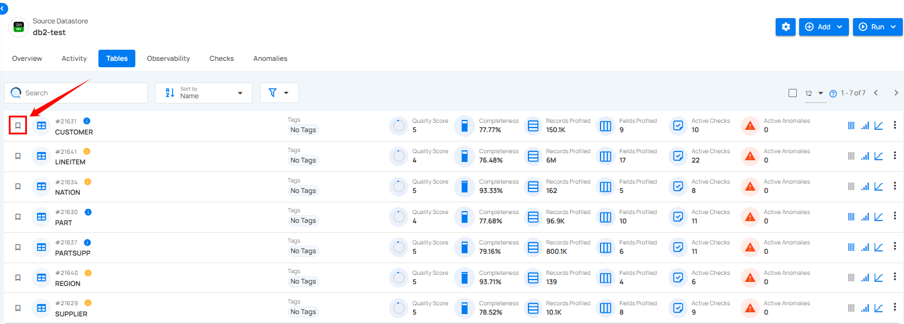
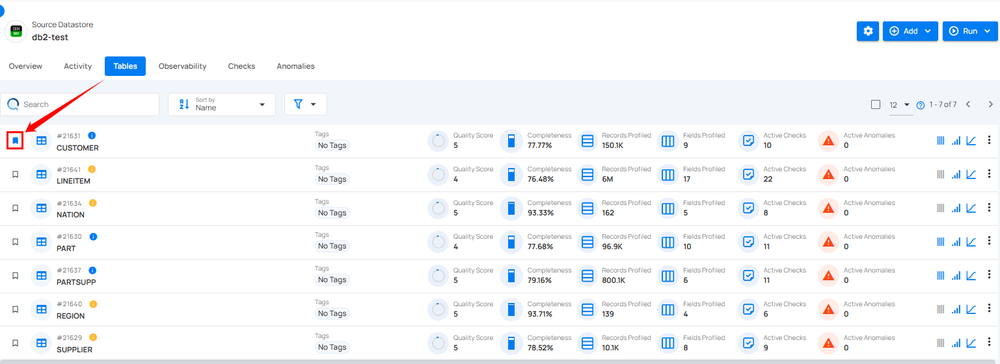

# Mark Tables & Files as Favorite

Marking tables and files as favorite allows you to quickly access important items. This feature helps you prioritize and manage the tables and files you use frequently, making data management more efficient.

!!! info
    Favoriting a table or file is user-specific. Only you can see your favorites; it does not affect other users.

**Step 1**: Locate the tables and files you want to mark as favorites and click on the bookmark icon to mark the table and file as a favorite.

After clicking on the bookmark icon, your table or file is successfully marked as a favorite and a success flash message will appear stating “The Table has been favorited”.

**Step 2**: To unmark tables and files, simply click on the bookmark icon of the marked tables and files. This will remove it from your favorites.

