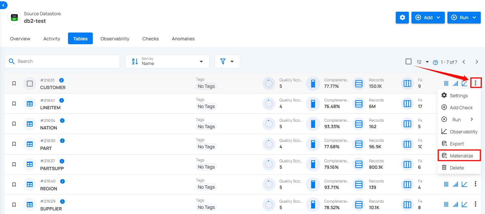
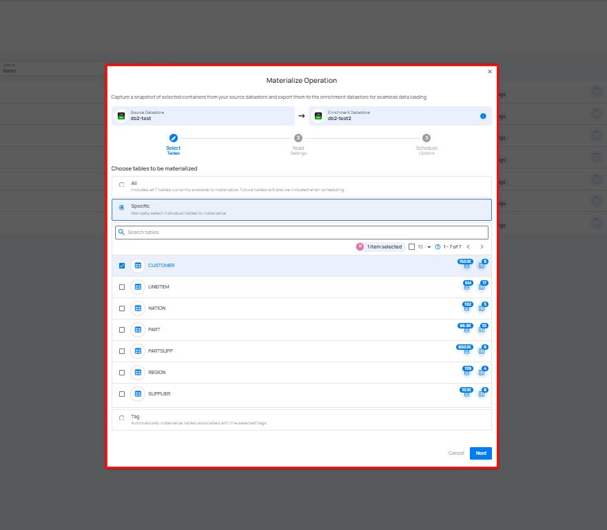

# Materialize

**Materialize Operation** captures snapshots of selected containers from a source datastore and exports them to an enrichment datastore for seamless data loading. Users can run it instantly or schedule it at set intervals, ensuring structured data is readily available for analysis and integration.

**Step 1:** Select the tables in your JDBC datastore that you would like to capture and export containers for the Materialize Operation, then click on **Materialize**.

A modal window will appear with the **Materialize Operation** setting.

For the next steps, detailed information on the materialize operation is available in the [Materialize Operation](https://userguide.qualytics.io/container/materialize-operation/) section of the documentation.