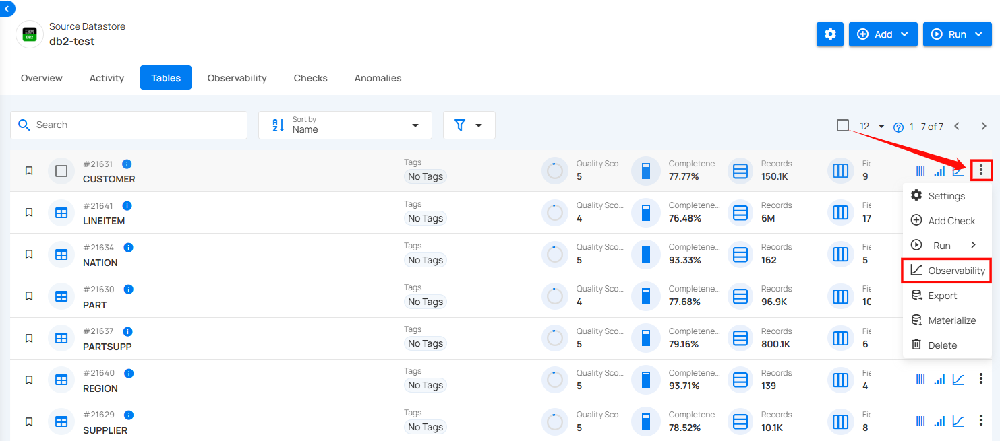
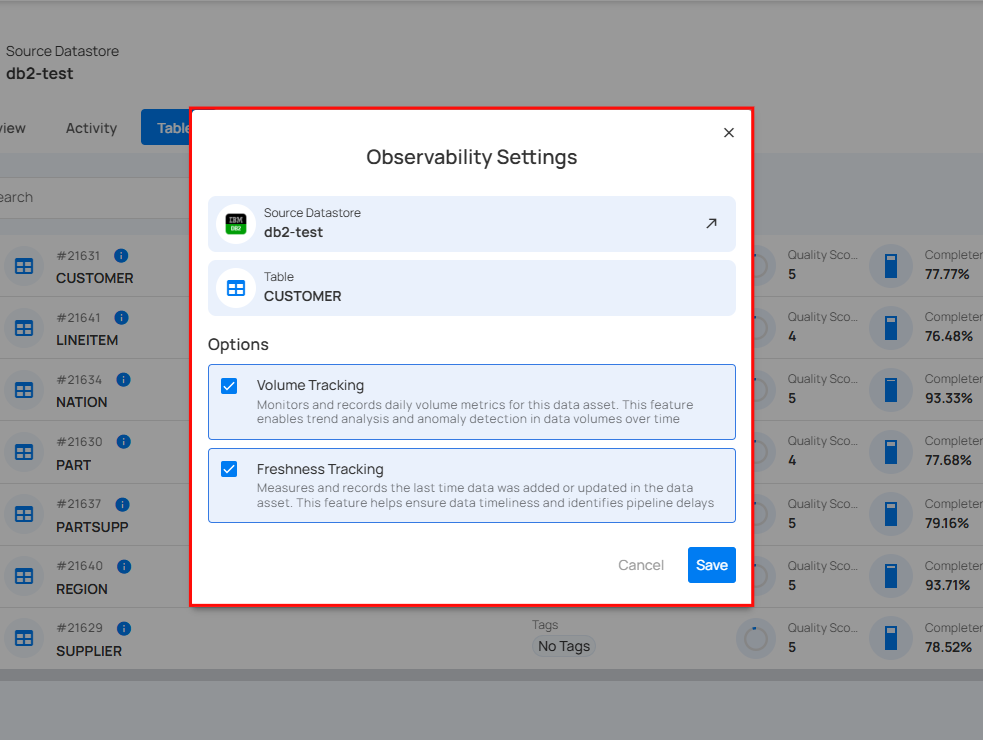
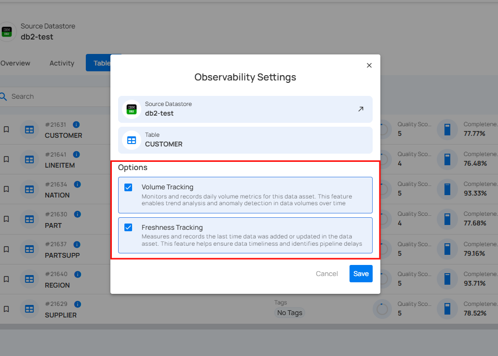
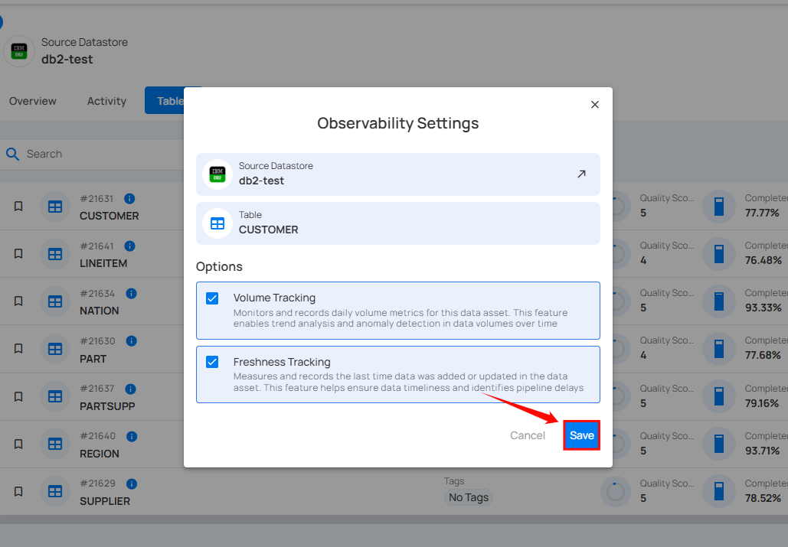

# Observability Settings

Observability helps you track and monitor data performance in your connected source datastore’s tables and files. It provides insights into data volume, detects anomalies, and ensures smooth data processing by identifying potential issues early. This makes it easier to manage and maintain data quality over time.

**Step 1:** Select the table in your JDBC datastore that you would like to monitor, then click on **Observability.**  

A modal window **“Observability Settings”** will appear. Here you can view the details of the table and datastore where actions have been applied.

**Step 2:** Check the "**Volume Tracking**" to enable trend analysis and anomaly detection in data volumes over time and check the "**Freshness Tracking**" to ensure data timeliness and to identify pipeline delays.

**Volume Tracking** monitors and records daily volume metrics for this data asset. This feature enables trend analysis and anomaly detection in data volumes over time. **Freshness Tracking** measures and records the last time data was added or updated in the data asset. This feature helps ensure data timeliness and identifies pipeline delays.

**Step 3:** Click on the **Save** button.

After clicking on the Save button, a success flash message will appear stating **"Profile has been successfully updated"**.

