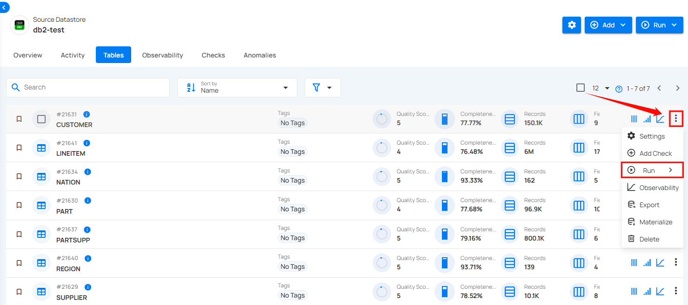
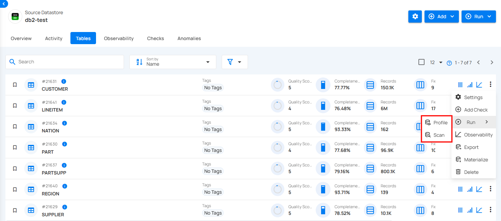

# Run

Execute various operations like profiling or scanning your table or file. It helps validate data quality and ensures that the table meets the defined checks and rules, providing insights into any anomalies or data issues that need attention.

**Step 1:** Click on the vertical ellipse next to the table name and select **Run**.

Under **Run**, choose the type of operation you want to perform:

- **Profile**: To collect metadata and profile the table's contents.

- **Scan**: To validate the data against defined rules and checks.

To understand how a profile operation is performed, you can follow the remaining steps from the documentation [Profile Operation.](https://userguide.qualytics.io/source-datastore/profile/#configuration).

To understand how a scan operation is performed, you can follow the remaining steps from the documentation [Scan Operation.](https://userguide.qualytics.io/source-datastore/scan/#configuration)
