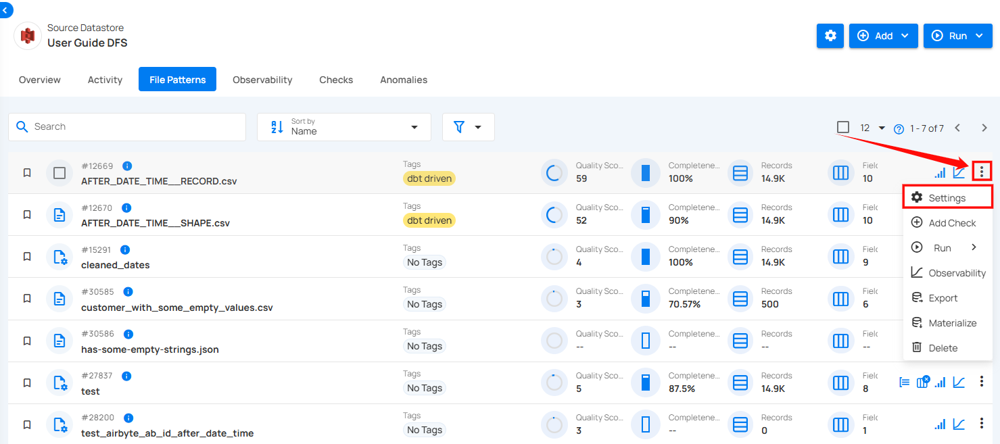

# Settings For DFS Files Pattern

Settings allow you to edit how data is processed and analyzed for a specific file patterns in your connected source datastore. This includes selecting fields for incremental and partitioning strategies, grouping data, excluding certain fields from scans, and adjusting general behaviors.

**Step 1:** Click on the vertical ellipse next to the file pattern of your choice and select **Settings** from the dropdown list.

A modal window will appear for **“File Pattern Settings”**.

**Step 2:** Modify the table setting based on:

- Group Criteria

- Excluding

- General

## Group Criteria

**Group Criteria** allow you to organize data into specific groups for more precise analysis. By grouping fields, you can gain better insights and enhance the accuracy of your profiling. 

For information about **Group Criteria**, you can refer to the documentation on [Grouping.](../container/overview-of-grouping.md)

## Excluding

**Excluding** allows you to choose specific fields from a file pattern that you want to exclude from data checks. This helps focus on the fields that matter most for validation while ignoring others that are not relevant to the current analysis.

For information about **Excluding**, you can refer to the documentation on [Excluding Settings.](../container/overview-of-infer-data-type.md#excluding-fields)

## General

You can control how file patterns behave by checking or unchecking options to make data processing easier and more consistent. These settings help the system automatically adjust file structures for better integration and analysis.

* **Inferring Data Types:** When enabled, the system figures out the correct data type for each field and applies it automatically. This keeps data consistent and reduces errors, saving you time on manual fixes.

* **First Row as Field Names:** Turning this on uses the first row of a file as headers, making it simple to map and organize data in the right format.

* **Treating Empty Values as Nulls:** The Treat empty values as null setting controls how empty fields in files like Excel and CSV are handled. If enabled (true), empty fields are treated as NULL (missing data). If disabled (false), they are stored as empty strings (""), meaning the field exists but is blank. This affects reporting, calculations, and data processing, as NULL values are ignored while empty strings may still be counted.

**Step 3:** Once you have configured the file pattern settings, click on the **Save** button.

After clicking on the **Save** button, your table is successfully updated and a success flash message will appear stating **"File Pattern has been successfully updated"**.

