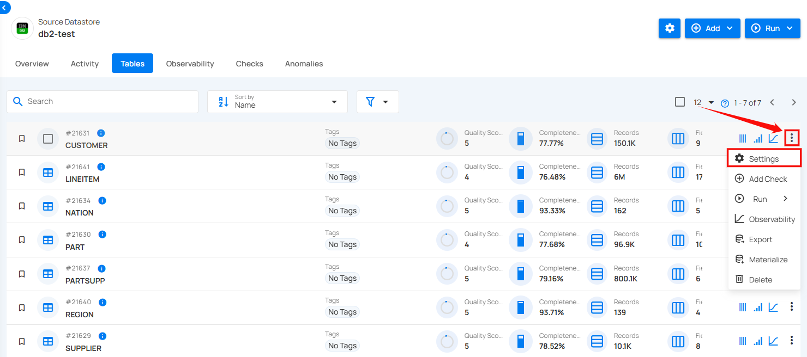
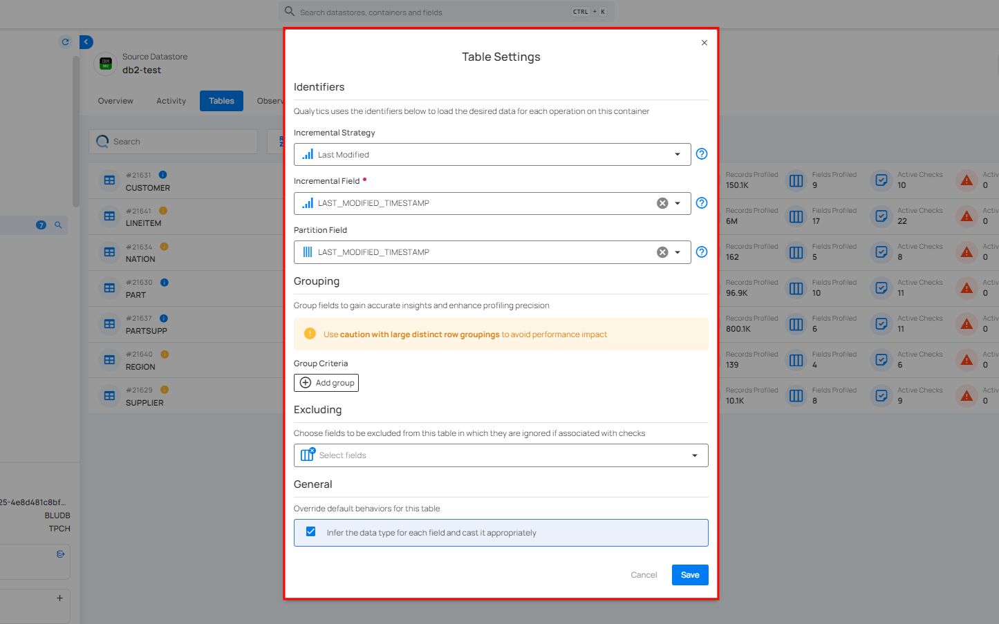
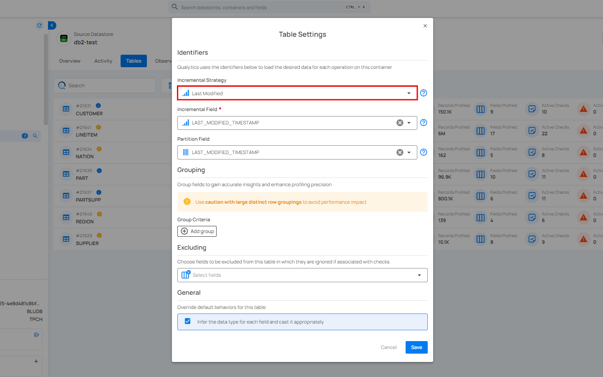
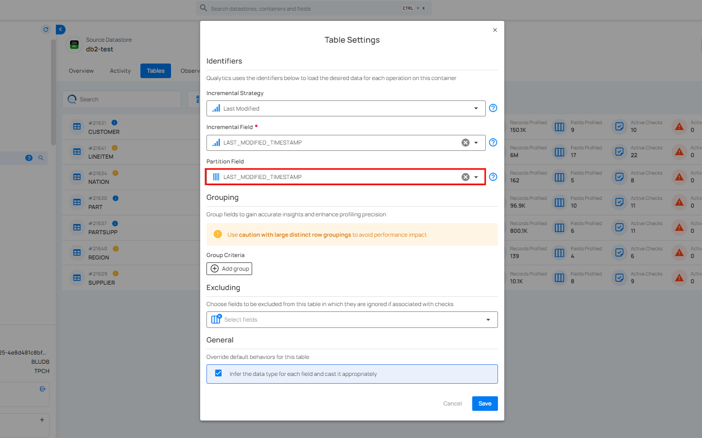
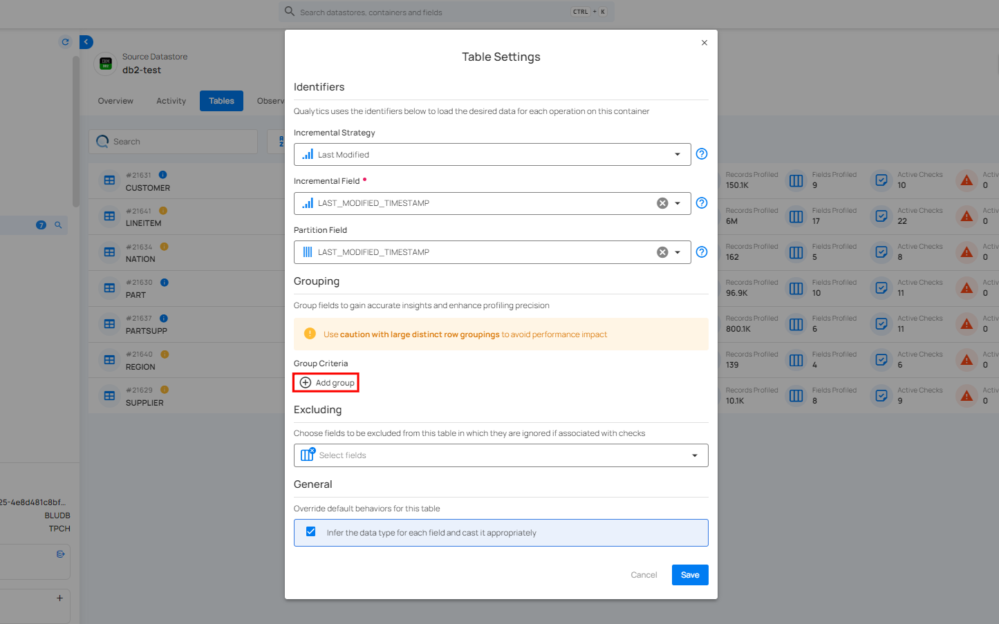
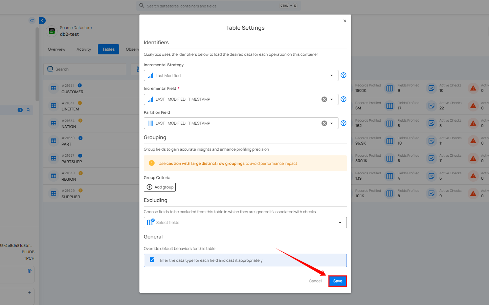

# Settings For JDBC Table

Settings allow you to edit how data is processed and analyzed for a specific table in your connected source datastore. This includes selecting fields for incremental and partitioning strategies, grouping data, excluding certain fields from scans, and adjusting general behaviors.

**Step 1:** Click on the vertical ellipse next to the table of your choice and select **Settings** from the dropdown list.

A modal window will appear for **“Table Settings”**.

**Step 2:** Modify the table setting based on:

- Identifiers

- Group Criteria

- Excluding

- General

## Identifiers

An **Identifier** is a field that can be used to help load the desired data from a Table in support of analysis. For more details about identifiers, you can refer to the documentation on [Identifiers.](https://userguide.qualytics.io/container/overview-of-identifiers/)

### Incremental Strategy

This is crucial for tracking changes at the row level within tables. This approach is essential for efficient data processing, as it is specifically used to track which records have already been scanned. This allows for scan operations to focus exclusively on new records that have not been previously scanned, thereby optimizing the scanning process and ensuring that only the most recent and relevant data is analyzed.

!!! note
    If you have connected a DFS datastore, no manual setup is needed for the incremental strategy, the system automatically tracks and processes the latest data changes.

For information about incremental strategy, you can refer to the [Incremental Strategy](https://userguide.qualytics.io/container/overview-of-identifiers/#partition-field) section in the Identifiers documentation.   
                                                                                    
### Incremental Field

**Incremental Field** lets you select a field that tracks changes in your data. This ensures only new or updated records are scanned, improving efficiency and reducing unnecessary processing.

### Partition Field

**Partition Field** is used to divide the data in a table into distinct segments, or dataframes. These partitions allow for parallel analysis, improving efficiency and performance. By splitting the data, each partition can be processed independently. This approach helps optimize large-scale data operations.

For information about **Partition Field**, you can refer to the [Partition Field](https://userguide.qualytics.io/container/overview-of-identifiers/#partition-field) section in the Identifiers documentation. 

## Group Criteria

**Group Criteria** allow you to organize data into specific groups for more precise analysis. By grouping fields, you can gain better insights and enhance the accuracy of your profiling. 

For information about **Group Criteria**, you can refer to the documentation on [Grouping.](https://userguide.qualytics.io/container/overview-of-grouping/)

## Excluding

**Excluding** allows you to choose specific fields from a table that you want to exclude from data checks. This helps focus on the fields that matter most for validation while ignoring others that are not relevant to the current analysis.

For information about **Excluding**, you can refer to the documentation on [Excluding Settings.](https://userguide.qualytics.io/container/overview-of-infer-data-type/#excluded-fields)

## General

You can control the default behavior of the specific table by checking or unchecking the option to infer the data type for each field. When checked, the system will automatically determine and cast the data types as needed for accurate data processing.

For information about **General**, you can refer to the documentation on [General Settings.](https://userguide.qualytics.io/container/overview-of-infer-data-type/)

**Step 3:** Once you have configured the table settings, click on the **Save** button.

After clicking on the **Save** button, your table is successfully updated and a success flash message will appear stating **"Table has been successfully updated"**.

