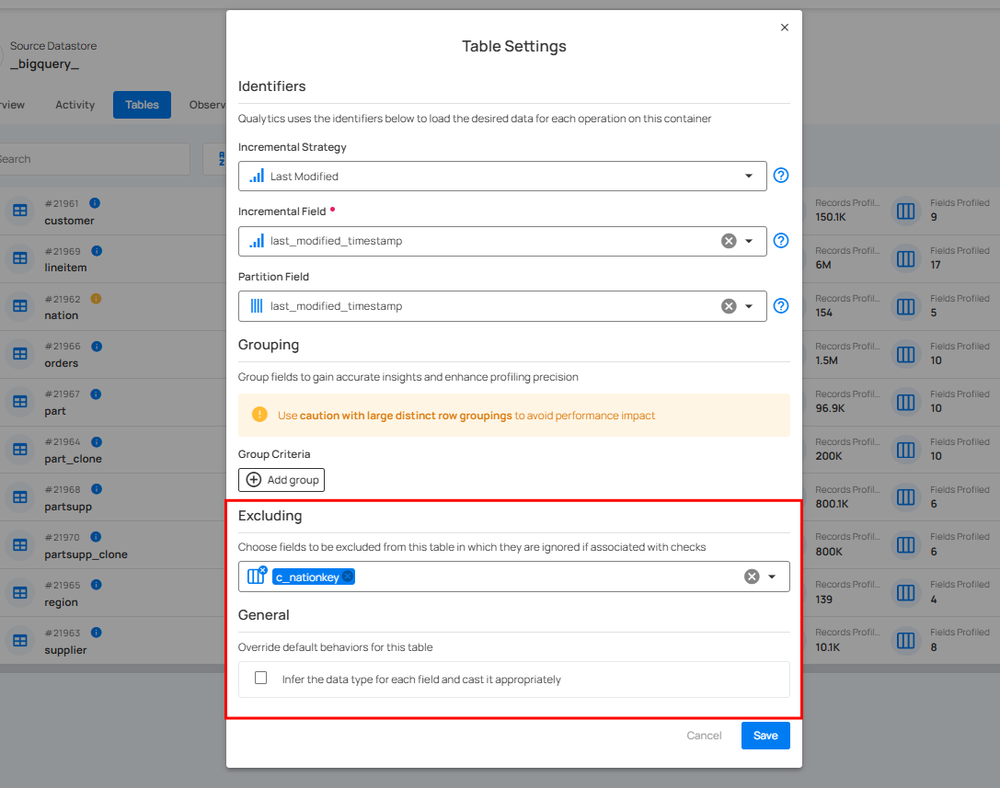
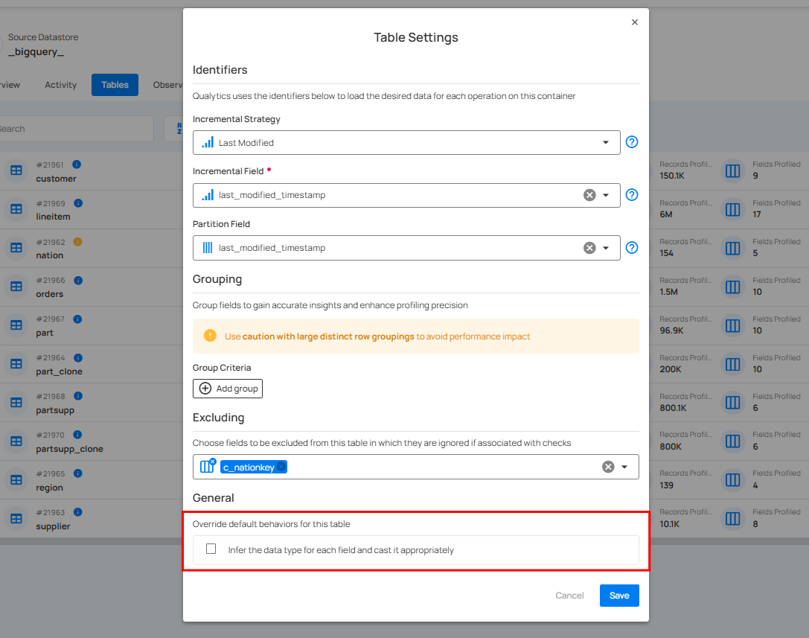

# General & Excluding Overview

General and excluding fields in Qualytics simplify data analysis by organizing key information and removing irrelevant or sensitive data. This ensures efficient management, protects privacy, and supports customized configurations for specific needs.

Let’s get started 🚀

## Manage General & Excluding 

**Step 1:** Log in to your Qualytics account and select the source datastore (**JDBC** or **DFS**) from the left menu that you want to manage.

**Step 2:** Select Tables (if JDBC datastore is connected) or File Patterns (if DFS datastore is connected) from the Navigation tab on the top.

**Step 3:** You will view the full list of tables or files belonging to the selected source datastore.

**Step 4:** Click on the vertical ellipse next to the table of your choice and select **Settings** from the dropdown list.

A modal window will appear for **“Table Settings”**, where you can manage general and excluding for the selected table.

## Excluding Fields

This configuration allows you to selectively exclude specific fields from containers. These excluded fields will be omitted from check creation during profiling operations while also being hidden in data previews, without requiring a profile run.

This can be helpful when dealing with sensitive data, irrelevant information, or large datasets where you want to focus on specific fields.

### Benefits of Excluding Fields

#### Targeted Analysis

Focus your analysis on the fields that matter most by removing distractions from excluded fields.

#### Data Privacy

Protect sensitive information by excluding fields that contain personal data or confidential information.

### Important Considerations

Excluding fields will permanently remove them from profile creation and data preview until you re-include them and re-profile the container.

## Infer Data Type

The "infer data type" option in containers allows the system to automatically determine the appropriate data types (e.g., fractional, integer, date) for columns within your data containers. This setting is configurable for both JDBC and DFS containers.

### Behavior in JDBC Datastores

* **Default:** Disabled  
* **Reason:** JDBC datastores provide inherent schema information from the database tables. Qualytics leverages this existing schema for accurate data typing.  
* **Override:** You can optionally enable this setting if encountering issues with automatic type detection from the source database.

### Behavior in DFS Datastores

* **Default:**  
  * Enabled for CSV files  
  * Disabled for other file formats (Parquet, Delta, Avro, ORC, etc.)  
      
* **Reason:**  
  * CSV files lack a defined schema. Data type inference helps ensure correct data interpretation.  
  * File formats like Parquet, Delta, Avro, and ORC have embedded schemas, making inference unnecessary.  
      
* **Override:** You can adjust the default behavior based on your specific data sources and requirements.

### Rule for the "Infer Data Type"

#### Schema-Based Data Sources

If the data source has a defined schema (JDBC, Delta, Parquet, Avro, ORC), the flag is set to "False".

#### Schema-less Data Sources

If the data source lacks a defined schema (CSV), the flag is set to "True".

## Override file pattern for DFS datastores

Override the file pattern to include files with the same schema but don't match the automatically generated pattern from the initial cataloging.

In some cases, you may have multiple files that share the same schema but don't match the automatically generated file pattern during the initial cataloging process. To address this, Qualytics has the ability to override file patterns in the UI. This allows you to specify a custom pattern that encompasses all files with the shared schema, ensuring they are properly included in profiling and analysis.

### Explore Deeper Knowledge

If you want to go deeper into the knowledge or if you are curious and want to learn more about DFS filename globbing, you can explore our comprehensive guide here: [How DFS Filename Globbing Works](https://userguide.qualytics.io/dfs-globbing/how-dfs-filename-globbing-works/).

### Important Considerations

Subsequent catalog operations without pruning (`Disabled`) will use the new pattern.