# Apply Check Template for Quality Checks

You can export check templates to make quality checks easier and more consistent. Using a set template lets you quickly verify that your data meets specific standards, reducing mistakes and improving data quality. Exporting these templates simplifies the process, making finding and fixing errors more efficient, and ensuring your quality checks are applied across different projects or systems without starting from scratch.

Let’s get started 🚀

**Step 1:**  Log in to your Qualytics account and click the **“Library”** button on the left side panel of the interface.

Here you can view the list of all the customer data validation templates. 

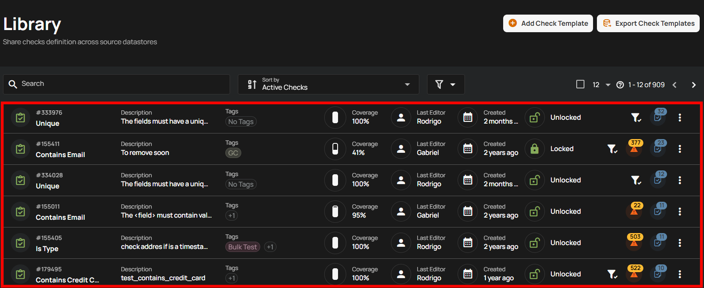

**Step 2**: Locate the template, click on the **vertical ellipsis (three dots)** next to it, and select **“Add Check”** from the dropdown menu to create a Quality Check based on this template

For demonstration purposes, we have selected the **“After Date Time”** template.

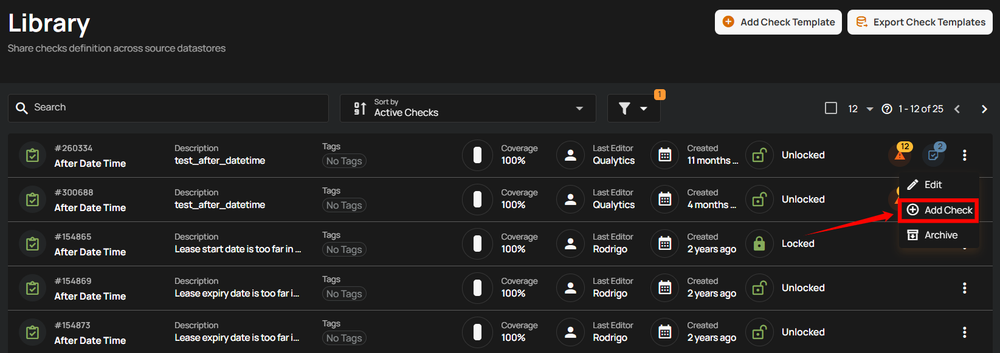

A modal window titled **“Authored Check Template”** will appear, displaying all the details of the Quality Check Template.

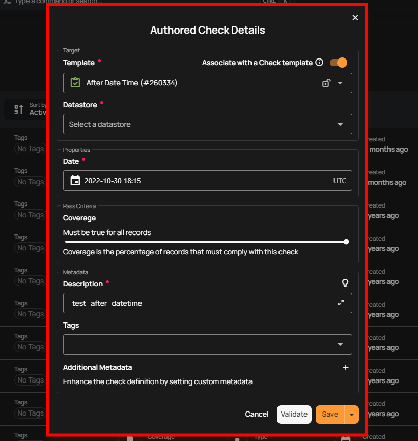

**Step 3:** Enter the following details: 

**1. Associate with a Check Template:** 

* If you toggle **ON** the **"Associate with a Check Template"** option, the check will be linked to a specific template.

* If you toggle **OFF** the **"Associate with a Check Template"** option, the check will not be linked to any template, which allows you full control to modify the properties independently.

Since we are applying a check template to create quality checks, it's important to keep the toggle on to ensure the template is applied as a quality check.

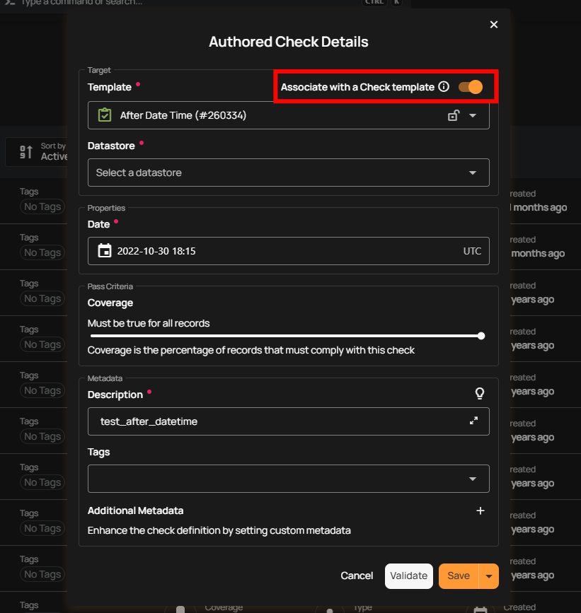

**2. Template:** Choose a **Template** from the dropdown menu that you want to associate with the quality check. The check will inherit properties from the selected template.

* **Locked**: If the template is locked, it will automatically sync with any future updates made to the template. However, you won't be able to modify the check's properties directly, except for specific fields like **Datastore**, **Table**, and **Fields**, which can still be updated while maintaining synchronization with the template.

* **Unlocked**: If the template is unlocked, you are free to modify the check's properties as needed. However, any future updates to the template will no longer affect this check, as it will no longer be synced with the template.

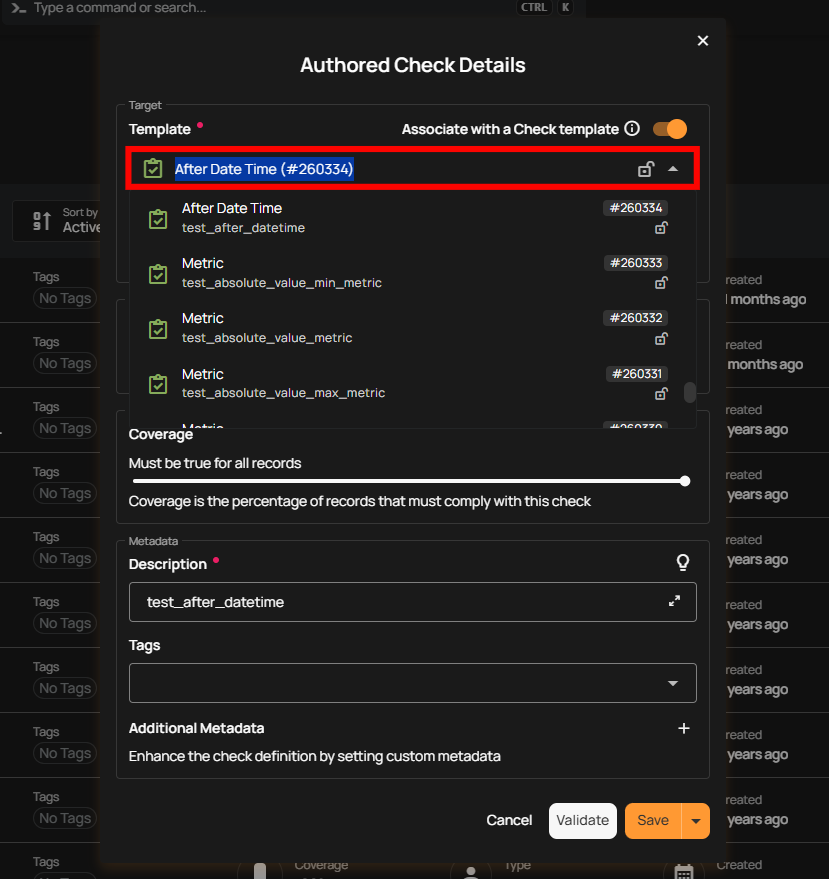

**3. Datastore:** Select the **Datastore, Table** and **Field** where you want to apply the check template. This ensures that the template is linked to the correct data source, allowing the quality checks to be performed on the specified datastore.

For demonstration purposes, we have selected the **“Analytics-DBT POC”** datastore, with the **“LINEITEM”** table and the **“L_COMMITDATE”** field.

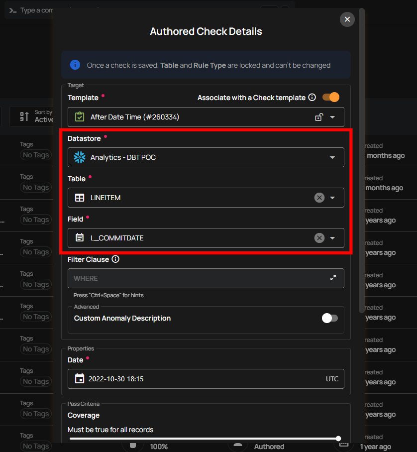

**Step 4:** After completing all the check details, click on the **"Validate"** button. This will perform a validation operation on the check without saving it. The validation allows you to verify that the logic and parameters defined for the check are correct. It ensures that the check will work as expected by running it against the data without committing any changes.

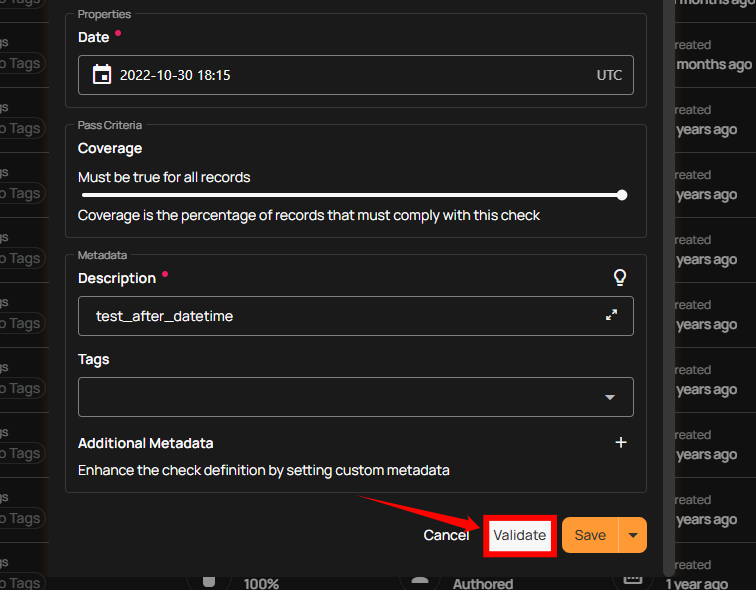

If the validation is successful, a green message will appear saying **"Validation Successful"**. 

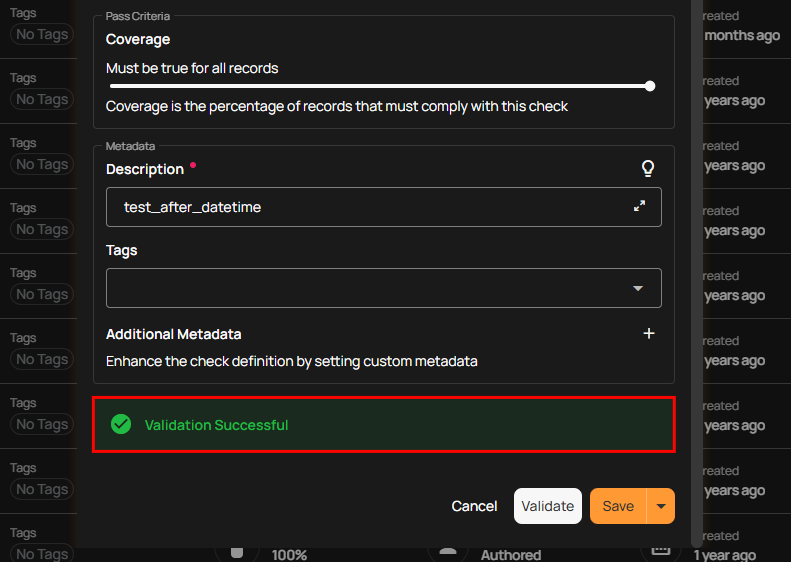

If the validation fails, a red message will appear saying **"Failed Validation"**. This typically occurs when the check logic or parameters do not match the data properly.

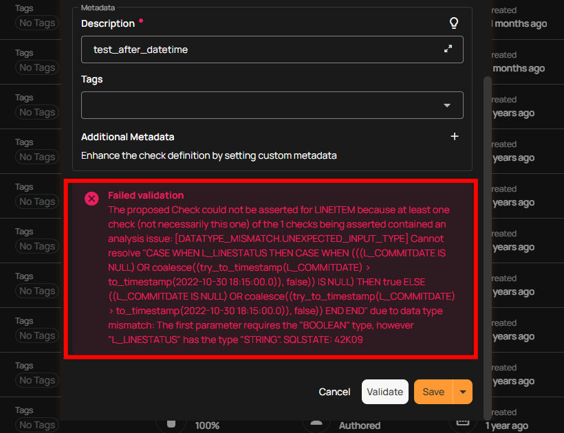

**Step 5:** Once you have a successful validation, click the **"Save"** button. 

!!! info 
    You can create as many Quality checks as you want for a specific template.

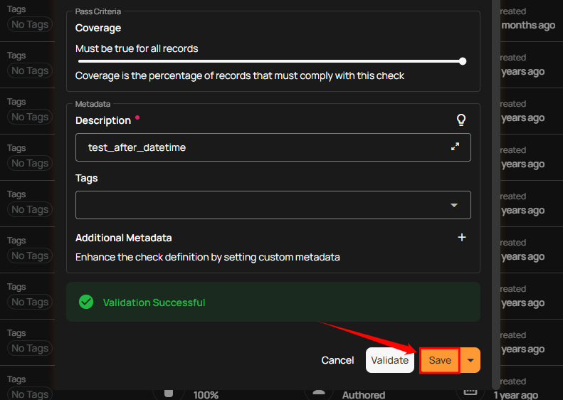

After clicking on the **“Save”** button your check is successfully created and a success flash message will appear saying **“Check successfully created”.**

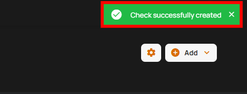