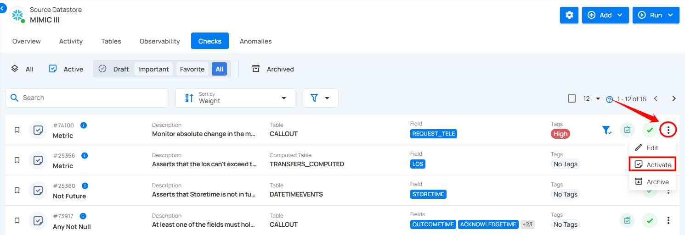

# Activate Archived Checks

You can activate archived checks individually or in bulk.

## Method I: Activate Specific Check

**Step 1:** Navigate to the **Archived** check section, and click on the vertical ellipsis (⋮) next to the archived check you want to activate, and select **"Activate"** from the drop-down menu.

For Demonstration purposes, we have selected the **"Metric"** check.

**Step 2:** A confirmation modal window **“Activate Check”** will appear, click on the **“Activate”** button to activate the archived check.

**Step 3:** After clicking on the **Activate** button, your check has been successfully moved to the active checks and a success message will appear on the screen.

## Method II: Activate Archived Checks in Bulk

**Step 1:** Hover over the archived checks and click on the checkbox to select multiple checks in bulk.

When multiple checks are selected, an action toolbar appears, displaying the total number of checks chosen along with a vertical ellipsis for additional bulk action options.

**Step 2:** Click on the vertical ellipsis (⋮) and choose **"Activate"** from the drop-down menu to activate the selected checks.

**Step 3:** A confirmation modal window **“Bulk Activate Checks”** will appear, click on the **“Activate”** button to activate the archived checks.

After clicking on the **Activate** button, your archived checks will be activated and a success message will appear on the screen.