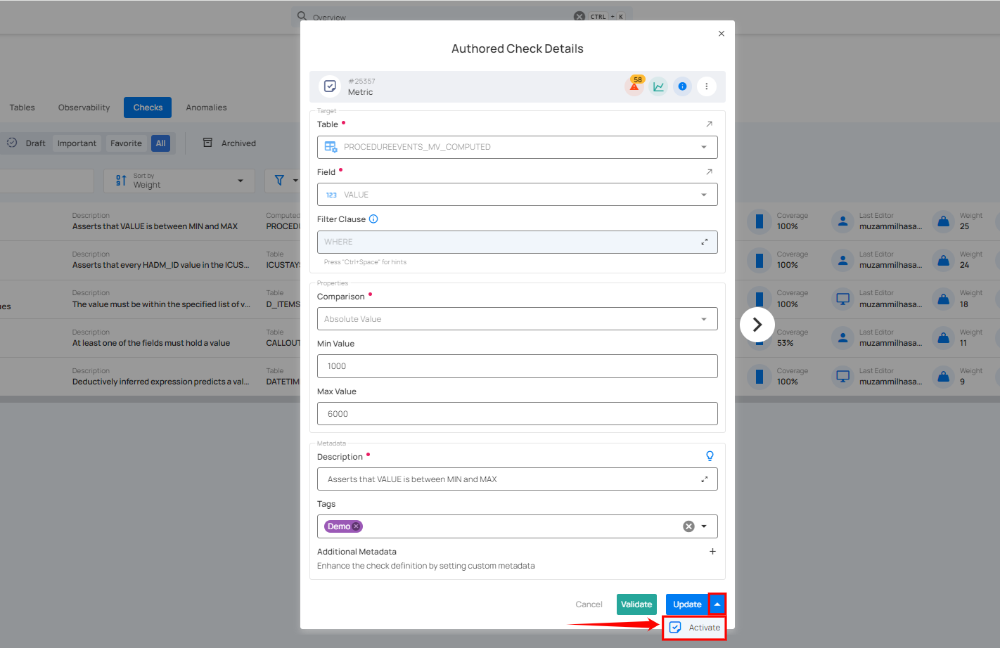
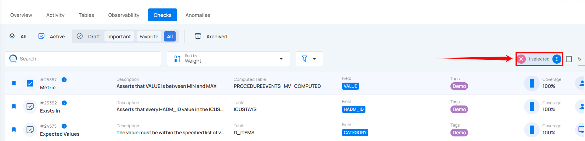

# Activate Draft Checks

There are two ways to activate draft checks: you can activate specific checks or activate multiple checks in bulk.
 
## Method I. Activate Specific Check

**Step 1:** Navigate to the **Draft** check section and click the vertical ellipsis **(⋮)** next to the draft check you want to activate, and select **Edit** from the dropdown menu.

For demonstration purposes, we have selected the **"Metric"** check.

A modal window will appear with the check details. If you want to make any changes to the [check details](https://userguide.qualytics.io/checks/checks-template/#:~:text=Enter%20the%20following%20details%20to%20add%20the%20check%20template%3A), you can edit them.

**Step 2:** Click the **down arrow** icon with the **Update** button. A dropdown menu will appear. Click the **Activate** button.  

After clicking the **Activate** button, your check has been successfully moved to active checks, and a success message will appear on the screen.

Alternatively, you can activate a draft check by clicking the vertical ellipsis **(⋮)** next to the draft check and selecting **"Activate"** from the dropdown menu.

A confirmation modal window **“Activate Check”** will appear. Click the **“Activate”** button to activate the draft check.

## Method II. Activate Draft Checks in Bulk

**Step 1:** Hover over the draft checks and click the checkbox to select multiple checks in bulk.

 
When multiple checks are selected, an action toolbar appears, displaying the total number of checks chosen along with a vertical ellipsis for additional bulk action options.

**Step 2:** Click the vertical ellipsis **(⋮)** and choose **"Activate"** from the dropdown menu to activate the selected checks.

**Step 3:** A confirmation modal window **“Bulk Activate Checks”** will appear. Click the **“Activate”** button to activate the draft checks.

After clicking the **Activate** button, your draft checks will be activated, and a success message will appear on the screen.