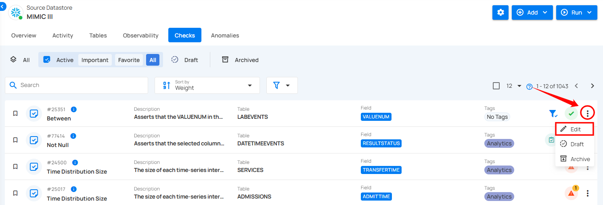
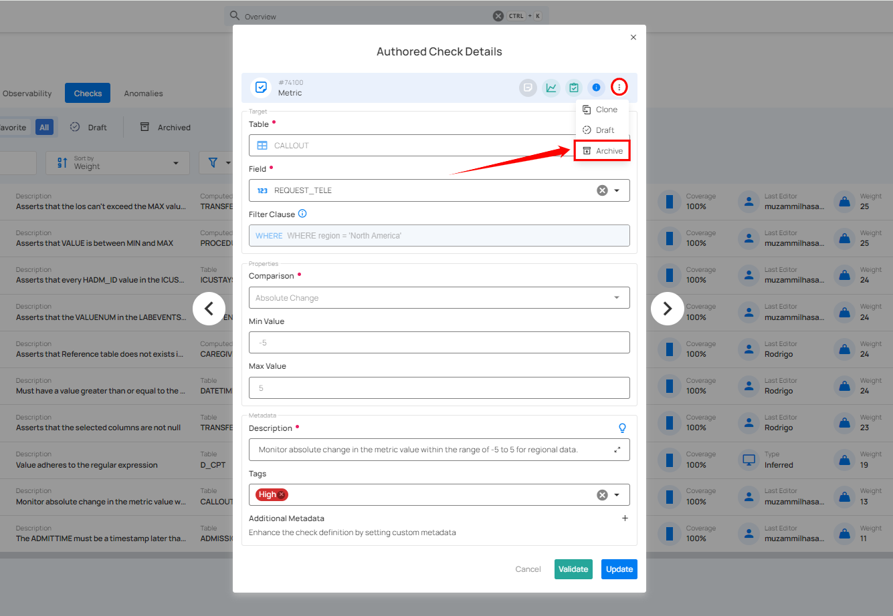
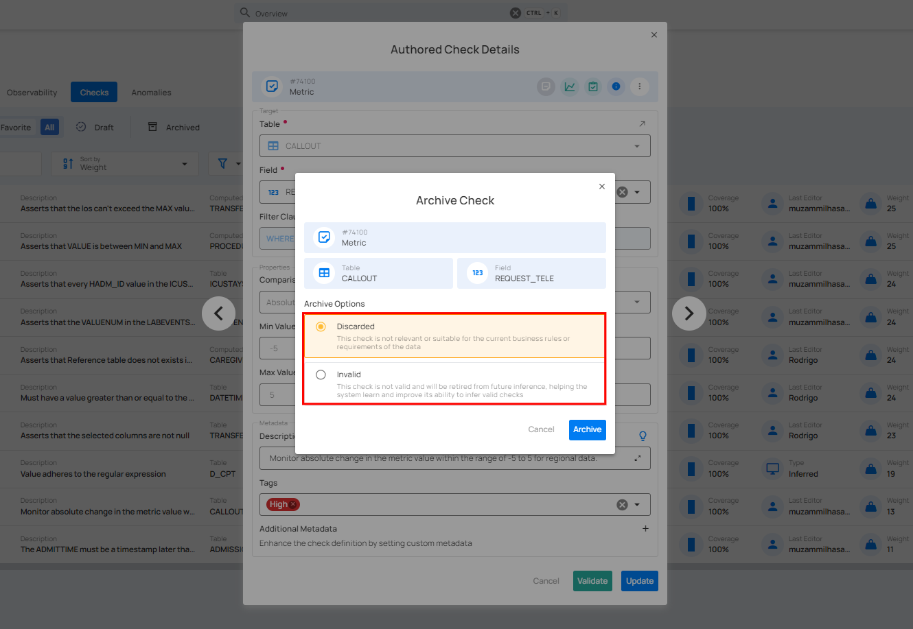
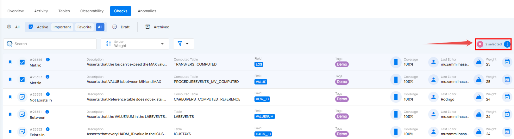
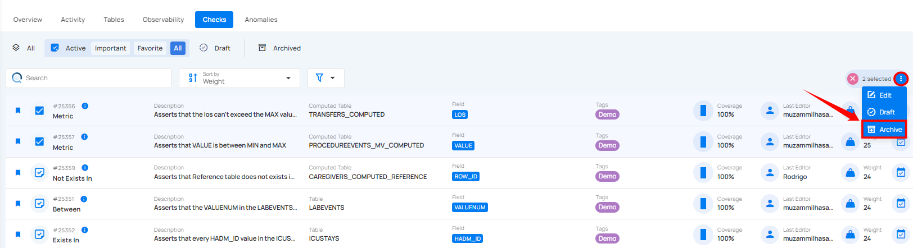

# Archive Checks

There are two ways to archive checks: you can archive individual checks or archive multiple checks in bulk.

## Method I: Archive Specific Check

You can archive a specific check using two ways: either by directly clicking the archive button on the check or by opening the check and selecting the archive option from the action menu.

### 1. Archive Directly

**Step 1:** Locate the check (whether Active or Draft) that you want to archive and click the vertical ellipsis **(⋮)** next to it and select **"Archive"** from the dropdown menu.

For demonstration purposes, we have selected the **"Greater Than Field"** check.

**Step 2:** A modal window titled **"Archive Check"** will appear, providing you with the following archive options:

* **Discarded**: Select this option if the check is no longer relevant or suitable for the current business rules or data requirements. This helps in archiving checks that are obsolete but still exist for historical reference.

* **Invalid**: Choose this option if the check is not valid and should be retired from future inference. This helps the system learn from invalid checks and improves its ability to infer valid checks in the future.

**Step 3:** Once you've made your selection, click the **Archive** button to proceed.

After clicking the **Archive** button, your check is moved to the archive, and a success message will appear on the screen.

### 2. Archive from Action Menu

**Step 1:** Locate the check (whether Active or Draft) that you want to archive and click the vertical ellipsis **(⋮)** next to it and select **"Edit"** from the dropdown menu.

For demonstration purposes, we have selected the **"Greater Than Field"** check.

**Step 2:** A modal window will appear displaying the check details. Click the vertical ellipsis **(⋮)** located in the upper-right corner of the modal window and click **"Archive"** from the dropdown menu.

**Step 3:** A modal window titled **“Archive Check”** will appear, providing you with the following archive options:

* **Discarded**: Select this option if the check is no longer relevant or suitable for the current business rules or data requirements. This helps in archiving checks that are obsolete but still exist for historical reference.

* **Invalid**: Choose this option if the check is not valid and should be retired from future inference. This helps the system learn from invalid checks and improves its ability to infer valid checks in the future.

**Step 4:** Once you've made your selection, click the **Archive** button to proceed.

After clicking the **Archive** button, your check is moved to the archive, and a success message will appear on the screen.

## Method II: Archive Checks in Bulk

You can archive multiple checks in a single step, deactivating and storing them for future reference or restoration while keeping your active checks uncluttered.

**Step 1:** Hover over the checks (whether Active or Draft) and click the checkbox to select multiple checks.

When multiple checks are selected, an action toolbar appears, displaying the total number of selected checks along with a vertical ellipsis for additional bulk action options.

**Step 2:** Click the vertical ellipsis **(⋮)** and choose **"Archive"** from the dropdown menu to archive the selected checks.

A modal window will appear, providing you with the following archive options:

**1. Delete all anomalies associated with the checks**: Toggle this option **"On"** if you want to delete any anomalies related to the selected checks when archiving them.

**2. Archive Options**: You are presented with two options to categorize why the checks are being archived:

* **Discarded**: Select this option if the check is no longer relevant or suitable for the current business rules or data requirements. This helps in archiving checks that are obsolete but still exist for historical reference.

* **Invalid**: Choose this option if the check is not valid and should be retired from future inference. This helps the system learn from invalid checks and improves its ability to infer valid checks in the future.

**Step 3:** Once you've made your selections, click the **"Archive"** button to confirm and archive the checks.  

After clicking the **"Archive"** button, your selected checks (whether Active or Draft) will be successfully archived, and a success message will appear on the screen.