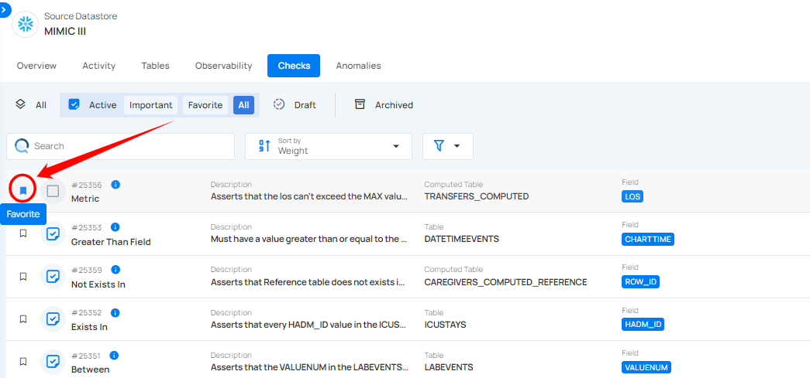

# Mark Check as Favorite

Locate the check you want to mark as a favorite and click the bookmark icon located on the right side of the check.

After clicking the **bookmark** icon, your check is successfully marked as a favorite, and a success message will appear on the screen.

To unmark a check, simply click the bookmark icon of the marked check. This will remove it from your favorites.

