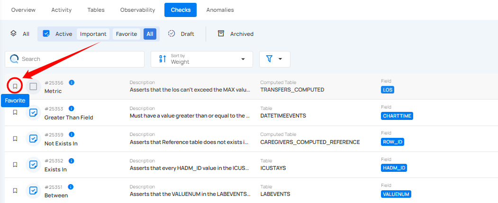

# Mark Check as Favorite

Marking a check as a favorite helps you quickly access and prioritize important checks in your data validation process. Favorited checks appear in the "Favorite" category, making them easier to manage and monitor.

**Step 1:** Locate the check that you want to mark as a favorite and click on the bookmark icon located on the right side of the check.

After clicking on the **bookmark** icon, your check is successfully marked as a favorite and a success message will appear on the screen.

To unmark a check, simply click on the bookmark icon of the marked check. This will remove it from your favorites.

