# Checks in Datastore

Checks are validation rules applied to datasets to ensure data quality and integrity. They can be categorized as Active, Draft, or Archived based on their status and usage. Each check includes detailed metadata such as importance, scan history, anomalies, and assertion results. This section guides you through viewing, managing, and analyzing these checks within your datastore.

Let's get started 🚀

## Navigation

**Step 1:** Log in to your Qualytics account and select the datastore from the left menu on which you want to manage your checks.

**Step 2:** Click on the **"Checks"** from the Navigation Tab.

## Categories Checks

You can categorize your checks based on their status, such as Active, Draft, Archived (Invalid and Discarded), or All, according to your preference. This categorization offers a clear view of the data quality validation process, helping you manage checks efficiently and maintain data integrity.

### All

By selecting **All Checks**, you can view a comprehensive list of all the checks in the datastore, including both **active** and **draft** checks, allowing you to focus on the checks that are currently being managed or are in progress. However, archived checks are not displayed in this.  

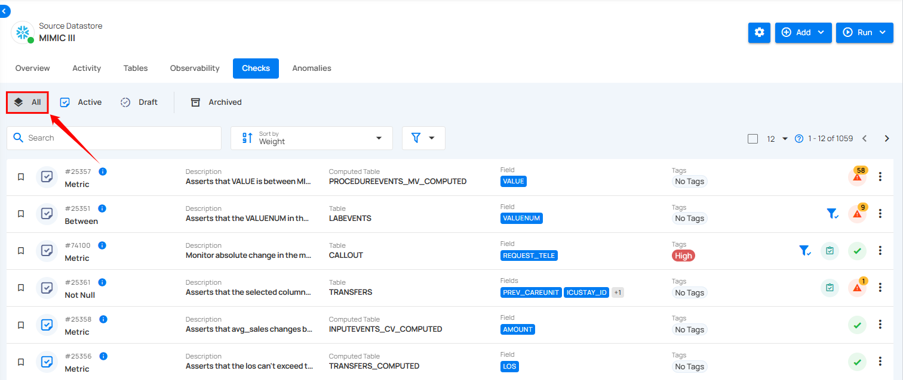

### Active

By selecting **Active**, you can view checks that are currently applied and being enforced on the data. These operational checks are used to validate data quality in real time, allowing you to monitor all active checks and their performance.

You can also categorize the active checks based on their importance and favorites to streamline your data quality monitoring.

**1. Important:** Shows only checks that are marked as important. These checks are prioritized based on their significance, typically assigned a weight of 7 or higher.

!!! note
    Important checks are prioritized based on a weight of 7 or higher.

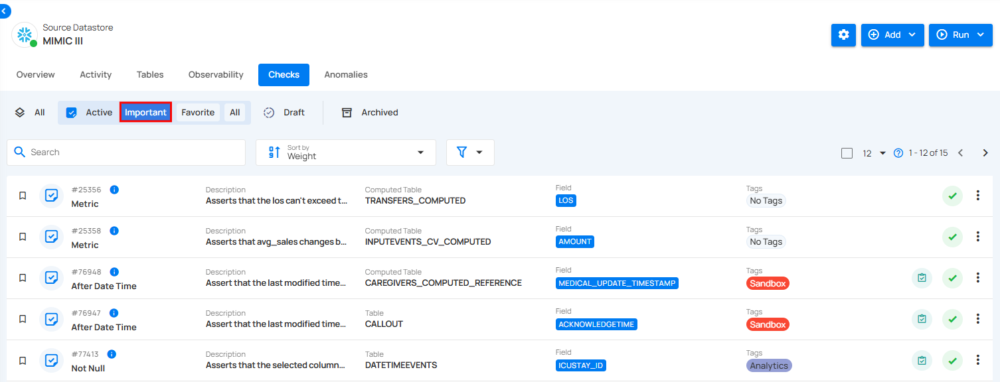

**2. Favorite:** Displays checks that have been marked as favorites. This allows you to quickly access checks that you use or monitor frequently.

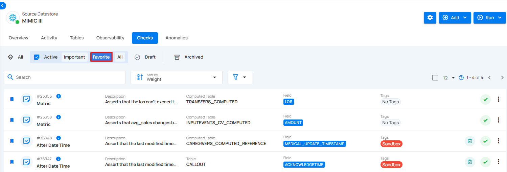

**3. All:** Displays a comprehensive view of all active checks, including important, favorite, and any checks that do not fall under these specific categories.

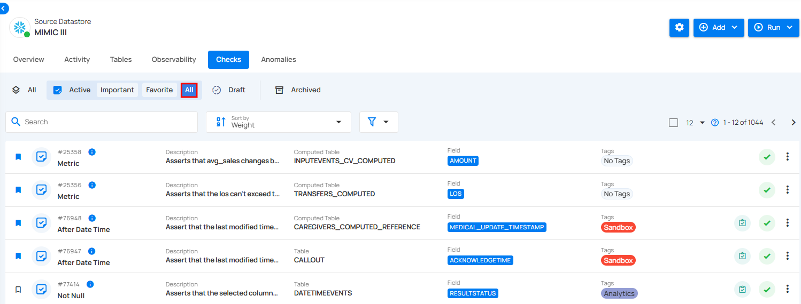

### Draft Checks

By selecting **Draft**, you can view checks that have been created but have not yet been applied to the data. These checks are in the drafting stage, allowing for adjustments and reviews before activation. Draft checks provide flexibility to experiment with different validation rules without affecting the actual data.

You can also categorize the draft checks based on their importance and favorites to prioritize and organize them effectively during the review and adjustment process.

**1. Important:** Shows only checks that are marked as important. These checks are prioritized based on their significance, typically assigned a weight of 7 or higher. 

**2. Favorite:** Displays checks that have been marked as favorites. This allows you to quickly access checks that you use or monitor frequently.  

**3. All:** Displays a comprehensive view of all draft checks, including important, favorite, and any checks that do not fall under these specific categories.

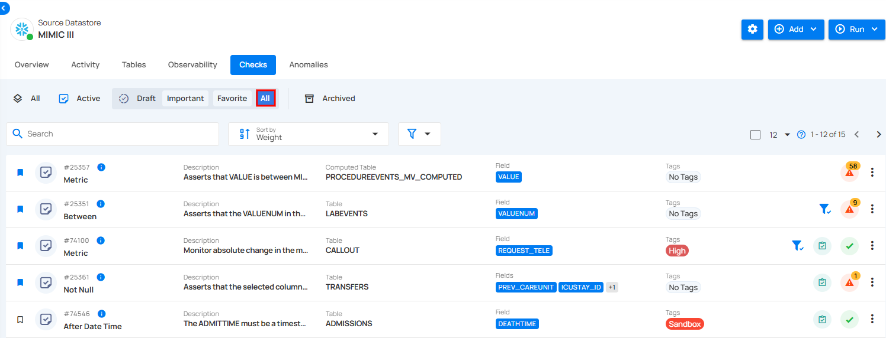

### Archived Checks

By selecting **Archived**, you can view checks that have been marked as discarded or invalid from use but are still stored for future reference or restoration. Although these checks are no longer active, they can be restored if needed.

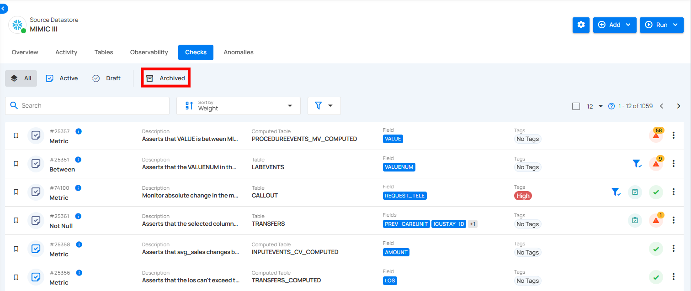

You can also categorize the archived checks based on their status as **Discarded**, **Invalid**, or view **All** archived checks to manage and review them effectively.

**1. Discarded**: Shows checks that have been marked as no longer useful or relevant and have been discarded from use.

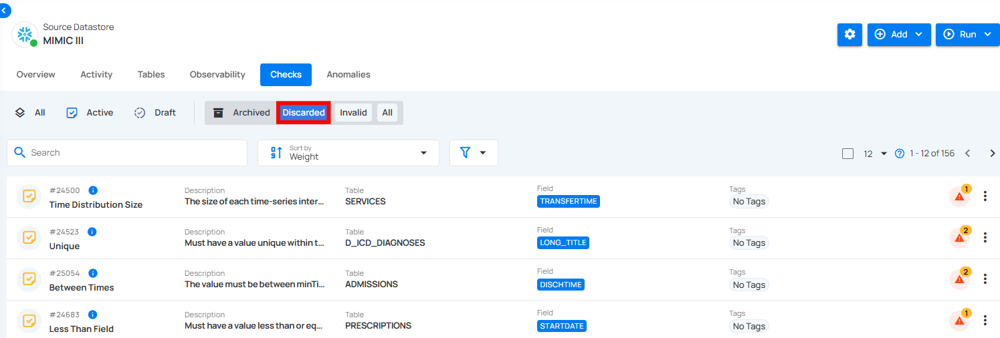

**2. Invalid**: Displays checks that are deemed invalid due to errors or misconfigurations, requiring review or deletion.

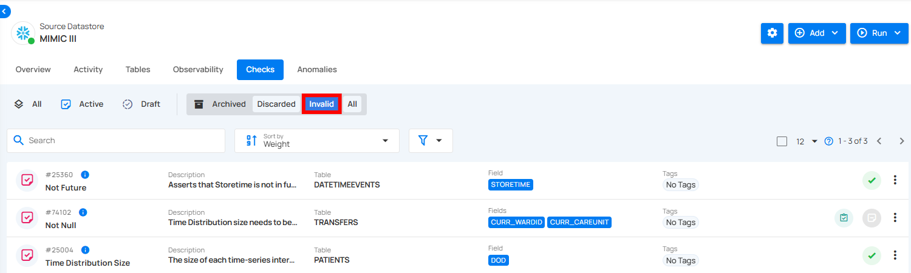

**3. All**: Provides a view of all archived checks within this category, including discarded and invalid checks.

## Check Info

Check Details provides important information about each check in the system. It shows when a check was last run, how often it has been used, when it was last updated, who made changes to it, and when it was created. This section helps users understand the status and history of the check, making it easier to manage and track its use over time.

**Step 1:** Locate the check you want to review, then hover over the info icon to view the Check Details.

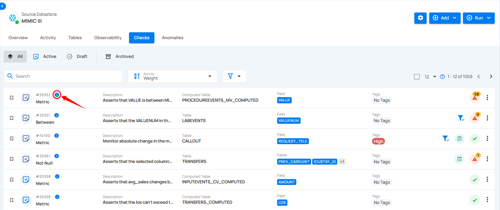

A popup will appear with additional details about the check.

### Last Asserted
Last Asserted At shows the most recent time the check was run, indicating when the last validation occurred. For example, the check was last asserted on **Oct 17, 2023, at 2:37 AM (GMT+5:30)**.

### Scans
Scans show how many times the check has been used in different operations. It helps you track how often the check has been applied. For example, the check was used in **30 operations**.

### Updated At
Updated At shows the most recent time the check was modified or updated. It helps you see when any changes were made to the check’s configuration or settings. For example, the check was last updated on **Sep 9, 2024, at 3:18 PM (GMT+5:30)**.

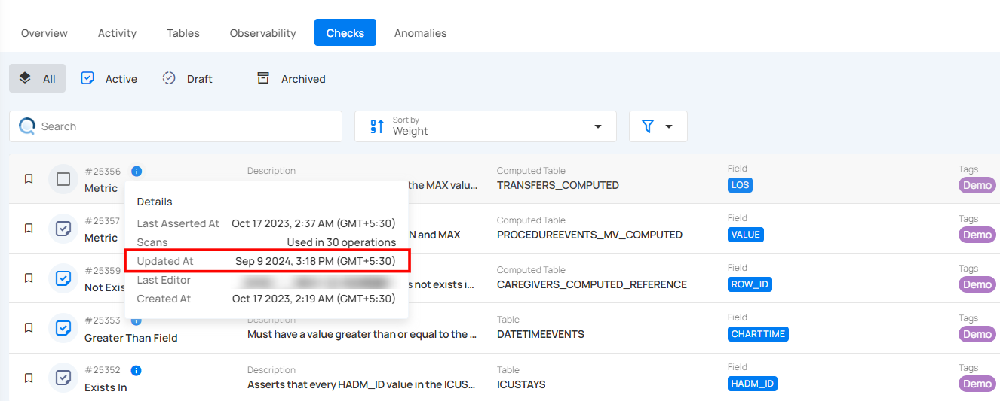

### Last Editor
Last Editor indicates who most recently made changes to the check. It helps track who is responsible for the latest updates or modifications. This is useful for accountability and collaboration within teams.

### Created At
Created At shows when the check was first made. It helps you know how long the check has been in use. This is useful for tracking its history. For example, the check was created on **Oct 17, 2023, at 2:19 PM (GMT+5:30)**.

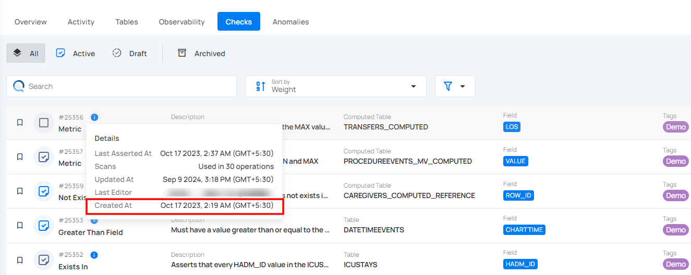

## Check Details

Check Detail View displays all key information related to a specific data quality check. It shows what the check is monitoring, how it's configured, where it's applied in the dataset, and whether any issues have been found. It also includes sections for viewing the check’s recent performance, related activities, and any additional metadata. This view helps users easily understand the purpose and current state of the check.

**Step 1:** Click on the check that you want to see the details of.

You will be navigated to the detail section, where you can view the **Summary**, **Observability,** **Properties**, **Activity**, and **Metadata** information.

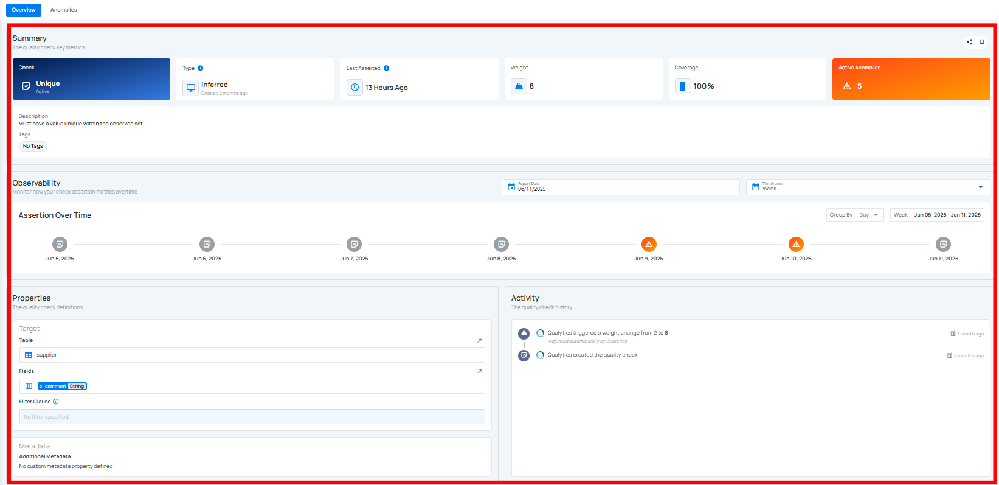

!!! info
       In addition to viewing the check details, you can also monitor and manage any anomalies associated with this check — all from the same page, without needing to navigate elsewhere.

### Summary Section

The Summary section shows that a data quality check is applied to a field and is currently active. It indicates whether the check was created automatically by the system or manually by a user and is being applied to the entire dataset and has a defined importance level. It also shows when the check last ran and whether there are any current issues found in the data.

**1. Check & Status** : The type of check applied to the data. In this case, it's a **Volumetric** check and the check is **Active**, meaning it's currently being applied.

**2. Type** : This check is **Authored**, meaning it was manually created by the users.

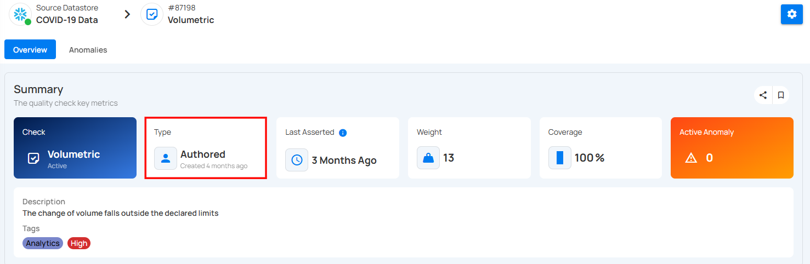

When you hover over the time period written below the type of the check, a pop-up appears displaying the complete date and time.

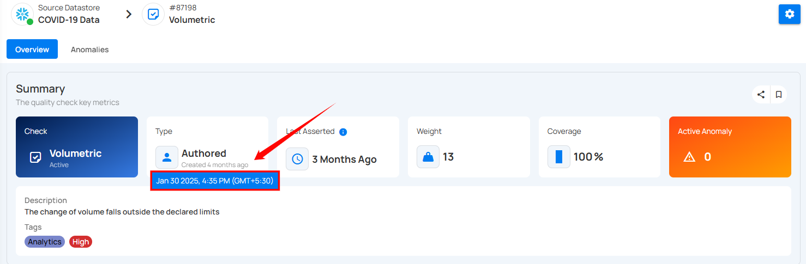

**3. Last Asserted** : Shows when the check was last run – **3 months ago** in this case.

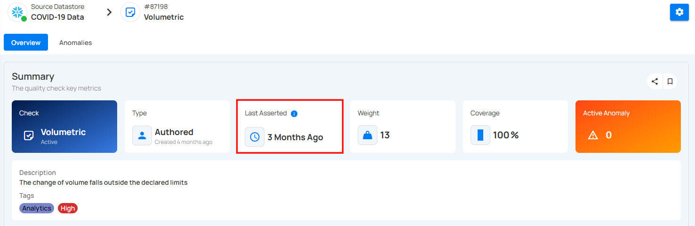

When you hover over the time the check last ran, a pop-up appears displaying the complete date and time.

**Last Asserted Details**

Click on the info icon to view the last asserted details.

A popup will appear with **Scans** details. Scans show how many times the check has been used in different operations. It helps you track how often the check has been applied. For example, the check was used in 19 operations.

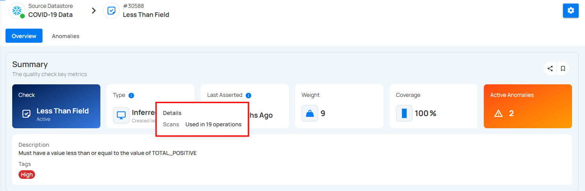

**4. Weight** : Indicates the importance or priority of this check – the weight is **13**.

**5. Coverage** : How much data this check applies to – here it's **100%**, meaning it applies to the whole dataset.

**6. Active Anomalies** : Number of current issues found – **0 anomalies** are active right now.

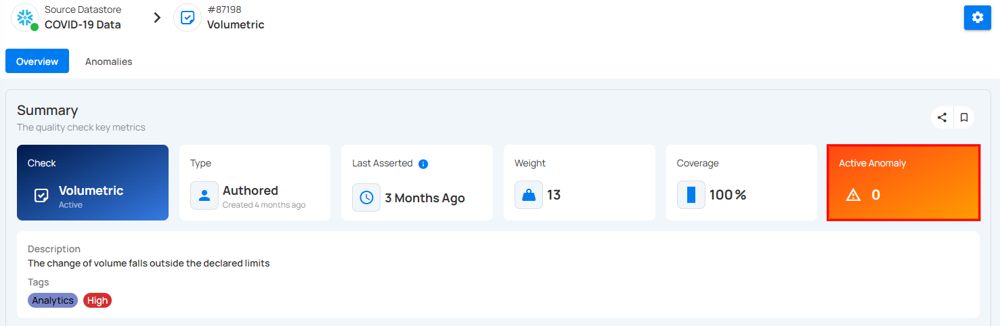

**7. Description** : Explains the rule or condition that the check is validating.

**8. Tags** : Displays any tags linked to the check. Users can also add new tags by clicking on the tag area.

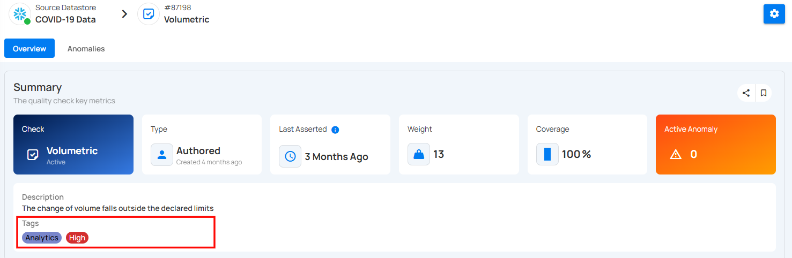

### Copy the Check Link

Click on the **Copy Check Link** icon(represented by share icon) located at the right corner of the summary section to copy a direct link to the selected check. This link can be shared with other users for quick access to the specific check within the platform.

### Favorite the check

Click on the bookmark icon located at the right corner of the summary section to mark the check as favorite.

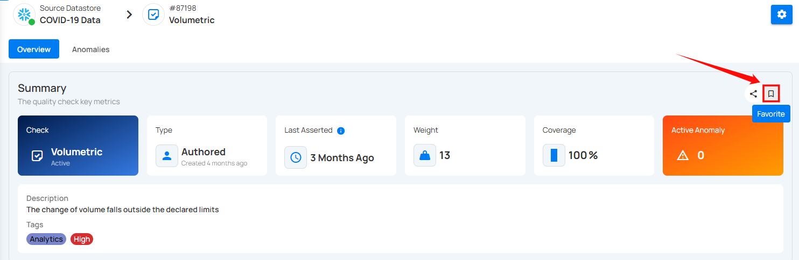

To unmark a check, simply click on the bookmark icon of the marked check. This will remove it from your favorites.

### Observability Section

**Observability** provides a visual overview of how a check performs over time by tracking assertion results. It helps identify trends, failures, or anomalies using daily status indicators across a selected timeframe.

Users can hover over any date in the timeline. It provides a comprehensive view of assertion statuses, including passed, failed, and anomalous results. By hovering over a specific date, users can access detailed information such as the result status, the number of asserted records, and any anomalies identified. Highlighting all available status types ensures a clearer understanding of the data quality over time.

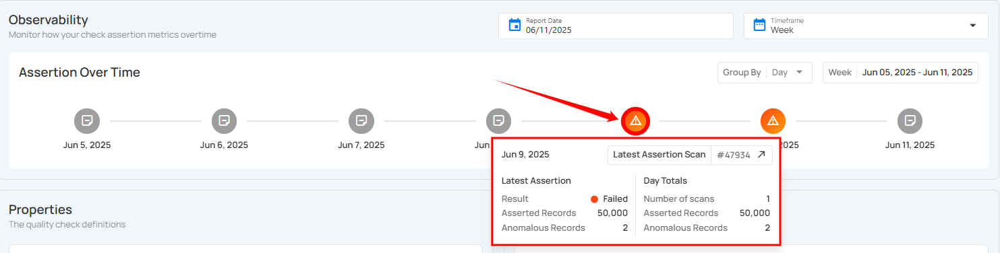

Additionally, clicking the Latest Assertion Scan button (e.g., #48151) will navigate users directly to the **Scan Results** page for that specific assertion.

### Selecting Report Date and Timeframe

The Observability section helps you monitor how your check assertion metrics change over time. You can customize the view by selecting a specific report date and timeframe to analyze trends over different periods.

#### Select the Report Date

**Step 1:** Locate the **Report Date** field at the top-right of the Observability section.

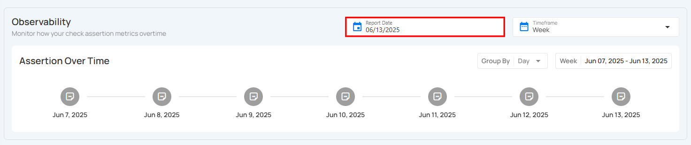

**Step 2:** Click on the **calendar** icon. A date picker will appear. Select the desired report date to update the Assertion Over Time graph accordingly.

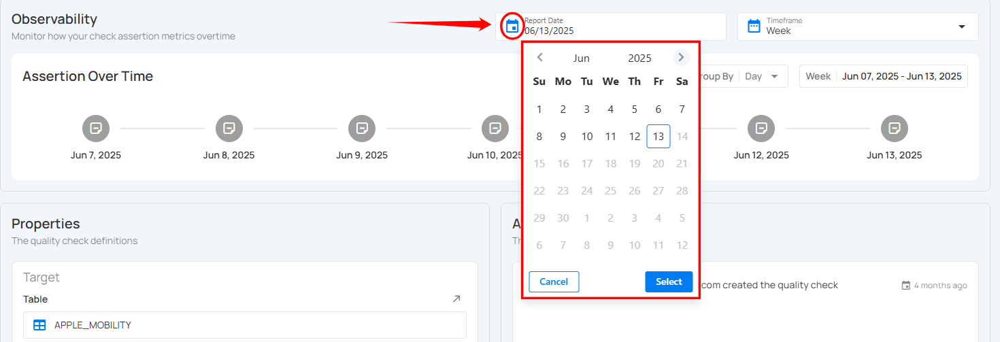

#### Choose the Timeframe

**Step 1:** Locate the **Timeframe** field at the top-right of the Observability section.

**Step 2:** Choose a timeframe for your assertion data view:

* **Week** – Shows assertion metrics distributed over a 7-day period.

* **Month** – Displays daily or weekly assertions throughout the selected month.

* **Quarter** – Covers a three-month range (e.g., Q1: Jan–Mar, Q2: Apr–Jun), useful for quarterly reporting and insights.

* **Year** – Presents assertion data trends for an entire calendar year, allowing for broad, high-level performance monitoring.

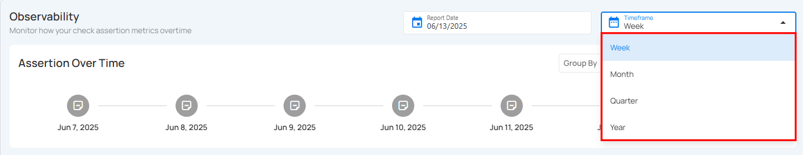

Once a timeframe is selected, the Assertion Over Time chart below will automatically adjust to reflect assertion activity within the chosen window.

### Properties Section

The Properties section explains where this check is applied. In this case, the check is applied to a table called **supplier**, specifically to the **s_comment** field of type **String**. There is no filter added, so the check is applied to all rows in the table. This helps maintain clean and trustworthy data, especially when phone numbers must be unique per customer.

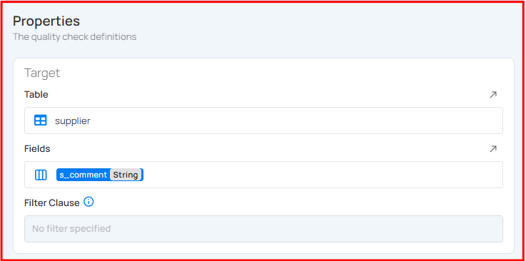

### Activity Section

The **Activity** section displays a chronological history of all actions performed on the quality check, including creation, updates, and automated adjustments. It provides visibility into how the check has evolved over time, capturing the exact configuration, properties, and tags associated with each event.

You can view the exact version of the check as it existed at that point in time by clicking the **check icon** on the right side of the activity entry.

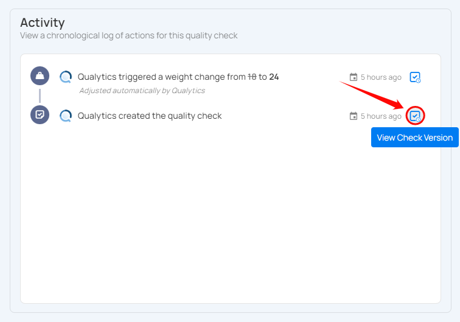

A right side panel will open with the historical configuration of the check.

The **Version At** field displays the exact date and time when that version of the check was created. For example, **July 8, 2025, at 5:42 AM (GMT+5:30)** indicates when the configuration shown was active in the system.

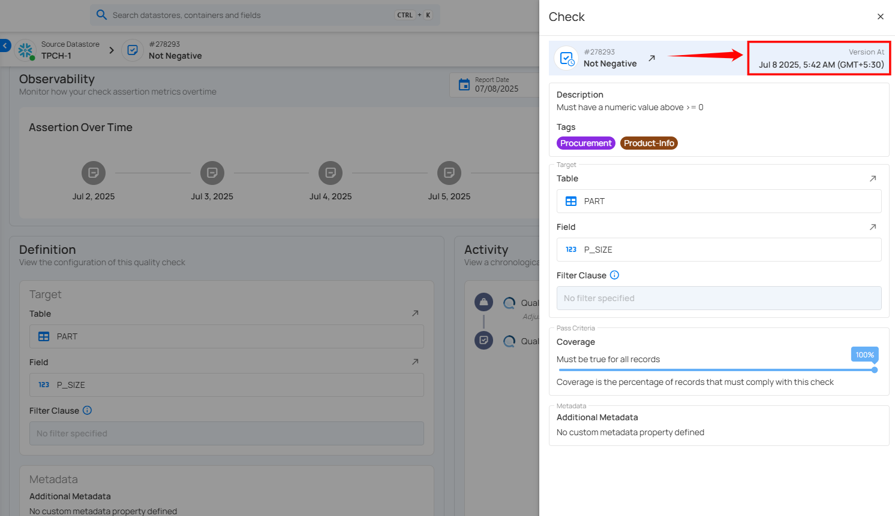

### Metadata Section

Currently, there is no extra metadata added to this check. Metadata can include additional notes or properties, but in this case, it's left blank.

