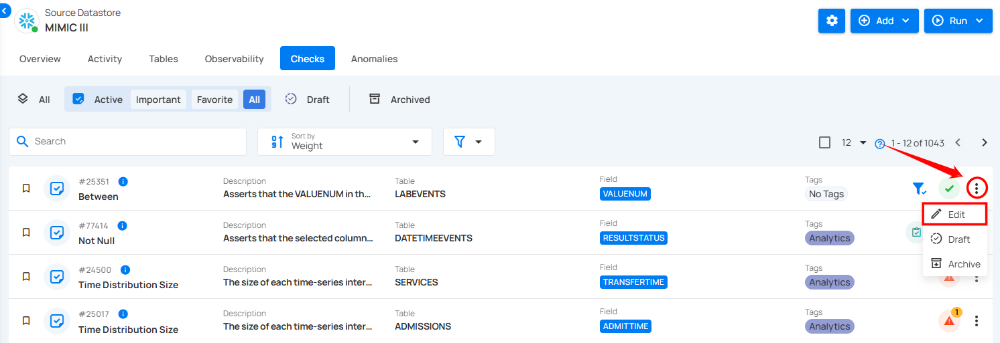
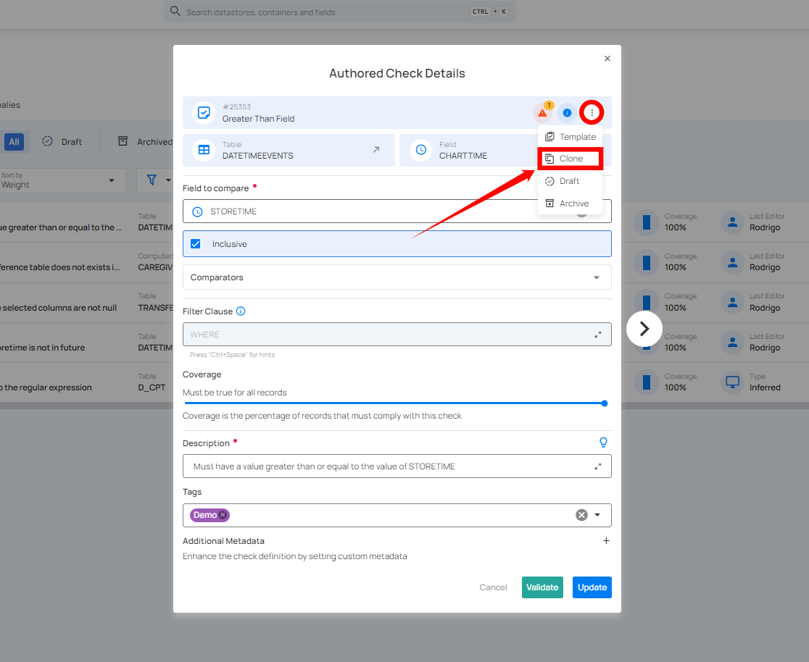
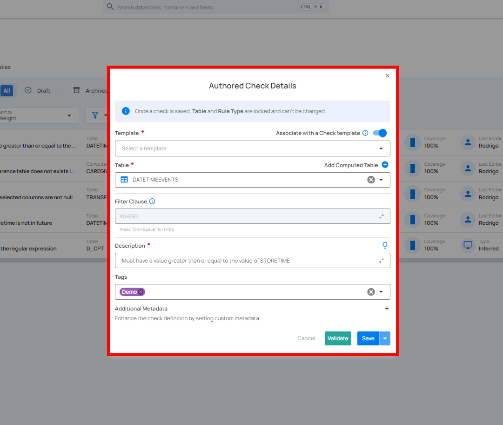
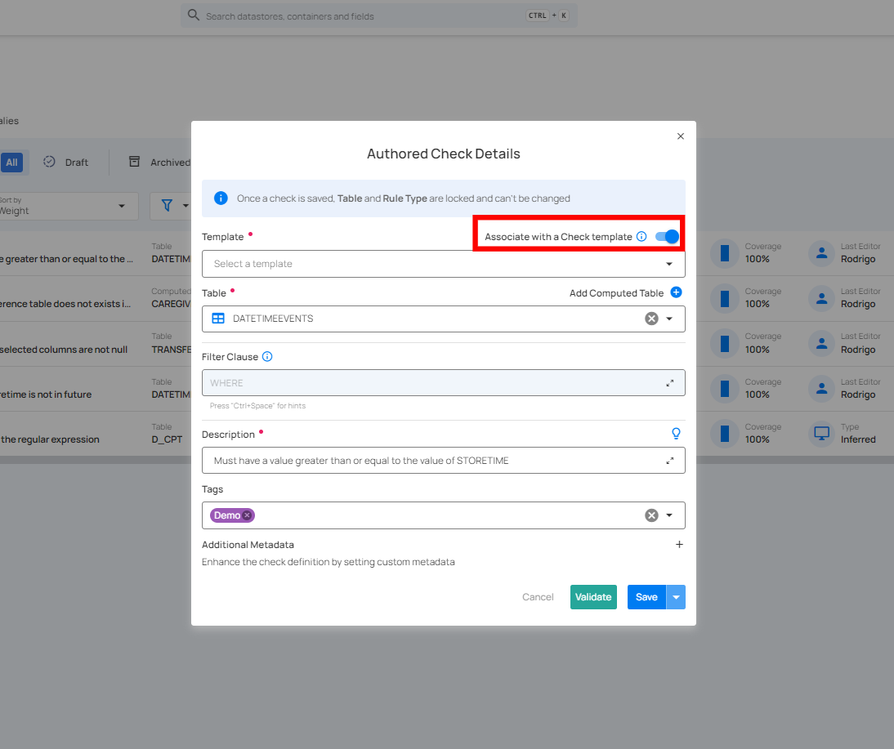
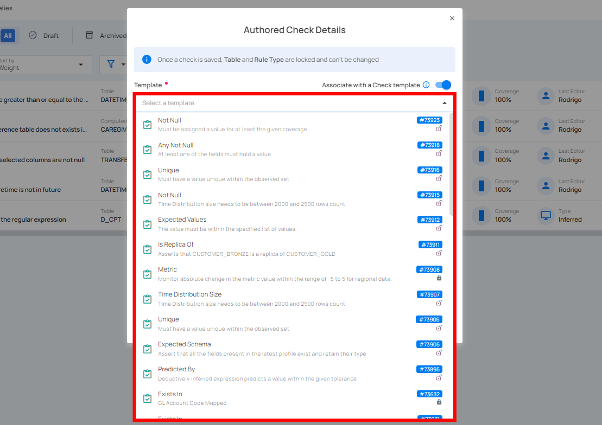
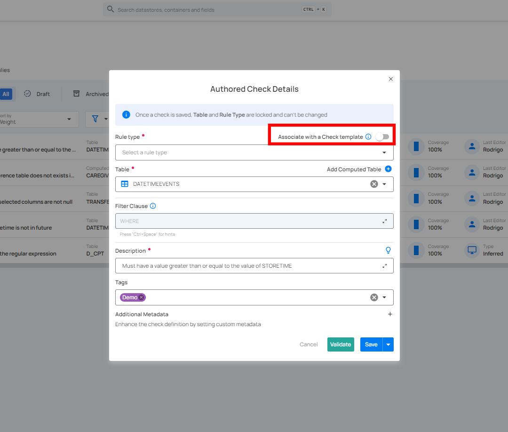
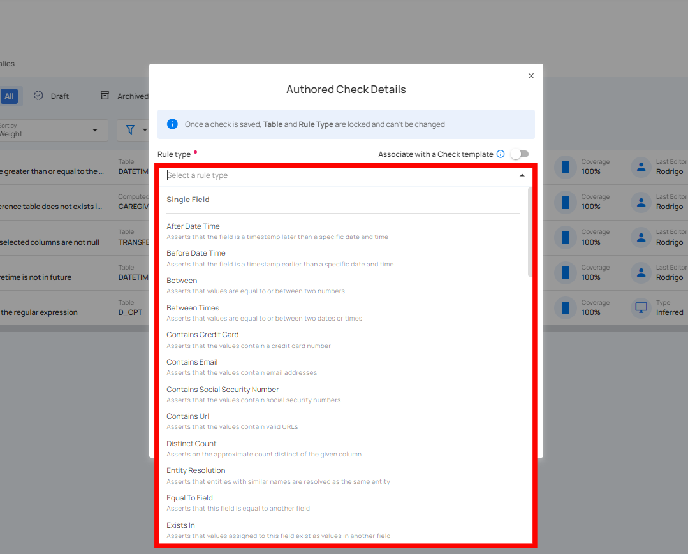
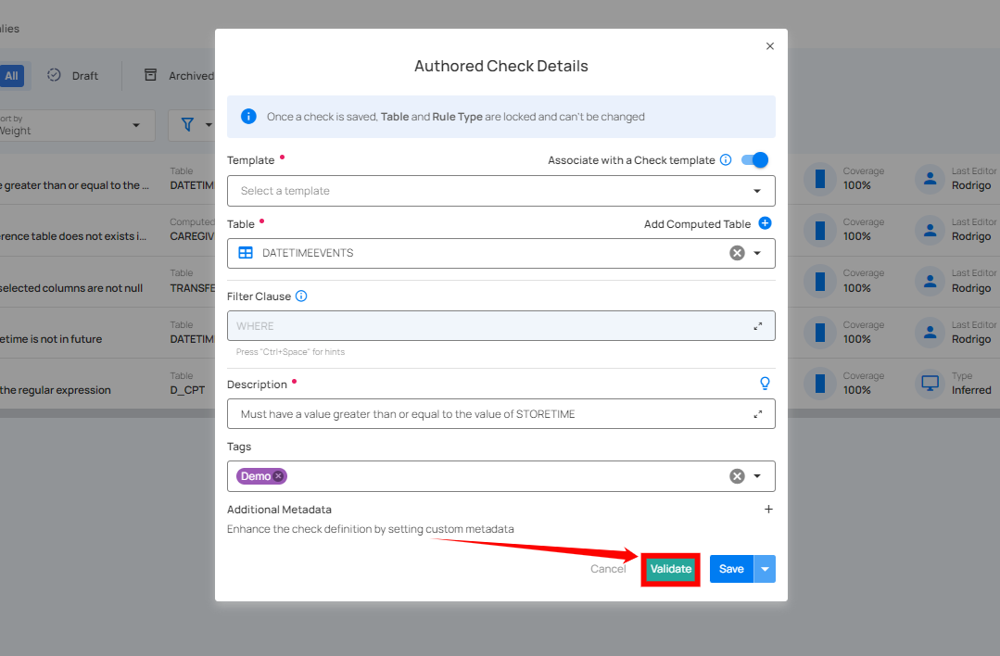
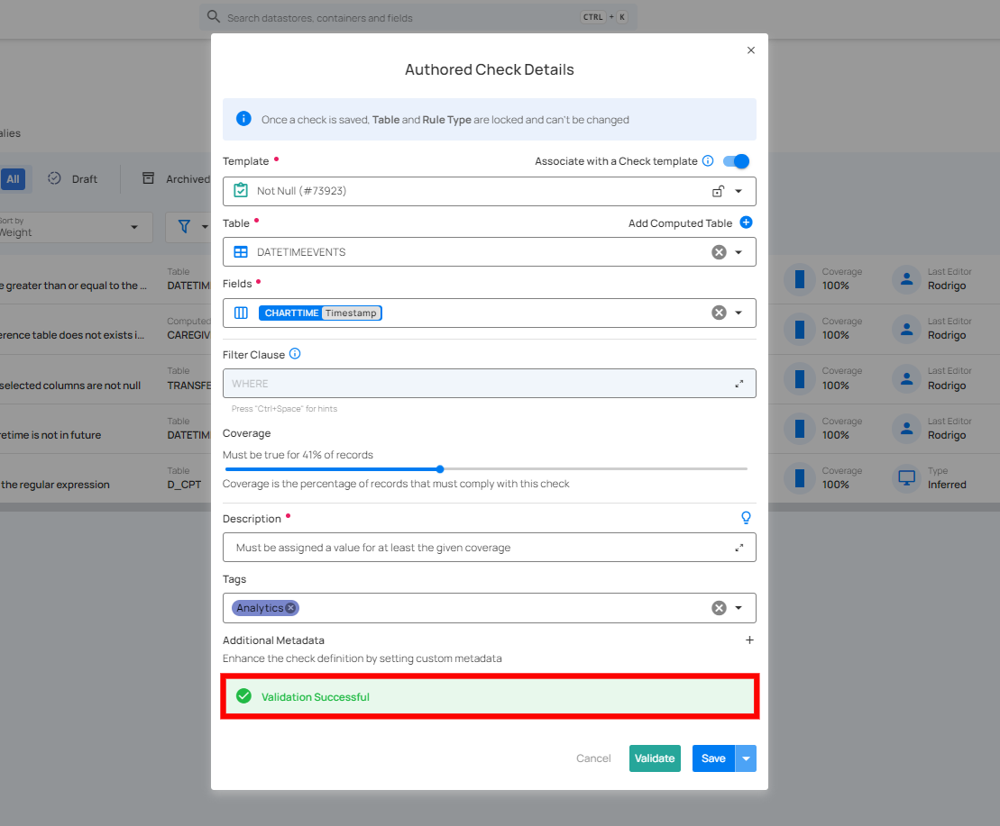
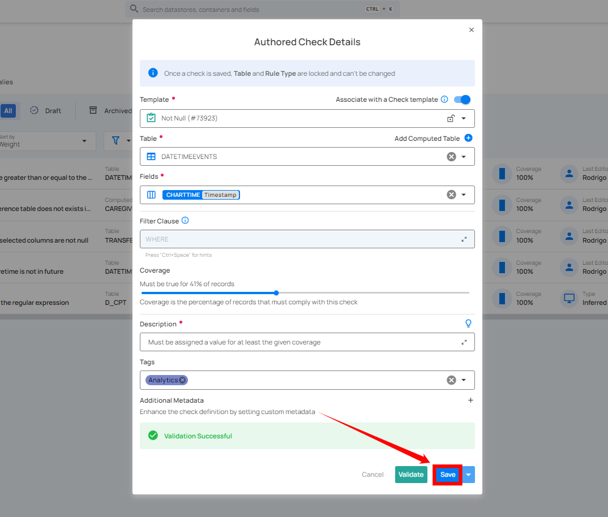

# Clone Check

**Step 1:** Click the vertical ellipsis (⋮) next to the check (whether Active or Draft) that you want to clone and select **Edit** from the drop-down menu.

For Demonstration purposes, we have selected the **"Between"** check.

**Step 2:** A modal window will appear displaying the check details. Click on the **vertical ellipsis (⋮)** located in the upper-right corner of the modal window, and select **"Clone"** from the drop-down menu.

**Step 3:** After clicking the Clone button, a modal window will appear. This window allows you to adjust the cloned check's details.

**1.** If you toggle on the **"Associate with a Check Template"** option, the cloned check will be linked to a specific template.

Choose a **Template** from the drop-down menu that you want to associate with the cloned check. The check will inherit properties from the selected template.

* **Locked:** The check will automatically sync with any future updates made to the template, but you won't be able to modify the check's properties directly.

* **Unlocked:** You can modify the check, but future updates to the template will no longer affect this check.

**2.** If you toggle off the **"Associate with a Check Template"** option, the cloned check will not be linked to any template, which allows you full control to modify the properties independently.

Select the appropriate **Rule Type** for the check from the drop-down menu.

**Step 4:** Once you have selected the template or rule type, fill in the remaining [check details](https://userguide.qualytics.io/checks/checks-template/#:~:text=Enter%20the%20following%20details%20to%20add%20the%20check%20template%3A) as required. 

**Step 5:** After completing all the check details, click on the **"Validate"** button. This will perform a validation operation on the check without saving it. The validation allows you to verify that the logic and parameters defined for the check are correct. It ensures that the check will work as expected by running it against the data without committing any changes.

If the validation is successful, a green message saying **"Validation Successful"** will appear. 

If the validation fails, a red message saying **"Failed Validation"** will appear. This typically occurs when the check logic or parameters do not match the data properly.

**Step 6:** Once you have a successful validation, click the **"Save"** button. The system will save any modifications you've made to the check, and create a clone of that check on the basis of your changes.  

After clicking on the **"Save"** button, your check is successfully created and a success message will appear on the screen.